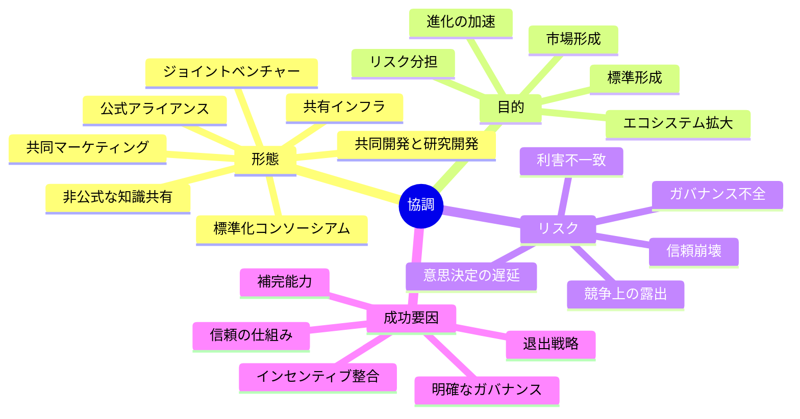
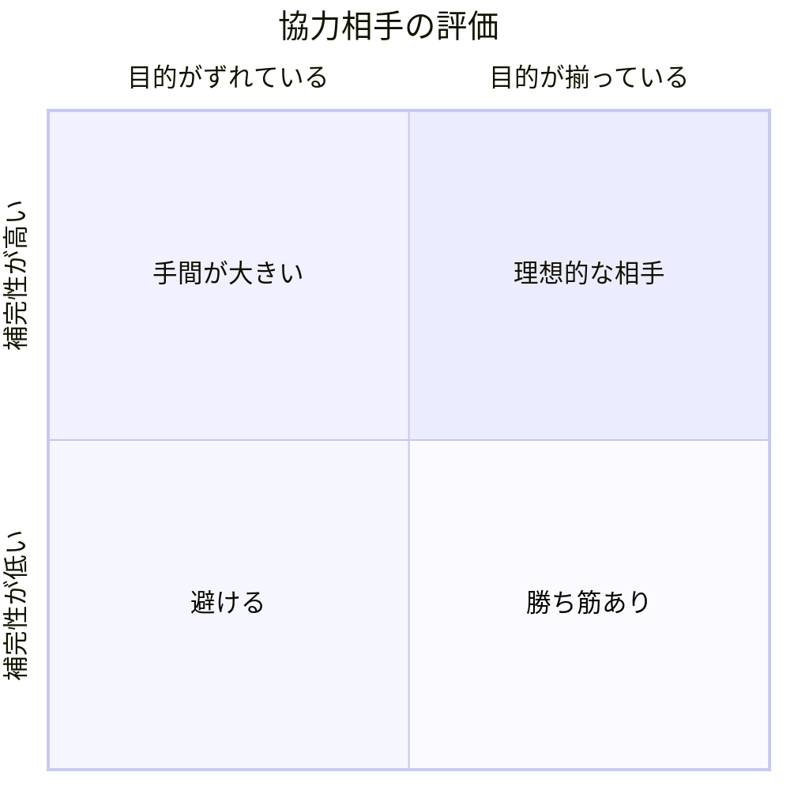

**競合を含む他者と協力し、単独では難しい目標を達成する戦略です。**

> *「他者と協力する。簡単そうに聞こえるが、実際にはそうではない。」*
>
> - Simon Wardley

この戦略は、相互利益が見込める場面で、提携、共同事業、業界横断の協業を組むことを扱います。

<AssessmentToolAdvert strategyName="協調" />

## 🤔 **解説**

### 協調とは何か

ここでいう協調とは、複数の主体が相互の目的を実現するために意図的に連携する、広い戦略概念です。ゆるやかな知識共有から、正式なアライアンスやジョイントベンチャーまでを含みます。より形式化された協調の下位類型としては、[アライアンス](/strategies/ecosystem/alliances)があります。

Wardley Mappingにおける協調は、単なる仲の良い共同作業ではありません。単独では難しい成果を、能力の補完、リスクの分担、標準の整備、共通基盤の構築によって実現するための、意図的な戦略です。相手が競合であっても、同じ制約に直面しているなら協調は成り立ちます。

### なぜ価値があるのか

協調が重要になるのは、課題が単独企業の能力を超えていたり、単独で進むコストの方が、競争上の見返りより大きかったりするときです。

価値は主に次の形で生まれます。

- **補完能力の結合:** 自社に足りないものを他者の強みで埋められる
- **リスク分散:** 高コスト・高不確実性の賭けを複数主体で引き受けられる
- **進化の加速:** 学習、データ、研究成果を持ち寄ることで進化が早まる
- **市場拡大:** 共通標準や共通基盤を作り、市場全体の器を広げられる
- **集中の実現:** 自社は本当に差別化すべき部分へ資源を集中できる

### どう機能するのか

出発点は単純です。大きな課題、市場形成、標準化、高額な研究開発では、二つ以上の頭脳や企業の方が一つより強いことがあります。目的は、単独では実現できないか、効率が悪すぎることを達成することです。そのために必要なのは、利害の整合、明確なガバナンス、そして信頼です。

協調は、共同マーケティングや調査共有のような緩い形から、ジョイントベンチャーや標準化団体のような重い形まで幅があります。資源と知識を束ねることで**進化を加速**できるため、ここでは加速戦略に分類されます。一方で、純粋なゼロサム競争の発想から一歩外れ、エコシステム全体を見る視点が必要になるため、文化的には難しい戦略でもあります。

### 協調の類型

協調は、関与の深さ、形式、戦略整合の度合いによって多様な形を取ります。

- **非公式な知識共有:** 共同研究、共通ツール、コミュニティ集会など
- **共同マーケティングや販路提携:** リーチやブランドを持ち寄る
- **共有インフラ:** 通信塔、充電網、共同プラットフォームなどへ共同投資する
- **共同開発や研究開発提携:** 新しいプロダクトやコンポーネントを一緒に作る
- **標準化コンソーシアム:** 業界標準を定義し普及させる。関連戦略として[標準化ゲーム](/strategies/markets/standards-game)がある
- **ジョイントベンチャー:** 新しい事業体を作って共通機会を追う
- **[アライアンス](/strategies/ecosystem/alliances):** 長期・正式・共同統治を伴う協調

どの形が適切かは、目的、対象コンポーネントの進化段階、当事者間の信頼水準で決まります。

## 🗺️ **実例**

### Sony Ericssonの提携（2000年代前半）

Sonyは家電の強みを持ち、Ericssonは通信インフラと携帯電話技術を持っていました。両者は協調してSony Ericssonの携帯電話を生み出し、互いの欠落を補いました。この協調によって、単独では難しかった規模でNokiaなどの大手と戦えました。

### Bluetooth SIG

Ericsson、Nokia、IBM、Intelなどが参加したBluetooth SIGは、無線周辺接続の標準を協調して作った例です。互いに別規格を争う代わりに、一つの標準を確立し、市場全体を広げ、Bluetoothの進化を加速しました。

### 仮想例: 希少疾患向け治療の共同開発

中堅の製薬企業2社が、それぞれ候補化合物を持っていたとします。別々に高価な治験を走らせるのではなく、共同契約を結び、併用療法の試験とデータ共有を行う方が早く安く進められるかもしれません。成功すれば、両社は地域分担や販売分担で市場を分け合い、単独では難しかった治療法の進化を早められます。

## 🚦 **使いどころ**

<Assessment strategyName="協調">
 <MapSignals>
  <li>創世記またはカスタムビルド段階のコンポーネントが、単独では大きすぎる、危険すぎる、遅すぎる。</li>
  <li>競合や同業他社も同じ課題を抱えており、共有アプローチの便益がある。</li>
  <li>エコシステム拡大や標準化が有利に働く新しい機会が立ち上がっている。</li>
  <li>相互運用性、プラットフォーム効果、共有インフラが成功条件になっている。</li>
  <li>現在のバリューチェーンに、補完能力を持つ隣接プレイヤーが見えている。</li>
  <li>短期的な統制や差別化より、市場形成の方が重要である。</li>
  <li>不確実性が高く、単独投資は重いが、共同探索なら成立する。</li>
 </MapSignals>
 <Readiness>
  <li>透明な報告や利害調整など、外部パートナーとの信頼を築き維持する仕組みがある。</li>
  <li>共同ガバナンスと共同意思決定を受け入れられる。</li>
  <li>非公式なものも含め、提携やアライアンスの経験がある。</li>
  <li>共同で生まれる知財や標準を交渉し管理できる。</li>
  <li>ゼロサム競争ではなく、エコシステム思考を支える文化がある。</li>
  <li>候補パートナーへ明確な便益を示し、成果を分け合う意思がある。</li>
  <li>退出や方針分岐を想定し、中核事業を不安定化させず扱える。</li>
 </Readiness>
</Assessment>

### 向くとき

- **課題が大きすぎる、危険すぎる、遅すぎる**ため、単独では成立しないとき
- 新しい標準やプラットフォームを作る場面で、**単独支配よりエコシステム形成の価値が大きい**とき
- 市場形成の初期で、早すぎる競争が全員の成長を止めてしまうとき

### 避けるとき

- 自社と候補パートナーの目的が根本的に衝突しているとき
- 共同開発の成果をめぐって、後で直接対立することが見えているとき
- 協調によって弱い競合へ過大な便益を与え、それが将来自社への脅威になるとき
- 自力で勝ち切れるのに、成果を不必要に分け合ってしまうとき

## 🎯 **リーダーシップ**

### 中核課題

協調では、**統制と開放性の均衡**を取らなければなりません。協力はイノベーションを加速しますが、依存や独自優位の希薄化も招きます。優れた指揮とは、利害を揃えながら将来の選択肢を残す契約と運営を組むことです。

### 必要なスキル

- [ステークホルダー調整と影響力](/leadership-skills/stakeholder-alignment-and-influence) — 信頼を作り、利害を整える
- [提携とアライアンスの運営](/leadership-skills/partnership-and-alliance-management) — 協力関係を運営する
- [ガバナンスと政策設計](/leadership-skills/governance-and-policy-design) — 共同行動を支えるルールを設計する

### 倫理面

協調では、公正な価値配分と透明性が重要です。片方だけが学習を持ち帰り、後から単独で刈り取る構図になると、信頼は壊れます。契約だけでなく、期待値、情報共有範囲、知財の扱い、紛争解決を明確にし、相手を搾取しない設計にする必要があります。

## 📋 **進め方**

1. **目的と利害を見極める:** 何を達成したいのか、双方が何を得るのかを明確にする
2. **協力の器を決める:** コンソーシアム、ジョイントベンチャー、提携など、目的に合う形を選ぶ
3. **信頼の仕組みを先に作る:** 小さな試行、透明性、事前合意した紛争解決手段を用意する
4. **ガバナンスを定める:** 意思決定権、成果配分、知財、情報共有、品質基準を明文化する
5. **退出条件を持つ:** 方向がずれたとき、関係を壊さず離脱できる条件を定める

## 📈 **成功指標**

- 単独で進めた場合に比べた市場投入速度や開発サイクルの短縮
- 研究開発費、参入費、インフラ投資の削減幅
- 標準化や市場形成による総市場規模の拡大
- 各組織へ持ち帰れた新しい能力や知識
- 中核事業のバリューチェーン上での位置強化
- 共同意思決定に要する時間と紛争件数
- 参加各社の満足度と継続意欲
- 協力を通じて生まれた新機能、新製品、新手法の数

## ⚠️ **失敗しやすい点**

### 利害のずれ

協調は、インセンティブがずれると簡単に壊れます。どちらかがただ乗りしたり、途中で別方向へ向かったりするからです。明確な合意と退出戦略が必要です。

### 意思決定の遅さ

協力には委員会や調整がつきものです。単独で決めるより遅くなりやすく、機動力を失う危険があります。

### 信頼の破綻

片側が一方的に学習を持ち逃げしたり、成果を独占したりすると、関係は悪化し、法的対立にまで発展しかねません。

## 🧠 **戦略的示唆**

### 進化段階で意味が変わる

協調は、対象の進化段階によって意味が大きく変わります。

- **創世記／カスタムビルド:** 希少な知識や高い不確実性を分け合うための協調になる
- **プロダクト／コモディティ:** 標準や市場拡大を目的とする協調が中心になる

### バリューチェーン上の使い方

協調を使うことで、組織は次のことができます。

- 差別化すべき高付加価値領域へ集中し、コモディティ化する部分は他者と組む
- バリューチェーン上の補完位置を結び、倍率効果を作る
- 共同で参入障壁を作り、外部からの破壊に備える

### パイを広げるか、取り合うか

Wardley Mappingの観点では、新興市場で早すぎる競争を始めると、市場全体の成長を止めることがあります。

協調は次の手段になります。

- 上位レイヤーのイノベーションを支える共通基盤を作る
- 標準を整え、採用と市場形成を早める
- ユーザーニーズに近い差別化部分で競い、基盤部分は協力する

### てこの支点を狙う

成功する協調は、しばしば特定の支点を狙います。

- **慣性点:** 業界全体の圧力がないと動かない抵抗領域
- **制約除去:** すべてのプレイヤーを苦しめる共通ボトルネック
- **ネットワーク効果:** 複数の参加者が集まるほど価値が増える箇所

### アライアンスとの違い

[アライアンス](/strategies/ecosystem/alliances)は、協調のうち、より形式化された形です。共同研究やゆるい連携が協調だとすれば、アライアンスは次を伴うことが多いです。

- 正式な契約とガバナンス
- 資源やインフラの共同保有
- 共同ブランドや市場向けの共通顔
- 市場や標準を形作るための共同行動

エコシステム単位の影響が欲しいときや、形式性が信頼の担保になるときは、アライアンスの方が向きます。

## ❓ **問うべきこと**

- 各当事者は何を持ち寄り、何を持ち帰るのか。それは持続可能に釣り合っているか
- 協力対象のコンポーネントは、進化軸のどこにあるか
- この協調は、将来自分たちが逃げにくい依存を作らないか。重要インターフェースは誰が握るのか
- いま共有する知識や能力は、後で自社に不利に働かないか
- 利害がずれたとき、誰がどう意思決定するのか
- この協調は市場形成を早めるのか、それとも逆に阻害するのか
- どの条件になったら関係を縮小、終了、再設計すべきか

## 🔀 **関連戦略**

- [アライアンス](/strategies/ecosystem/alliances) - 協調をより正式な形にしたもの
- [共創](/strategies/ecosystem/co-creation) - ユーザーと共に進める協調
- [包囲と探り](/strategies/competitor/circling-and-probing) - 協力ではなく、競合の反応を探る手法
- [標準化ゲーム](/strategies/markets/standards-game) - 協調はしばしば標準の確立を狙う
- [市場育成](/strategies/accelerators/market-enablement) - 関係者の足並みを揃えて市場を育てる
- [両面張り](/strategies/attacking/playing-both-sides) - 複数関係者との立ち位置を利用して競争上の緊張を作る

## ⛅ **関連する状勢パターン**

- [コンポーネントは共進化できる](/climatic-patterns/components-can-co-evolve) – 影響: 協力によって能力は一緒に成熟しうる
- [経済にはサイクルがある](/climatic-patterns/economy-has-cycles) – トリガー: 平時から戦時への移行が、新しい提携を促すことがある

## 📚 **参考文献**

- [61種類の戦略的な駆け引きについて](https://blog.gardeviance.org/2015/05/on-61-different-forms-of-gameplay.html) - Simon Wardleyによる戦略類型の整理。協調は単純に見えて実行が難しいことを強調している
- [アライアンスを機能させるためのシンプルなルール](https://hbr.org/2007/11/simple-rules-for-making-alliances-work) - アライアンスや協調を機能させるための実務上の注意点をまとめた記事
