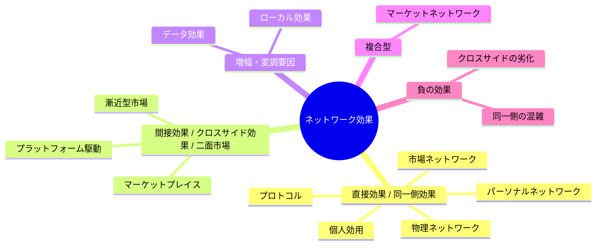

**利用者が増えるほど提供価値が上がる構造を活かし、自己強化的な成長ループを作る戦略です。**

> *「利用者数が増えるほど、限界価値が増すようにする技法。」*
>
> - Simon Wardley

これは、各利用者の参加が全体の効用を押し上げ、それがさらに新規参加を呼ぶ、自己増殖的な採用ループを作る戦略です。

## 🤔 **解説**

### ネットワーク効果とは何か、どう活用するのか

ネットワーク効果とは、あるサービスから各利用者が得る価値が、他の利用者数の増加に伴って高まる現象です。これが起きると、新規利用者が既存利用者の価値を高め、既存利用者の存在がまた次の利用者を呼ぶ、**正のフィードバックループ**が生まれます。

典型例は、ソーシャルネットワーク、メッセージング、マーケットプレイス、決済ネットワーク、アプリストアです。価値を高める構造があるなら、初期段階では**短期利益より利用者獲得**を優先してでも、**臨界量**に到達する意味があります。配車サービスが運転手側へ補助金を出して乗客側を立ち上げるのは、その典型です。

この戦略の狙いは、**規模を通じたロックイン**です。ネットワーク効果が効き始めると、利用者が多いほど価値が高まり、競合が追いつきにくくなります。

ネットワーク効果は、既存利用者にとっての価値増分である**総効果**と、新規利用者にとって参加動機を強める**限界効果**に分けて考えられます。

### 規模の経済との違い

ネットワーク効果は、規模の経済とは別物です。規模の経済は、量産により単位コストが下がる**供給側の効果**です。一方、ネットワーク効果は、利用者が増えるほど顧客価値が上がる**需要側の効果**です。工場は多く作るほど安く作れますが、SNS は利用者が増えるだけで価値が上がります。

### 臨界量

臨界量とは、ネットワークから得られる価値が、単体製品の価値や競合より明確に上回り、利用者が雪崩的に集まり始める状態です。ここに達すると、追随効果が働き、市場を取り切る可能性が出てきます。ただし、そこへ到達するまでの時間や難しさは市場ごとに大きく異なります。

### ネットワーク効果の種類

ネットワーク効果は一枚岩ではなく、複数の型があります。



#### 直接ネットワーク効果（同一側効果）

**同じ製品・サービスの利用者が増えるほど、その製品の価値が上がる効果です。**

電話、SNS、メッセージング、オンラインゲームなどが典型です。利用者が増えるほど、つながる相手や共有できる相手が増え、効用が上がります。

[メトカーフの法則](/terms/metcalfs-law) は、ネットワーク価値が利用者数の二乗に比例すると考えます。[リードの法則](/terms/reeds-law) は、部分集団形成まで考えると指数的に価値が増えうると示唆します。ユーザー同士の接続密度が高いほど、この効果は強くなります。

#### 間接ネットワーク効果（クロスサイド効果 / 二面市場）

片側の利用者増加が、もう片側の利用者価値を高める効果です。ハードウェアとソフトウェア、ゲーム機とゲーム、EC マーケットプレイス、配車プラットフォーム、アプリストアなどがこれに当たります。出店者が増えるほど買い手に価値が出て、買い手が増えるほど出店者側にも価値が出ます。

このタイプでは、「鶏と卵」の問題が常につきまといます。どちら側を先に育てるか、どの補助を入れるかが重要です。

#### ローカルネットワーク効果

ネットワーク全体ではなく、地理的、業界的、コミュニティ的に限られた範囲で効果が強く出るタイプです。配車サービスは都市ごとのドライバー密度と利用者密度が重要で、全世界の総数だけでは価値を測れません。

#### データネットワーク効果

利用者が増えるほどデータがたまり、そのデータがサービス改善を生み、さらに利用者が増える構造です。Google Search や Netflix の推薦などが典型です。

#### プラットフォームネットワーク効果

中央プラットフォームの上に開発者やパートナーが積み上げることで価値が増す効果です。iOS、Android、各種 SaaS プラットフォームが該当します。

#### マーケットネットワーク効果

個人ネットワークと取引ネットワークが融合した形です。職業的アイデンティティ、コミュニケーション、取引が一体化したプラットフォームで強く見られます。

#### 負のネットワーク効果

利用者が増えすぎると、逆に価値が下がることもあります。混雑、スパム、ノイズ、不正参加者、広告過多などがその原因です。ChatRoulette のように、望ましくない参加者の増加が全体品質を壊し、良質な利用者を追い出す例もあります。

### なぜ価値があるのか

ネットワーク効果を活用できると、強い競争優位と急成長を同時に狙えます。

- 利用者が増えるほど支払意思も滞在理由も強くなる
- 競合に対する参入障壁が高まる
- 採用が自己強化ループになる
- 条件がそろえば市場支配へ至る

### どう使うのか

- 早期には利用者獲得を最優先し、臨界量へ到達する
- 新規参加の摩擦を徹底的に下げる
- 必要なら片側へ補助金や優遇を入れ、もう片側を呼び込む
- 利用者同士の相互作用、再訪、紹介、データ蓄積を設計する

## 🗺️ **実例**

```mdx-code-block
import DocCardList from '@theme/DocCardList';

<DocCardList />
```

- **iOS / Android:** アプリ生態系による典型的な間接ネットワーク効果
- **電話:** 直接ネットワーク効果の古典例
- **WhatsApp:** 友人や同僚の参加が価値そのものになる
- **金融取引所（例: Chicago Board of Trade）:** 流動性が流動性を呼ぶ
- **LinkedIn:** 専門職ネットワークの規模が直接価値を生む

## 🚦 **使いどころ**

<Assessment strategyName="Network Effects">
  <MapSignals>
    <li>利用者が増えるほど、同一側またはクロスサイドで提供価値が高まる。</li>
    <li>二つ以上の相互依存する利用者群を持つプラットフォームや市場を運営している。</li>
    <li>ユーザー参加そのものが、他の利用者体験を改善している。たとえばコンテンツ、データ、流動性、社会的証明など。</li>
    <li>規模が、防御力や差別化の主要要因になっている。</li>
    <li>競合が臨界量へ近づき、自社の成長経路を脅かしている。</li>
    <li>コールドスタート問題はあるが、初期参加を集めれば tipping する見込みがある。</li>
    <li>データ蓄積や利用者間相互作用が競争上の主要レバーになっている。</li>
  </MapSignals>
  <Readiness>
    <li>短期利益より利用者成長を優先する予算と覚悟がある。</li>
    <li>直接、間接、ローカルなど、ネットワーク効果の型を理解している。</li>
    <li>補助金、紹介、限定特典など、初期参加を促す具体策を持っている。</li>
    <li>急成長で起きる品質低下や混雑を監視し、対処できる。</li>
    <li>共有、招待、投稿、取引など、自己強化的活動を生む設計になっている。</li>
    <li>ネットワーク成長とともに価値を高め続ける施策を持っている。</li>
    <li>増え続ける利用者を支えるインフラと運用品質を維持できる。</li>
  </Readiness>
</Assessment>

### 向くとき

- ソーシャル、マーケットプレイス、プラットフォームのように、事業モデル自体にネットワーク効果が埋め込まれているとき
- 初期は赤字でも、臨界量へ達すれば防御力が急上昇する構造があるとき
- 競合が追い上げてきており、既存のネットワーク優位をさらに強化すべきとき

### 避けるとき

- 利用者が増えても製品価値が本質的に増えないとき
- 数だけ増やすと品質や収益性が壊れるニッチ市場であるとき
- 総取り的な力学が弱く、質や単価の方が重要な市場であるとき

## 🎯 **リーダーシップ**

### 中核課題

- 二面市場での「鶏と卵」問題をどう超えるか
- 成長と収益化をどう両立するか
- ネットワーク拡大とともに品質をどう維持するか

### 必要なスキル

- [市場と顧客インサイト](/leadership-skills/market-and-customer-insight) — どの成長が価値につながるかを見抜く
- [プラットフォーム戦略とネットワーク効果](/leadership-skills/platform-strategy-and-network-effects) — インセンティブと設計を組み立てる
- [リスク管理とレジリエンス](/leadership-skills/risk-management-and-resilience) — 負のネットワーク効果へ先回りする

### 倫理面

ネットワーク効果は独占を生みやすいため、公正競争への配慮が欠かせません。利用者安全、データプライバシー、透明なモデレーション、アクセス格差の抑制も重要です。成長そのものではなく、誰にどんな価値と危険を配るのかを見なければなりません。

## 📋 **進め方**

### 初期採用戦略: 鶏と卵を超える

二面市場では、最初の供給側と需要側をどう立ち上げるかが最難関です。よく使われるのは、片側への補助金、狭いニッチからの立ち上げ、ネットワーク規模と無関係な初期価値の提供です。

### 価格戦略で成長を動かす

ネットワーク効果を狙う価格戦略では、短期利益より成長を優先します。無料や低価格で利用者を集め、臨界量を超えた後に価格を再設計する考え方です。将来の支払意思は、現在の利用者基盤の大きさに依存します。

### プラットフォーム設計で効果を増幅する

機能設計はネットワーク効果に直結します。いわゆる「5 つの C」には、Connection、Communication、Curation、Collaboration、Community が含まれます。相互作用のしやすさ、プロフィール可視性、紹介ループ、第三者の価値創出余地などが効きます。

### 補完財と周辺サービスを育てる

補完製品や補完サービスが増えるほど、間接ネットワーク効果は強くなります。アプリストア、決済、分析ツール、周辺事業者などが揃うことで、乗り換えコストと魅力の両方が高まります。

### 維持と強化を設計する

ネットワーク効果は、獲得後の維持で決まります。相互接続密度を上げ、コミュニティ参加を促し、品質低下や混雑を早期に抑え続ける必要があります。

## 📈 **成功指標**

- ネットワーク規模と成長率
- 利用者エンゲージメントと維持率
- 利用者一人あたり価値
- ネットワーク密度と相互作用回数
- コンバージョン率
- 顧客獲得コスト

## ⚠️ **失敗しやすい点**

- **戦略なき資金燃焼:** 後からどう収益化するかがないまま、数だけ追う
- **他の価値要因の無視:** 品質、満足度、信頼がなければ、規模だけでは残らない
- **過大評価:** ある地点で効果が頭打ちになることを無視する
- **臨界量の難しさ:** 初期立ち上げを越えられず終わるケースが多い
- **負のネットワーク効果:** 混雑、低品質、不正参加で価値が目減りする
- **マルチテナント化:** 利用者が複数ネットワークを平気で併用し、独占優位が弱まる
- **巨大化による鈍化:** 利用者基盤にあぐらをかいて非効率・非革新的になる
- **容量不足:** 急成長を支える基盤と運用が足りない
- **バイラルとの混同:** 拡散力と防御力は別物であることを見誤る

## 🧠 **戦略的示唆**

### 進化とネットワーク効果

臨界量への到達は、バリューチェーン上のコンポーネントの進化に大きな力を与えます。

創世記やカスタムビルド段階では、ネットワーク効果はまだ弱く、採用も遅いのが普通です。この段階では、[参入障壁](/terms/barriers-to-entry) を下げ、初期採用者を集め、参加インセンティブを整えることが先です。そこで転換点を超えると、コンポーネントは急速にプロダクト化し、やがてコモディティ化へ向かいます。

大きく活発な利用者基盤は、補完財、標準化、乗り換えコスト上昇を呼び込みます。早期に臨界量を作れた組織は、事実上の標準を握り、パートナーを囲い、後発に高い壁を作れます。

ただし、その窓は永遠には続きません。コンポーネントが完全にコモディティ化すると、差別化の重心は別の上位システムへ移ります。したがって、どの層で臨界量を作るか、いつ別の層へ重心を移すかを見極める必要があります。

### てこの支点

最終的には、利用者同士の価値交換をどう増やすかが核心です。つながり、紹介、投稿、取引、データ蓄積を増やす支点を見つけることが重要です。

## ❓ **問うべきこと**

- 自社事業に効くネットワーク効果はどの型か
- どの設計がネットワーク効果を最大化するか
- 主要な課題と落とし穴は何か
- 成功をどう測るか
- 時間とともに効果をどう維持し強めるか

## 🔀 **関連戦略**

- [先行確保](/strategies/positional/land-grab) - 早期に利用者基盤を押さえるためによく使う
- [最後の一社](/strategies/markets/last-man-standing) - ネットワーク効果が最終的な勝者を作ることがある
- [両面市場](/strategies/ecosystem/two-factor-markets) - クロスサイド効果を直接扱う
- [標準化ゲーム](/strategies/markets/standards-game) - 標準争いがネットワーク優位に直結する
- [市場育成](/strategies/accelerators/market-enablement) - 補完提供者を増やして効果を増幅する
- [ライセンシング](/strategies/poison/licensing) - 第三者の採用を増やし、ネットワークを広げる

## ⛅ **関連する状勢パターン**

- [変化は必ずしも線形ではない](/climatic-patterns/change-is-not-always-linear) – 影響: ネットワーク効果は急激で非線形な採用曲線を生みやすい
- [進化を避ける選択肢はない](/climatic-patterns/no-choice-on-evolution) – トリガー: 支配的ネットワークが現れると、他者は参加を強いられやすい

## 📚 **参考文献**

- [Network effect - Wikipedia](https://en.wikipedia.org/wiki/Network_effect)
- [What Is the Network Effect? - Investopedia](https://www.investopedia.com/terms/n/network-effect.asp)
- [What Are Network Effects? | HBS Online](https://online.hbs.edu/blog/post/what-are-network-effects)
- [The Network Effects Bible - NFX](https://www.nfx.com/post/network-effects-bible)
- [What are Network Effects? Indirect and Direct Network Effects - Applico Capital](https://www.applicoinc.com/blog/network-effects/)
- [What are Network Effects? Direct & Indirect [With Examples] - Maven](https://maven.com/articles/network-effects)
- [What are network effects? - Sharetribe](https://www.sharetribe.com/marketplace-glossary/network-effects/)
- [Network Effects: Definition, History and Examples | Built In](https://builtin.com/articles/network-effect)
- [The Network Effects Manual: 16 Different Network Effects - NFX](https://www.nfx.com/post/network-effects-manual)
