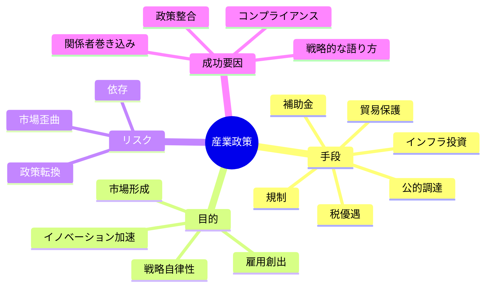

**政府の投資や政策と足並みを揃える、またはそれに影響を与えることで、戦略産業の成長を加速する戦略です。**

> *「ある分野への政府投資。」*
>
> - Simon Wardley

<AssessmentToolAdvert strategyName="Industrial Policy" />

## 🤔 **解説**

### 産業政策とは何か

産業政策とは、補助金、税優遇、公的調達、規制、インフラ投資といった手段を通じて、政府が戦略産業を意図的に支援することです。企業側から見ると、それは政策に合わせるだけでなく、制度設計へ働きかけ、自社に有利な市場条件を作ることも含みます。

目的は、高額で不確実な投資のリスクを下げ、資金を確保し、市場条件そのものを自社にとって有利な方向へ動かすことです。特に半導体、グリーンエネルギー、防衛、通信インフラのような、国家的な重要性と巨額投資が結びつく領域で効きます。

### なぜ使うのか

- **高額投資のリスクを下げる:** 補助金、保証、税優遇で資本負担を軽くできる
- **研究開発を加速する:** 助成金や契約によって探索速度を上げられる
- **政府需要を作れる:** 公的調達や義務化標準が初期市場になる
- **規制環境を変えられる:** 参入障壁を下げたり、自社に有利な枠組みを作れたりする
- **戦略自律性を高められる:** 国家や地域の重要分野で供給能力を確保できる

### どう機能するのか

組織が産業政策を活用するときは、通常次のような流れになります。

1. 政策優先順位と制度変更タイミングを地図にする
2. 政策立案者、関係省庁、業界団体、影響者との関係を築く
3. 自社の提案を公共目的と結びつけて説明する
4. 実証実験や試作品で価値を示す
5. 補助金、税制、契約、公的投資を確保する
6. コンプライアンスと説明責任を守り続ける

### 産業政策の主な形

## 🗺️ **実例**

### 航空宇宙産業への政府支援

Boeing や Airbus は、防衛契約、直接補助、共同保有に近い枠組みを背景に大きく成長しました。純粋な民間資本だけでは到達しにくい研究開発規模と量産能力を、公的支援が加速しました。

### 中国の EV 産業

中国では補助金、インフラ整備、製造支援が大規模に行われ、BYD や NIO のような企業が市場原理だけでは難しかった速度で国際競争力を持つに至りました。

### 仮想例: 波力発電スタートアップ

再生可能エネルギーの新興企業が、国家のグリーンインフラ政策と連携し、研究助成と固定買い取り契約を得たとします。これにより、実証設備への投資リスクと市場投入までの時間を大幅に減らせます。

## 🚦 **使いどころ**

<Assessment strategyName="Industrial Policy">
  <MapSignals>
    <li>政府が自社分野向けの予算や施策を打ち出している。たとえばグリーン技術、防衛、半導体など。</li>
    <li>高額資本や規制障壁があり、公的支援がリスクやコストを大きく下げる。</li>
    <li>雇用、安全保障、技術革新などの政策目的が、自社戦略と一致している。</li>
    <li>政治環境が、複数年にわたる施策を支えられる程度には安定している。</li>
  </MapSignals>
  <Readiness>
    <li>政策対応やアドボカシーに必要な資源と専門性がある。</li>
    <li>公共部門の報告、監査、透明性要件に対応できる。</li>
    <li>制度形成の流れと時間軸を理解している。</li>
    <li>効果を示す実証や試作を出せる。</li>
  </Readiness>
</Assessment>

### 向くとき

- 公的資金、市場保証、規制支援の長期便益が、監督や依存のコストを上回るとき
- 単独で抱えるには大きすぎる投資やインフラがあり、国家的優先分野と重なるとき
- 政策支援を足場に、自立競争力まで持っていける見込みがあるとき

### 避けるとき

- 政策サイクルが不安定または遅すぎるとき
- 補助金や制度条件が、戦略上の自由度を過度に奪うとき
- 国家支援なしでは成立しない依存構造になりそうなとき

## 🎯 **リーダーシップ**

### 中核課題

公的目的と私的な戦略目的をどう両立させるかです。政府監督と説明責任を受け入れながら、機動力も失わないようにしなければなりません。

### 必要なスキル

- [規制・政治リテラシー](/leadership-skills/regulatory-and-political-acumen) — 政策環境と政府関係者を読み解く
- [戦略的コミュニケーションとストーリーテリング](/leadership-skills/strategic-communication-and-storytelling) — 国家や社会の物語と自社計画を結びつける
- [ガバナンスと政策設計](/leadership-skills/governance-and-policy-design) — コンプライアンスと説明責任の構造を作る
- [ステークホルダー調整と影響力](/leadership-skills/stakeholder-alignment-and-influence) — 官民の関係者を同じ方向へ揃える

### 倫理面

産業政策への関与では、透明性と公的説明責任が不可欠です。戦略的優位を狙うとしても、それが不公正な市場歪曲や不透明な便益供与になってはなりません。自社以外にも価値が返ること、公的資金の使途が妥当であることを示す必要があります。

## 📋 **進め方**

1. 関係する政策領域と資金制度を調査し、地図にする
2. 政策、法務、技術、財務の横断チームを作る
3. 公共利益と自社利益が両立する提案を作る
4. 成功指標つきの実証やデモ案件を出す
5. 補助金、税優遇、公的調達の条件を交渉する
6. コンプライアンスと報告の運用を整える
7. 政策変化を継続監視し、戦略を調整する
8. 過度な依存を避けるため、出口や多角化も設計する

## 📈 **成功指標**

- 獲得した公的資金の規模と条件
- 基準計画に対するプロジェクト進捗の加速
- 規制承認や標準採用の進展
- 政策支援によって増えた市場シェアや取扱量
- 資本コストの低下
- 監査結果と主要関係者の満足度

## ⚠️ **失敗しやすい点**

- 単一の制度や省庁に依存しすぎること
- 補助金がある案件ばかり追い、市場性を見失うこと
- 官僚的遅延で機動力が落ちること
- 不公平な優遇と見なされ、反発を招くこと
- 政策転換で戦略の穴が露呈すること

## 🧠 **戦略的示唆**

### ナショナルチャンピオン型か、エコシステム型か

産業政策には、少数の大企業へ集中投資する型と、広いエコシステムを育てる型があります。前者は大きな規模を得やすい反面、単一プレイヤーに賭けるリスクが高い。後者はしなやかですが、関係調整が複雑になります。どちらの政策に乗っているのかを読み違えると、戦略は外れます。

### 補助金は両刃の剣

補助金は開発と市場投入を早めますが、市場シグナルをゆがめ、依存も作ります。優れた指揮は、補助金を恒常収入にせず、特定マイルストーン到達と能力蓄積のために使います。目標は、政策支援がなくても戦える地点へ到達することです。

### 政策サイクルと政治リスク

産業政策は政権交代や国家優先順位の変化で簡単に変わります。したがって、制度横断で依存を分散する、地域を分ける、自社の中核価値提案を政策抜きでも成立させる、といった耐性が必要です。

## ❓ **問うべきこと**

- この産業政策は、短期的な資金以外の意味で自社長期戦略とどう整合するか
- 助成申請、コンプライアンス、ロビー活動などに必要な内部能力はあるか
- 政治変動、依存、評判毀損など主要リスクをどう抑えるか
- この支援が縮小・終了した後も、自社は競争できるか
- この政策参加は、周辺エコシステムへどう影響するか。協力余地はあるか
- 政策自体や自社関与に、倫理上の懸念や負の外部性はないか

## 🔀 **関連戦略**

- [ロビー活動](/strategies/user-perception/lobbying) - 政策形成へ働きかける主要手段
- [市場育成](/strategies/accelerators/market-enablement) - 政府支援が市場そのものを立ち上げることがある
- [標準化ゲーム](/strategies/markets/standards-game) - 標準化政策が優位形成に直結する

## ⛅ **関連する状勢パターン**

- [資本は新しい価値領域へ流れる](/climatic-patterns/capital-flows-to-new-areas-of-value) – 影響: 政府資金が狙った分野へ資本を集める
- [経済にはサイクルがある](/climatic-patterns/economy-has-cycles) – トリガー: 戦時や大きな社会転換期に政策支援が強まりやすい

## 📚 **参考文献**

- Simon Wardley, *On Industrial Policy and Strategic Climatic Patterns*
- *The Rise of Airbus* - 欧州の政府連携と補助による航空産業形成の事例
- *Wardley on Industrial Policy in China's Tech Landscape* - 中国テック分野における産業政策の解説
