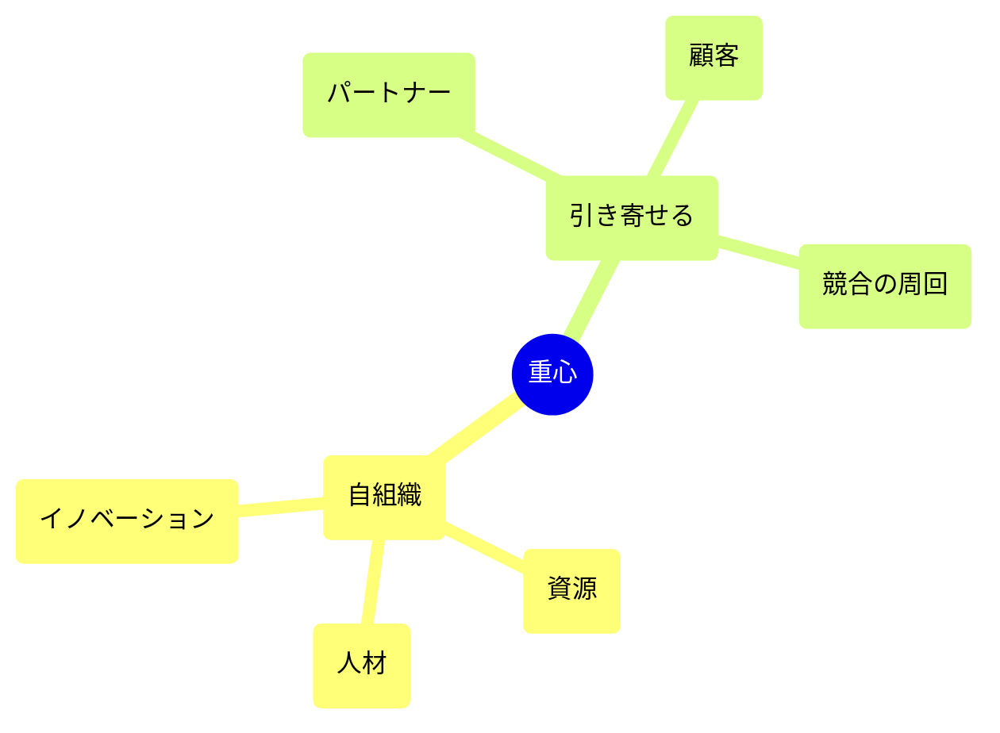

**人材、知識、資源を意図的に集中させ、他者が自発的または戦略的に自社の周りを回らざるを得ない状態を作る戦略です。**

> *「組織への市場の注目を生むために、人材の焦点を作ること。」*
>
> - Simon Wardley

## 🤔 **解説**

### 重心とは何か

重心とは、組織が人材、専門知識、データ、活動を意図的に集中させ、その領域の重心になる戦略です。優秀な人が働きたい場所、他社がその上に作りたいプラットフォーム、エコシステムが参加したい中心になることを狙います。人と資源が集まるほど引力は強まり、影響力と優位が自己強化されます。

軍事の「重心」が相手の力や結束の源を指すのに対し、事業では価値、人材、影響力が極端に集中し、周囲の配置換えを引き起こす地点を指します。

### なぜ使うのか

- 人材、データ、ネットワーク効果で持続的な優位を確保するため
- 業界の方向、標準、物語を主導するため
- パートナー、顧客、場合によっては競合まで引き寄せるため
- 成功がさらに成功を呼ぶ自己強化ループを作るため

### どう使うのか

- オープンソース、研究、イベントなど、目立つ高インパクト施策へ投資する
- 優秀な人材やパートナーに魅力的な文化やプラットフォームを作る
- 参加するほど価値が高まるよう、ネットワーク効果を促す
- 一度作った引力を維持し続ける。放置すれば重力は弱まる

## 🗺️ **実例**

### テック集積地としてのシリコンバレー

シリコンバレーは、世界の技術人材にとって重心になりました。Google、Apple、Facebookなどが作った引力により、優秀な人材が自然に集まりました。たとえばGoogleはAI研究の論文公開、TensorFlowの公開、会議開催などでAI人材の中心地になり、分野の方向へ強い影響を持ちました。

### オープンソース・エコシステムにおけるRed Hat

Red Hatは、オープンソースのプロジェクトに投資し、それを支える事業と文化を構築することで、企業向けオープンソースの重心になりました。Linuxをめぐる人材や顧客がRed Hatに集まり、IBMのような大企業でさえその引力を無視できませんでした。

### ケンブリッジとスタンフォードのイノベーション集積

英国ケンブリッジと米国スタンフォード周辺は、ともに研究者、起業家、投資家を引き寄せる集積地です。評判とネットワークが、新しい挑戦の引力源になっています。

## 🚦 **使いどころ**

<Assessment strategyName="重心">
 <MapSignals>
  <li>地図上で重要なコンポーネントや人材プールが初期進化段階にある。</li>
  <li>他者が欲しがる固有データ、資源、プラットフォームを持っている。</li>
  <li>専門家、パートナー、ユーザーが自社の周りに集まり始めている。</li>
  <li>競合やパートナーが、自社施策を参照したり追随したりしている。</li>
  <li>市場がネットワーク化しており、ハブになることが大きな影響力につながる。</li>
  <li>標準や物語を主導する明確な機会がある。</li>
 </MapSignals>
 <Readiness>
  <li>焦点領域へ資源を集中し、継続投資できる。</li>
  <li>優秀な人材やパートナーを惹きつけ、維持できる文化がある。</li>
  <li>エコシステムやコミュニティを育てる能力がある。</li>
  <li>過度な集中のリスクを管理し、適応力を保てる。</li>
  <li>人材の引き抜きや対抗ハブの構築など、対抗策に備えられる。</li>
  <li>引力を更新し続ける仕組みを持てる。</li>
 </Readiness>
</Assessment>

## 🎯 **リーダーシップ**

### 中核課題

引力を維持するには、継続投資、文化の手入れ、慢心への警戒が必要です。過去の名声に乗る場所ではなく、今も参加したい場所であり続けなければなりません。

### 必要なスキル

- [戦略的コミュニケーションとストーリーテリング](/leadership-skills/strategic-communication-and-storytelling) — 物語と方向性を定める
- [人材育成とチームづくり](/leadership-skills/talent-development-and-team-building) — 人材を引きつけ、育てる
- [提携とアライアンスの運営](/leadership-skills/partnership-and-alliance-management) — エコシステムと提携を運営する
- [コミュニティとエコシステムの育成](/leadership-skills/community-and-ecosystem-stewardship) — 文化と適応を支える
- [財務感覚と資本配分](/leadership-skills/financial-acumen-and-capital-allocation) — 投資を継続する

### 倫理面

排他的で単一文化的な環境を作らないことです。過度の集中は多様性とイノベーションを損ないます。支配が搾取へ傾かないよう、広いエコシステムへの責任もあります。

## 📋 **進め方**

### 質量を作る

卓越した人材、固有データ、独自能力など、景観の中で最も魅力的な価値密度を作ります。価値密度が高いほど、引力は強くなります。

### 表面積を作る

外部が接続、貢献、構築しやすいように、開かれたインターフェース、プラットフォーム、参加モデルを設計します。参加障壁を下げることで、ハブの周りに活動が増えます。

### 引力を作る

魅力的な物語、意味のある誘因、利害の整合を設計し、人材、パートナー、ユーザーを引き込みます。最初の魅力だけでなく、関わり続ける理由も必要です。

## 📈 **成功指標**

- 流入する人材、パートナー、ユーザーの増加
- 自社が標準やハブとして言及される頻度
- 周辺で生まれる活動、プロジェクト、価値の増加
- 業界の方向、標準、物語への影響力
- 重要人材とパートナーの定着率

## ⚠️ **失敗しやすい点**

### 集中しすぎるリスク

ひとつの場所、技術、分野へ過度に賭けると、他所のイノベーションを見落とします。

### 維持不能

重心は移ります。文化を誤れば、人材もパートナーもすぐに散ります。

### 競合の対抗策

競合は独自ハブを作ったり、人材を引き抜いたりしてきます。

### 慢心

自分たちの引力が永続すると考えると、停滞して重要性を失います。

## 🧠 **戦略的示唆**

### 強すぎる引力は罠にもなる

引力が強いほど、社内外の慣性も強まります。優位を生んだ質量が、後には硬直の原因になります。文化を更新し、プラットフォームをモジュール化し、内部反対意見にも誘因を与えなければ、重力は崩壊に変わります。

### 他者の重力を乗っ取る

重心は一から作るだけではありません。他者のハブへ入り込み、物語を少しずつ自分に有利な形へ変えることもできます。重要なのは、既存の物語と整合しつつ、重力の向きを変えることです。

### 物語自体が引力になる

人も組織も、しばしばビジョンの周りを回ります。SpaceX、OpenAI、Teslaのように、「意味のある大きな未来に取り組んでいる」という物語は、それ自体が強い引力になります。指揮は、野心、明確さ、行動が揃った物語を作り、それに内側の文化が実際に見合うようにしなければなりません。

## ❓ **問うべきこと**

- 優秀な人材は本当に自社へ集まっているか
- パートナーやユーザーにとって、自社のプラットフォームやコミュニティが第一候補か
- 引力を維持し更新するために何をしているか
- 競合はどう反応しているか。新しいハブは生まれていないか
- 多様で創造的な環境を保てているか

## 🔀 **関連戦略**

- [人材の引き抜き](/strategies/competitor/talent-raid) - 引力を維持するにも崩すにも、人材獲得は重要な動き
- [アライアンス](/strategies/ecosystem/alliances) - 提携は重力を増し、対抗ハブへの牽制にもなる
- [取り込み](/strategies/ecosystem/co-opting) - 参加者を取り込むことで重心を補強できる
- [オープンアプローチ](/strategies/accelerators/open-approaches) - 開かれた標準やプラットフォームは引力を強める
- [実験](/strategies/attacking/experimentation) - 周辺で試行を重ねることで、弱点や新しい引力点が見える
- [フールズ・メイト](/strategies/attacking/fools-mate) - ハブの盲点を突く意外な一手で支配を崩せる
- [集中投資](/strategies/attacking/directed-investment) - 資源を特定の節へ寄せて重心を作り変える

## ⛅ **関連する状勢パターン**

- [資本は新しい価値領域へ流れる](/climatic-patterns/capital-flows-to-new-areas-of-value) – トリガー: 新しいハブの周りへ投資が集まりやすい
- [効率がイノベーションを可能にする](/climatic-patterns/efficiency-enables-innovation) – 影響: 成熟基盤がどこに引力が生まれるかを変える

## 📚 **参考文献**

- [クラスターと競争の新しい経済学（Michael Porter、HBR）](https://hbr.org/1998/11/clusters-and-the-new-economics-of-competition)
- [プルの力](/books/the-power-of-pull)
- [クリティカルマス](/terms/critical-mass)
