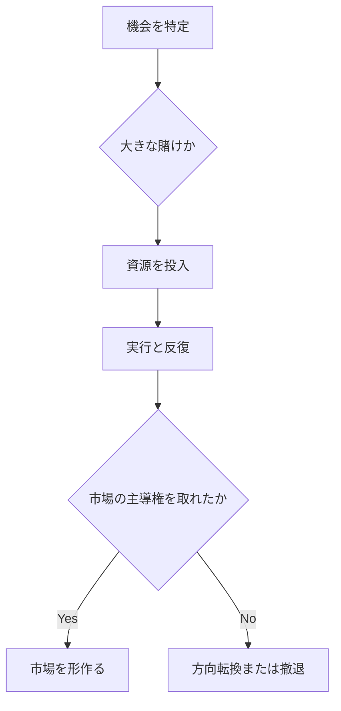

**特定の未来変化や新興領域に対して、大胆かつ集中的に資源を投じ、他者より先に優位を取りにいく戦略です。**

> *「特定または識別された未来変化に対するVC的アプローチ。」*
> – Simon Wardley

## 🤔 **解説**

### 集中投資とは何か

集中投資とは、資本、人材、研究開発、組織的な注意力を、戦略的に不可避、または極めて有望だと見た特定の変化へ意図的に寄せることです。確実になるまで薄く様子を見るのではなく、将来の状況を作り変えると判断した対象へ、VCのような高リスク高リターンの賭けを置きます。狙いは、競合より先に進化を産業化し、知財、人材、標準、市場認知で先手を取ることです。

- 地図、弱いシグナル、ホライズンスキャンから見えた明確な機会や脅威へ焦点を当てる
- 成功すれば大きいが、失敗コストも高い
- 社内ベンチャー、コーポレートVC、大規模R&Dの形をとることが多い

### なぜ使うのか

- 新しい能力の産業化や規模化で競合を飛び越えるため
- 標準、エコシステム、ユーザー期待を他者より先に形作るため
- 人材、知財、市場シェアで防御しやすい先行地位を作るため
- 変化の速い環境で、組織学習と適応を加速するため

### どう使うのか

- 地図とホライズンスキャンで、戦略的に避けがたい変化や新しい移行を特定する
- その機会が広く認識される前に、大きな資源を投じる
- 自律、学習、高速反復ができるよう投資の器を設計する
- 本流との統合度合いを調整する。分離しすぎると孤立し、近づけすぎると潰れる

## 🗺️ **実例**

### GoogleによるDeepMind買収（2014）

GoogleはAIの重要性が高まる前にDeepMindを買収し、高度な研究へ継続投資しました。これによりAI人材と技術で大きな先行を得て、後続製品群の土台を作りました。

### AT&TのBell Labs

AT&Tは独占利益をBell Labsへ振り向け、トランジスタ、衛星、情報理論といった根本技術へ集中投資しました。これは数十年にわたり通信分野での優位を支え、周辺産業まで形作りました。

### 仮想例: 製薬企業のmRNA先行投資

ある製薬企業がmRNAの弱いシグナルを早く読み取り、パンデミック前から大型投資を続けていたなら、需要が現れた瞬間に先行者優位を得ていたはずです。

### 失敗例: 1990年代の早すぎるVR投資

複数の企業がVRへ大型投資しましたが、技術も市場も整っておらず、回収できませんでした。早すぎる賭けの危険を示す例です。

## 🚦 **使いどころ**

<Assessment strategyName="Directed Investment">
 <MapSignals>
  <li>地図上で、バリューチェーンに大きな変化や不可避性が見えている。</li>
  <li>高い影響を持つ特定の新興領域を見定めている。</li>
  <li>競合はその変化に遅いか、まだ気づいていない。</li>
  <li>長期で高リスクな投資を支えられる資源がある。</li>
  <li>成功時に統合または規模化へつなぐ道筋が見えている。</li>
  <li>孤立や統合の早すぎる失敗のリスクを理解している。</li>
  <li>状況の変化を監視し、調整できる仕組みがある。</li>
 </MapSignals>
 <Readiness>
  <li>不確実性と長い時間軸に耐えられる。</li>
  <li>探索と失敗からの学習を支える文化がある。</li>
  <li>経営が早い段階で大きな資源配分を決断できる。</li>
  <li>短期圧力から投資対象を守れる。</li>
  <li>社内ベンチャーやコーポレートVCに近い運営経験がある。</li>
  <li>新規事業の自律性と本流との統合を両立できる。</li>
  <li>賭けが外れたときの撤退や転換手順がある。</li>
 </Readiness>
</Assessment>

### 向くとき

- 地図やホライズンスキャンから、戦略的に避けがたい変化を見つけたとき
- 長期の大きな賭けに耐える資源とリスク許容度があるとき
- 機会の窓が狭く、先行優位が重要なとき

### 避けるとき

- 変化の見立てが曖昧すぎて、全損リスクを許容できないとき
- 中核事業が直近で危機にあり、資源を割けないとき
- 組織文化や構造が探索的な取り組みを支えられないとき

## 🎯 **リーダーシップ**

### 中核課題

不確実性の中で大胆な賭けにコミットし、途中の曖昧さや挫折があっても支援を切らさないことです。

### 必要なスキル

- [戦略的センスメイキング](/leadership-skills/strategic-sensemaking) — 未来変化を読む
- [リスク管理とレジリエンス](/leadership-skills/risk-management-and-resilience) — リスクとシナリオを扱う
- [戦略的コミュニケーションとストーリーテリング](/leadership-skills/strategic-communication-and-storytelling) — 関係者を整合させる
- [財務感覚と資本配分](/leadership-skills/financial-acumen-and-capital-allocation) — 資本を守って配る
- [実験と学習](/leadership-skills/experimentation-and-learning) — 学習文化を育てる

### 倫理面

大きな賭けは、資源浪費、機会費用、失敗時の従業員やパートナーへの影響を伴います。透明性と責任ある資源管理が必要です。

## 📋 **進め方**

1. 地図とホライズンスキャンで高潜在の未来変化を見つける
2. 事業仮説を立て、集中的な投資への経営コミットを取る
3. 自律、学習、高速反復が回る形で実行母体を設計する
4. 状況の変化に合わせて進捗を見直し、必要なら転換・撤退する
5. 成功時には本流への統合または規模化の計画を動かす

## 📈 **成功指標**

- 対象領域での人材、知財、市場シェアの先行
- 標準、エコシステム、ユーザー期待を形作る力
- 組織学習と新能力の蓄積
- 長期的な投資対効果
- 新能力の統合や規模化の成功

## ⚠️ **失敗しやすい点**

### 間違った潮流に賭ける

重く張った未来が来なければ、大きな損失になります。

### 孤立または統合失敗

スカンクワークスが孤立しすぎても、早く本流へ戻しすぎても失敗します。

### 財務の張りすぎ

想定より時間がかかると、組織が耐えられなくなることがあります。

### 文化の不整合

親組織が短期成果を求めすぎると、新しい取り組みを自ら潰します。

## 🧠 **戦略的示唆**

### 進化とタイミング

集中投資は、早すぎても遅すぎても効きません。地図は、いつ賭けるべきかを見極める助けになります。

### 対抗策を前提にする

競合は、自分たちも投資する、買収する、標準を握ろうとするなどの手で応じます。先に張った側も、二手三手先まで備える必要があります。

### バリューチェーンの重力を動かす

集中投資は、バリューチェーンの中の重心を移し、人材、パートナー、ユーザーを引き寄せます。同時に、新しいボトルネックや標準も作りえます。

## ❓ **問うべきこと**

- どの不可避性や弱いシグナルを見ているか
- 最悪の失敗は何か
- 成功したらどう中核事業へ移すか
- 短期圧力からどう守るか
- 賭けが外れたときの撤退線はどこか
- 競合はどう返してくるか

## 🔀 **関連戦略**

- [弱いシグナル](/strategies/positional/weak-signal-horizon) - 早いシグナルが集中投資の起点になる
- [先行者戦略](/strategies/positional/first-mover) - 集中投資は先行優位を取るための主要手段
- [重心](/strategies/attacking/centre-of-gravity) - 人材や活動の新しい中心を作る投資になることがある
- [実験](/strategies/attacking/experimentation) - 大きな賭けの前後で、実験が機会を見極める
- [プレスリリース・プロセス](/strategies/attacking/press-release-process) - 投資対象の物語を整え、社内外を揃える

## ⛅ **関連する状勢パターン**

- [将来価値は確実性に反比例する](/climatic-patterns/future-value-is-inversely-proportional-to-the-certainty-we-have-over-it) – 影響: 大きな賭けは不確実だが高い価値を狙う
- [変化は必ずしも線形ではない](/climatic-patterns/change-is-not-always-linear) – トリガー: 急な移行を見越して資源を集中する理由になる

## 📚 **参考文献**

- [イノベーションのジレンマ](/books/the-innovators-dilemma)
- [コーポレートベンチャリング：イノベーション群を管理する](https://www.strategy-business.com/article/03408)
- [Google DeepMind：世界をリードするAIスタートアップの物語](https://www.techadvisor.com/article/738778/google-deepmind-the-story-behind-the-worlds-leading-ai-startup.html)
- [Bell Labs：王冠の宝石での日々](/books/bell-labs-life-in-the-crown-jewel)
