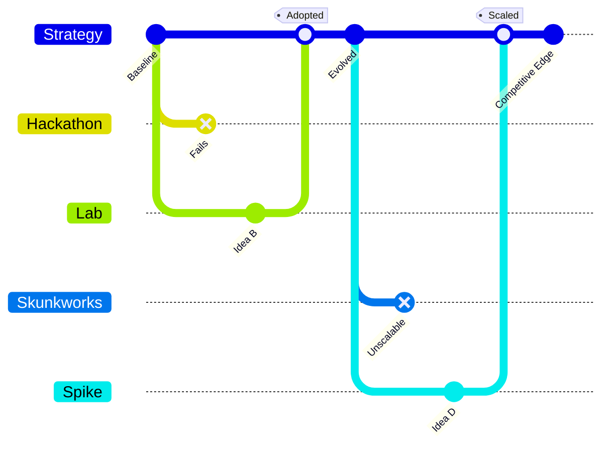

**小さく速い実験を専任チームで回し、競合より早く学んで機会を捉える戦略です。**

> *「専門家グループ、hackday、その他の実験メカニズムの活用。」*
> – Simon Wardley

## 🤔 **解説**

### 実験とは何か

実験とは、新しいアイデア、技術、市場を探索するために、軽量な試行を意図的に使うことです。組織は hackday、ラボ、スカンクワークスのような場を作り、通常の制約の外で動けるようにします。実験は可逆で安価であるべきで、大きな資源を賭ける前に、地図上の一手を試せます。

### なぜ使うのか

- 競合より先に有望な選択肢を見つけるため
- 地図で不確実な領域や新興コンポーネントが見えるときに、曖昧さを減らすため
- 失敗を許容する安全な場を作り、組織慣性を崩すため

### どう実験するか

1. 地図からテーマや焦点領域を決める
2. 時間を区切り、単純で安価な試作にする
3. 学びをすぐ回収し、うまくいったものを本流へ渡す

### 戦略的な意味

実験は学習速度を上げ、将来の優位になりうる選択肢を表面化させます。好奇心と継続改善の文化も育てます。

## 🗺️ **実例**

### Lockheed Martin の Skunk Works

小規模で隔離されたチームが、通常の官僚手続きを迂回しつつ SR-71 Blackbird のようなブレークスルーを実現しました。

### Facebook の Hackathon

短時間の hackathon から Like ボタンのような機能が生まれ、ユーザー関与を先行維持する助けになりました。

### 仮想例: 創薬の加速

AI を使う小さな探索チームが化合物スクリーニングを高速化し、従来 R&D より早く有望候補へ到達するケースです。

## 🚦 **使いどころ**

<Assessment strategyName="Experimentation">
  <MapSignals>
    <li>地図に不確実な領域や新興コンポーネントが多い。</li>
    <li>競合が新技術を試し始めている。</li>
    <li>新しいバリューチェーンの可能性は見えるが、成立性のデータがない。</li>
    <li>通常の開発は官僚制で遅い。</li>
    <li>高リスクなしに小さなパイロットを回す余力がある。</li>
  </MapSignals>
  <Readiness>
    <li>経営が失敗からの学習を支える。</li>
    <li>hackday やラボに使える時間やチームを確保できる。</li>
    <li>成功した実験を本流へ統合する道筋がある。</li>
    <li>学びと影響を測る指標がある。</li>
    <li>実験者が過剰な手続きから守られている。</li>
  </Readiness>
</Assessment>

### 向くとき

- 急な変化や不確実性に対して、速い学習が必要なとき
- 新技術や新市場を小さな賭けで探索したいとき
- 組織が実験結果に基づいて実際に動けるとき

### 避けるとき

- 規制や安全要件が高速反復を許さないとき
- 実験を拡張する道も、捨てる道もないとき
- 失敗が罰せられ、正直な試行ができないとき

## 🎯 **リーダーシップ**

### 中核課題

リスクを取れる余地を作りつつ、有望なアイデアを実際に採用できるようにすることです。

### 必要なスキル

- [Change leadership and transformation](/leadership-skills/change-leadership-and-transformation) — 好奇心と心理的安全性を育てる
- [Financial acumen and capital allocation](/leadership-skills/financial-acumen-and-capital-allocation) — 実験チームと予算を守る
- [Decision-making under uncertainty](/leadership-skills/decision-making-under-uncertainty) — 伸ばす実験と止める実験を見極める
- [Strategic communication and storytelling](/leadership-skills/strategic-communication-and-storytelling) — 学びを組織全体へ伝える

### 倫理面

実験はユーザーのプライバシーや同意を尊重する必要があります。参加者を都合よく使うような運用は避けるべきです。

## 📋 **進め方**

1. 地図から戦略テーマを定める
2. hackday、ラボ、spike に時間やチームを配分する
3. 実験は小さく、期限を切り、記録を残す
4. 結果を速く見て、拡張、反復、中止を決める
5. 学びを広く共有し、次の探索を促す

## 📈 **成功指標**

- 本流製品へ移った実験の数
- アイデアから試作までの時間短縮
- 地図上で発見された戦略選択肢の増加
- hackday や実験プログラムへの参加度
- 学びが戦略へ戻っているか

## ⚠️ **失敗しやすい点**

### イノベーション劇場

派手な hackathon だけで、実製品へ影響しないなら信用を失います。

### 焦点不足

無秩序な実験は資源を散らします。戦略テーマに沿わせる必要があります。

### 統合不足

本番へ入る道がなければ、試作は孤立し優位へ変わりません。

## 🧠 **戦略的示唆**

### 進化段階に応じて役割が変わる

コンポーネントが未成熟なほど、実験の価値は大きいです。成熟が進んだら、発見より改善へ比重を移すべきです。

### 対抗側の反応は速い

競合は成功した実験をすぐ真似ることがあります。うまくいったら、深掘りするか別方向へ切るかを早く決める必要があります。

### バリューチェーンのボトルネックを早く見つける

実験は、新しい依存関係や制約を早い段階で露出させます。まだ固まっていないバリューチェーンに対して先手を打てます。

## ❓ **問うべきこと**

- 地図からどのテーマを掘るべきか
- 結果をどう記録し共有するか
- 成功した試作をどう本番へ移すか
- 実験のための時間と予算があるか
- ユーザーや評判を損なうリスクはないか

## 🔀 **関連戦略**

- [集中投資（Directed Investment）](/strategies/attacking/directed-investment) - 実験で見えた有望領域へ大きく張る
- [重力中心（Center of Gravity）](/strategies/attacking/centre-of-gravity) - 強いラボは人材を引き寄せる中心になる
- [共創（Co-creation）](/strategies/ecosystem/co-creation) - 実験をユーザーと一緒に回すと洞察が深まる
- [Weak Signal (Horizon)](/strategies/positional/weak-signal-horizon) - 実験は弱いシグナルを確かめる初動になる
- [高速追随（Fast Follower）](/strategies/positional/fast-follower) - 他社の成功実験を素早く取り込む
- [プレスリリース・プロセス](/strategies/attacking/press-release-process) - 実験結果を物語として整え、支持を広げる
- [Circling and Probing](/strategies/competitor/circling-and-probing) - 競合位置を探る小さな試し打ちと相性がよい
- [Differentiation](/strategies/markets/differentiation) - 実験から生まれた独自性を差別化へ変える

## ⛅ **関連する状勢パターン**

- [進化や採用は時間だけでは測れない。不確実性を受け入れる必要がある](/climatic-patterns/you-cannot-measure-evolution-over-time-or-adoption-you-need-to-embrace-uncertainty) – 影響: 不確実性が高いほど実験が必要になる
- [競合の行動はゲームを変える](/climatic-patterns/competitors-actions-will-change-the-game) – トリガー: 小さな試行で競合の一手へ速く対応できる

## 📚 **参考文献**

- [Empowered](/books/empowered)
- [Empowered Product Teams](https://www.svpg.com/empowered-product-teams/)
- [Google's 20% Time](https://www.wired.com/2013/08/20-percent-time-will-never-die/)
- [Skunk Works](https://www.lockheedmartin.com/en-us/who-we-are/business-areas/aeronautics/skunkworks.html)
