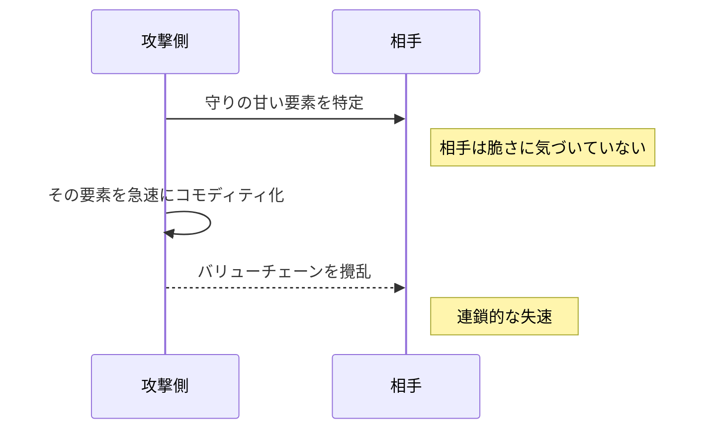

**制約を利用して上位システムの産業化を強制し、相手の土台を一気に崩す、高速でほぼ反撃しにくい戦略です。**

> *「制約を使って高次システムの産業化を強制すること。」*
>
> - Simon Wardley

## 🤔 **解説**

### フールズ・メイトとは何か

フールズ・メイトは、速度と 対抗されにくさが特徴の攻撃的な戦略機動です。相手のバリューチェーンの中にある、見落とされがちだが重要な制約を使い、あるコンポーネントのコモディティ化、つまり Wardley のいう産業化を急速に進めます。その結果、相手の上位システムや市場地位を崩します。

核心は、競合が依存しているのに十分には守っていない、あるいは重要性を誤解している要素を見つけることです。その要素をオープン化、新標準化、圧倒的効率化などで一気に安く広く入手可能にすると、相手の差別化前提が崩れます。

### なぜ強力なのか

- **驚き:** 相手が脆いと認識していない場所を突く
- **速度:** 有効な防御が立つ前に既成事実を作る
- **梃子の大きさ:** 一要素のコモディティ化で、相手のシステム全体へ大きな影響を与える
- **慣性の利用:** 既存勢力の投資、文化、既存モデルが素早い適応を妨げる
- **間接攻撃:** 中核強みへ正面から行かず、土台を崩す

### どう機能するのか

典型的には次の流れです。

1. **高い状況認識:** 相手のバリューチェーンを深く理解し、要石 となる要素を見つける
2. **相手の「愚かな前提」を見抜く:** その要素が高価、希少、専有のまま続くと思い込んでいる点を突く
3. **急速なコモディティ化:** オープンソース、新標準、無料かつ優れた代替などで一気に崩す
4. **連鎖的な破壊:** 差別化前提だった要素が普及し、上位の収益構造や価値提案が崩れる
5. **相手が反応できない:** 奇襲性、埋没費用、内部抵抗、誤認により有効反応が遅れる

### チェス由来の比喩

名前はチェス最速の 詰み に由来します。初手の認識不足で王を露出した側が、わずか二手で詰む現象です。事業でも同様に、重要要素への認識不足や 慢心 があると、特定の弱点を突かれた瞬間に想像以上に速く敗勢へ入ります。

## 🗺️ **実例**

### Wardley のコンテンツ制作シナリオ

Simon Wardley は、コンテンツ業界での仮想例として、制作・編集系システムのような下位要素を急速にコモディティ化するケースを挙げます。強力なオープンソース制作ソフトが無料で広がれば、新しい制作者が一気に増え、既存スタジオの強みだった高価な制作能力の独占が崩れます。

### Linux とプロプライエタリなサーバー OS

Linux の台頭は、単一企業の一撃ではないにせよ、サーバー OS 層の急速なコモディティ化として読むことができます。多くの既存勢力は Linux を趣味的プロジェクトと軽視しましたが、結果として 重要インフラの一層がコモディティ化し、価格力と市場支配が崩れました。

### Google による VP9 / AV1 の推進

Google と Alliance for Open Media によるロイヤルティフリーのコーデック推進は、動画コーデックという重要要素をプロプライエタリなライセンシングから切り離す動きでした。配信やデバイスの価値連鎖における重要コンポーネントがコモディティ化すると、旧来の収益構造は圧迫されます。

## 🚦 **使いどころ**

<Assessment strategyName="Fool's Mate">
  <MapSignals>
    <li>相手のバリューチェーンが、重要だが誤解・過小評価・防御不足の要素へ依存している。</li>
    <li>その要素を、自社の手段で急速にコモディティ化または neutralize できる。</li>
    <li>相手はその脆さに対する状況認識が低い。</li>
    <li>その要素のコモディティ化が、上位システムや事業モデルへ cascading failure を起こしそうだ。</li>
    <li>いったん攻撃すると相手はその要素から簡単に逃げられない。</li>
  </MapSignals>
  <Readiness>
    <li>自社は相手より高い状況認識を持っている。</li>
    <li>速度と secrecy を伴って commoditization move を実行できる。</li>
    <li>大胆で高リスクな動きを取る覚悟がある。</li>
    <li>実行後の市場でどう勝つかの設計がある。</li>
    <li>曖昧さと unintended consequences に耐える指揮がある。</li>
    <li>遅れて来る retaliation を耐えられる。</li>
  </Readiness>
</Assessment>

### 向くとき

- 相手が 明らかに過小評価している盲点 を見つけたとき
- その要素を オープンソース、新標準、技術的な破壊で急速にコモディティ化できるとき
- 相手の 状況認識 が低く、間接攻撃を予期しにくいとき
- 小さいプレイヤーが 非対称優位 を取りたいとき
- 核となる破壊行動を極めて速く実行できるとき

### 避けるとき

- 相手の状況認識が高く、すぐ検知・対抗されるとき
- 速度も 秘匿 も足りないとき
- 実行後に生まれる新しい市場で勝つ計画がないとき
- 標的要素が実はそこまで 重要でないとき
- 自社が耐えられない 報復 リスクが高いとき
- こちらこそ読み違えて「愚か者」になる危険が大きいとき

## 🎯 **リーダーシップ**

### 中核課題

課題は二つあります。

1. **正しい 要石 の特定と 秘匿**
   - 本当に 重要で、しかもコモディティ化可能な要素を見抜くこと
2. **決断と高速実行**
   - 対象を決めたら、ためらわず一気に実行すること

### 必要なスキル

- [競争インテリジェンス](/leadership-skills/competitive-intelligence) — 相手の心理とバリューチェーンを読む
- [システム思考とバリューチェーン思考](/leadership-skills/systems-and-value-chain-thinking) — 連鎖効果を読む
- [リスク管理とレジリエンス](/leadership-skills/risk-management-and-resilience) — 高リスクの一手を取る
- [不確実性下での意思決定](/leadership-skills/decision-making-under-uncertainty) — 不完全情報で決める
- [実行規律とオペレーショナルエクセレンス](/leadership-skills/execution-discipline-and-operational-excellence) — 速く正確に実行する
- [情報統制とオペレーショナルセキュリティ](/leadership-skills/information-control-and-operational-security) — 意図を隠す
- [市場と顧客インサイト](/leadership-skills/market-and-customer-insight) — 新しい市場で勝つ設計をする

### 倫理面

- 相手を深く損なう意図を持つ戦略なので、影響の重さは大きい
- 市場全体の不安定化を起こしうる
- 相手企業の従業員や周辺プレイヤーへも影響が出る
- 単なる 操作 ではなく、本当に市場非効率を崩しているかが問われる
- 冷酷な一手 と見なされたときの 評判リスク もある

## 📋 **進め方**

1. **深いバリューチェーン分析をする**
   - 相手の重要要素、依存、進化状態を地図化する
2. **候補の 要石 を見つける**
   - 重要で、防御が薄く、コモディティ化しやすく、相手が軽視している要素を探す
3. **相手の 愚か者ishness を評価する**
   - 旧来思考、傲慢、官僚主義、盲点 などを確認する
4. **コモディティ化計画 を作る**
   - オープンソース、標準化、無料版、アライアンスなどで急速に豊富さを作る
5. **秘匿と陽動を整える**
6. **速く決定的に実行する**
7. **効果を増幅する**
   - 他プレイヤーにも 採用 を広げる
8. **翌日の戦いを準備する**
   - 新市場での勝ち方をすぐ動かす

## 📈 **成功指標**

- 競合の反応が遅い、混乱している、効いていない
- 競合の市場シェア、売上、利益、ロードマップへ 測定可能な影響 が出る
- 自社が投入した コモディティ化した解決策 が急速に採用される
- 市場力学が本当に変わる
- 自社の戦略目的が達成される

## ⚠️ **失敗しやすい点**

### 要石 の見誤り

間違った要素を コモディティ化すると、資源を浪費し、相手へ警戒だけを与えます。

### 速度と 秘匿 の不足

半端な実行では 奇襲性が消えます。

### 相手の予想外の適応

慣性に賭けても、相手が速く変わることはあります。

### 実は重要ではなかった

見かけほど相手に重要でなければ、打撃は小さくなります。

### 巻き添え被害 の過小評価

自社や味方の 利益プール まで壊す危険があります。

### 破壊を刈り取れない

崩した後で勝てなければ、利益は他者に取られます。

### 予想外の 報復

驚いた相手やその 同盟者 が、別の市場で強く返してくる可能性があります。

## 🧠 **戦略的示唆**

### 奇襲性と秘匿情報 が本質

フールズ・メイトは情報格差のゲームです。相手が見ていない脆さをこちらだけが見ていることが、最大資産です。

### 既存勢力の慣性と認知バイアスを突く

大きな既存勢力ほど埋没費用、プロセス、文化抵抗、自前主義などで非定型の攻撃に弱くなります。

### 事業版の asymmetric warfare

小さいプレイヤーでも、相手の一点を突けば大きな損害を与えられます。正面戦力差を埋める代表例です。

### 価値の再評価を強制する

差別化源や利益源だった要素を コモディティ化すると、市場全体が「価値はどこにあるのか」を再評価せざるを得なくなります。

### 制約は両義的

相手の制約を突くだけでなく、自社の資源制約が creative indirect attack を生むこともあります。open source はその代表です。

### 攻撃側にも賭けの性質がある

成功すれば 市場主導権 もありえますが、失敗すれば資源を失い、意図も露出します。翌日の市場で戦う用意がない勝利は 空虚 です。

### 最善の防御は高い状況認識

自社の 重要コンポーネント を常に 地図化し、脆さへ偏執的 であることが防御になります。自分で自分を 自己侵食 する覚悟も重要です。

## ❓ **問うべきこと**

- 本当に不可欠で、しかも undervalued な要素を特定できたか
- 相手のどんな assumptions や inertia が vulnerability を生んでいるか
- 速度と 秘匿 を現実に担保できるか
- commoditization 手段は十分に 採用 を起こせるか
- 実行後の市場でどう勝つか
- 自社や ecosystem への 巻き添え被害 は何か
- 倫理的境界を越えていないか
- 想定外に相手が速く返したらどうするか

## 🔀 **関連戦略**

- [オープンアプローチ](/strategies/accelerators/open-approaches) - open source が delivery mechanism になりやすい
- [既存制約の活用](/strategies/decelerators/exploiting-constraint) - 相手制約を極端に leverage する形
- [参入障壁の切り崩し](/strategies/attacking/undermining-barriers-to-entry) - key component を コモディティ化すると障壁も崩れる
- [シグナル歪曲](/strategies/markets/signal-distortion) - capability が perception されるだけでも歪みを起こせる
- [重力中心](/strategies/attacking/centre-of-gravity) - 実は見えにくい重力中心を壊すことが多い

## ⛅ **関連する状勢パターン**

- [過去の成功は慣性を生む](/climatic-patterns/past-success-breeds-inertia) – トリガー: incumbents は脅威を dismiss しやすい
- [破壊には二つの異なる形がある](/climatic-patterns/two-different-forms-of-disruption) – 影響: 急速な commoditization shift が予想外の upheaval を起こす

## 📚 **参考文献**

- [Fool's mate in Business](https://blog.gardeviance.org/2014/11/fools-mate-in-business.html)
- [The Innovator's Dilemma](/books/the-innovators-dilemma)
- [The Black Swan](https://en.wikipedia.org/wiki/The_Black_Swan:_The_Impact_of_the_Highly_Improbable)
- [Fool's mate in chess](https://en.wikipedia.org/wiki/Fool%27s_mate)
