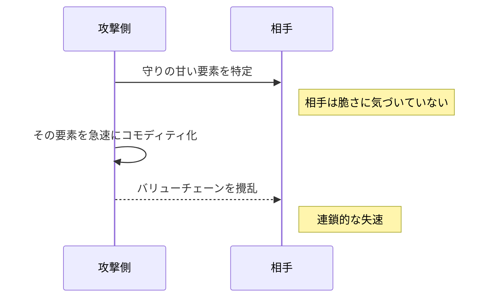

**制約を利用して上位システムの産業化を強制し、相手の土台を一気に崩す、高速で対抗の難しい戦略です。**

> *「制約を使って上位システムの産業化を強制すること。」*
>
> - Simon Wardley

## 🤔 **解説**

### フールズ・メイトとは何か

フールズ・メイトは、速度と対抗の難しさを特徴とする攻撃戦略です。相手のバリューチェーンにある、見落とされがちだが重要な制約を利用し、特定のコンポーネントのコモディティ化、つまり Wardley Mapping でいう産業化を急速に進めます。その結果、相手の上位システムや市場での地位を崩します。

核心は、競合が依存していながら十分に守っていない、あるいは重要性を誤解しているコンポーネントを見つけることです。それをオープンソース化、新たな標準の推進、圧倒的に効率のよい代替手段などによって一気に安く広く利用可能にすると、希少性や専有性を前提にしていた相手の差別化が崩れます。

### なぜ強力なのか

- **奇襲:** 相手が脆弱だと認識していない場所を突く
- **速度:** 相手が有効な防御を整える前に既成事実を作る
- **大きな梃子:** 一つのコンポーネントをコモディティ化し、相手のシステム全体へ不釣り合いに大きな影響を与える
- **慣性の利用:** 既存勢力の投資、文化、既存の事業モデルが素早い適応を妨げる
- **間接攻撃:** 中核強みへ正面から行かず、土台を崩す

### どう機能するのか

典型的には次の流れです。

1. **高い状況認識:** 相手のバリューチェーンを深く理解し、重要だが防御の甘い「要石」を見つける
2. **相手の「愚かな前提」を見抜く:** その要石が高価、希少、プロプライエタリ、または自社の管理下にあり続けるという思い込みを突く
3. **急速なコモディティ化または無力化:** オープンソース、新たな標準、無料で優れた代替手段などによって、その要石を安価で豊富なものにする
4. **連鎖的な破壊:** 差別化の前提だった要石が広く利用可能になり、上位の収益構造や価値提案が崩れる
5. **相手が対応できない状況を作る:** 奇襲、埋没費用、内部抵抗、攻撃経路への誤認によって、有効な対応を遅らせる

### チェス由来の比喩

名前は、チェスで最短となる二手のチェックメイトに由来します。序盤の不用意な手で王を致命的に露出すると、相手はその弱点を突いてすぐに勝負を決められます。事業でも同様に、重要なコンポーネントへの状況認識不足や慢心があると、特定の弱点を突かれた瞬間に想像以上の速さで敗勢へ追い込まれます。

## 🗺️ **実例**

### Wardley のコンテンツ制作シナリオ

Simon Wardley は、コンテンツ業界の仮想例として、制作・編集システムのような下位のコンポーネントを急速にコモディティ化するケースを挙げています。強力なオープンソース制作ソフトウェアが無料で広がれば、参入障壁が下がって新しい制作者が一気に増え、既存スタジオの強みだった高価な制作能力の独占が崩れます。

### Linux とプロプライエタリなサーバー OS

Linux の台頭は、単一企業による攻撃ではないものの、サーバー OS 層の急速なコモディティ化として捉えられます。多くの既存勢力は Linux を趣味的なプロジェクトだと軽視しましたが、結果として重要なインフラ層がコモディティ化し、プロプライエタリな OS ベンダーの価格決定力と市場支配力が損なわれました。

### Google による VP9 / AV1 の推進

Google による VP9 のオープンソース化と、その後のオープンメディアアライアンスによる AV1 の推進は、動画コーデックという重要なコンポーネントをプロプライエタリなライセンスモデルから切り離す動きでした。配信サービスやデバイスメーカーのバリューチェーンでコーデックがコモディティ化すると、ライセンス料に依存していた従来の収益構造は圧迫されます。

## 🚦 **使いどころ**

<Assessment strategyName="Fool's Mate">
 <MapSignals>
  <li>相手のバリューチェーンが、重要だが誤解、過小評価、または防御不足のコンポーネントに依存している。</li>
  <li>自社の手段によって、そのコンポーネントを急速にコモディティ化または無力化できる。</li>
  <li>相手は、その脆弱性に対する状況認識が低い。</li>
  <li>そのコンポーネントのコモディティ化が、上位システムや事業モデルへ連鎖的な障害を起こしそうだ。</li>
  <li>いったん攻撃を始めると、相手はそのコンポーネントへの依存から簡単には逃れられない。</li>
 </MapSignals>
 <Readiness>
  <li>自社は、競争環境と相手のバリューチェーンについて、相手より高い状況認識を持っている。</li>
  <li>十分な速度と秘匿性を保って、コモディティ化または無力化の一手を実行できる。</li>
  <li>大胆で攻撃的な、高リスクの戦略を取る覚悟がある。</li>
  <li>実行後に生まれる市場で、どのように事業を運営し利益を得るかを設計している。</li>
  <li>曖昧さと意図しない結果に耐えられる指揮体制がある。</li>
  <li>遅れて起きる可能性のある報復にも耐えられる。</li>
 </Readiness>
</Assessment>

### 向くとき

- 相手が明らかに過小評価、誤解、または防御不足のままにしている要石を見つけたとき
- その要石をオープンソース、新たな標準、または技術的な破壊によって急速にコモディティ化できるとき
- 相手の状況認識が低く、間接攻撃を予期しにくいとき
- 小規模なプレイヤーが非対称な優位を必要としているとき、または高コストの正面衝突を避けたいとき
- 核となる破壊行動を極めて速く、決定的に実行できるとき
- 相手が、標的とするコンポーネントについて明らかに慢心しているとき

### 避けるとき

- 相手の状況認識が高く、動きをすぐに検知して対抗できるとき
- 必要な速度や秘匿性がない、または代替手段に急速な採用を促すだけの魅力がないとき
- 実行後に生まれる新しい市場で勝つ計画がないとき
- 標的のコンポーネントが実はそれほど重要ではない、または相手が簡単に代替手段へ切り替えられるとき
- 自社が耐えられないほど効果的な報復を受ける可能性が高いとき
- 状況や相手の能力、市場への影響を読み違え、こちらが「愚か者」になる危険が大きいとき

## 🎯 **リーダーシップ**

### 中核課題

中核となる課題は二つあります。

1. **正しい要石の特定と秘匿**

   相手にとって本当に重要で、しかも急速にコモディティ化できる要石を正しく見抜き、分析と実行計画を徹底して秘匿します。見誤れば、資源を浪費するだけでなく、意図を早々に露呈します。

2. **決断と高速実行**

   対象を決めたら、組織やエコシステムを動員して、ためらわず一気に実行します。遅れれば奇襲の効果が失われ、相手に防御を整える時間を与えます。

### 必要なスキル

- [競争インテリジェンス](/leadership-skills/competitive-intelligence) — 相手の心理とバリューチェーンを読む
- [システム思考とバリューチェーン思考](/leadership-skills/systems-and-value-chain-thinking) — 連鎖効果を読む
- [リスク管理とレジリエンス](/leadership-skills/risk-management-and-resilience) — 高リスクの一手を取る
- [不確実性下での意思決定](/leadership-skills/decision-making-under-uncertainty) — 不完全情報で決める
- [実行規律とオペレーショナルエクセレンス](/leadership-skills/execution-discipline-and-operational-excellence) — 速く正確に実行する
- [情報統制とオペレーショナルセキュリティ](/leadership-skills/information-control-and-operational-security) — 意図を隠す
- [市場と顧客インサイト](/leadership-skills/market-and-customer-insight) — 新しい市場で勝つ設計をする

### 倫理面

- 相手へ大きな損害を与えることを意図した戦略なので、その影響の重さを直視する必要がある
- 市場全体の不安定化を起こしうる
- 相手企業の従業員や周辺プレイヤーへも影響が出る
- 市場の非効率を解消するのか、それとも不公正な操作や欺瞞に踏み込むのかを見極める必要がある
- 冷酷な一手と見なされたときの評判リスクがある
- 実行後の市場構造が健全で持続可能なものになるかも考慮する必要がある

## 📋 **進め方**

1. **バリューチェーンと状況認識を深く分析する**

   相手の重要なコンポーネント、依存関係、進化段階を地図化し、慢心、投資不足、未検証の前提がないかを調べます。

2. **候補の要石を見つける**

   相手に不可欠でありながら、防御が薄く、急速にコモディティ化でき、相手が軽視しているコンポーネントを探します。

3. **相手の「愚かな前提」を評価する**

   旧来の思考、傲慢さ、官僚主義、他領域への過度な集中、または純粋な盲点のどれが脆弱性を生んでいるかを確認します。

4. **コモディティ化計画を作る**

   オープンソース、新たな標準、無料または大幅に安い代替手段、アライアンスなどによって、要石を急速に安価で豊富なものにします。

5. **秘匿と陽動を整える:** 分析と準備を秘密にし、必要に応じて相手の注意をそらす
6. **速く決定的に実行する:** 必要な資源を揃え、最大限の速度と効果で代替手段を投入する
7. **効果を増幅する**

   他の市場参加者にも採用を促し、新しい手段の利点を伝えて相手への圧力を強めます。

8. **実行後に備える**

   相手の反応を予測し、新しく生まれた市場で勝つための製品、サービス、事業モデルをすぐに動かします。

## 📈 **成功指標**

- 競合の反応が遅い、混乱している、または有効な対抗策になっていない
- 競合の市場シェア、売上、利益、ロードマップに測定可能な影響が出る
- 自社が投入した、コモディティ化を促す解決策が急速に採用される
- 対象コンポーネントの価格低下や供給元の増加など、市場力学が実際に変わる
- 脅威の無力化や自社に有利な新市場の形成など、当初の戦略目的を達成する

## ⚠️ **失敗しやすい点**

### 要石を見誤る

重要でないコンポーネントをコモディティ化すると、資源を浪費し、戦略的な成果を得られないまま相手を警戒させます。自社にも利益をもたらしていた障壁を、意図せず取り除く可能性もあります。

### 速度や秘匿性が足りない

実行が遅い、または計画が漏れると、相手は脅威を認識して防御を整えられます。資源投入が不十分な中途半端なコモディティ化も、急速な採用を生みません。

### 相手の予想外の適応

相手の慢心や慣性に賭けても、予想以上の速さで代替手段へ移行したり、有効な対抗策を取ったりする可能性があります。

### 実は重要ではなかった

標的が見かけほど相手の中核事業に不可欠でなければ、相手は影響を吸収したり、少ない混乱で代替手段へ切り替えたりできます。

### 巻き添え被害と意図しない結果を過小評価する

コモディティ化の衝撃は、自社や協力者の利益プールまで壊す可能性があります。市場を予測や制御の難しい形で不安定化させ、自社より第三者を利することもあります。

### 破壊を刈り取れない

相手を崩すことは戦いの半分にすぎません。変化後の市場で競争し勝つ準備がなければ、利益は他者に取られます。

### 予想外の報復

奇襲を受けた相手やその協力者が、攻撃対象とは別の市場で強く報復する可能性があります。

## 🧠 **戦略的示唆**

### 奇襲と秘匿情報が本質

フールズ・メイトは、秘匿情報と奇襲をめぐるゲームです。相手が認識していない脆弱性をこちらだけが見抜いていることが、攻撃側の最大の資産です。実行前に意図が知られれば、相手は防御を整えられるため、情報優位そのものが失われます。

### 既存勢力の慣性と認知バイアスを突く

大きな既存勢力ほど、埋没費用、確立済みのプロセス、文化的な抵抗、自前主義などによって、定石から外れた攻撃に弱くなります。従来の改善へ集中する認知バイアスも、間接的な脅威への対応を遅らせます。

### 事業における非対称戦

小規模で機敏なプレイヤーでも、相手の一点に狙いを定めれば、資源を直接競り合わせずに大きな損害を与えられます。正面からの戦力差を、高い梃子の効く弱点への集中で埋める戦略です。

### 価値の再評価を強制する

差別化や利益の源泉だったコンポーネントをコモディティ化すると、対象企業だけでなく市場全体が「価値はどこにあるのか」を再評価せざるを得なくなります。利益プールが既存勢力から移り、変化後の状況に備えたプレイヤーへ新たな機会が生まれます。

### 制約は両義的

相手が希少または管理可能だと考える制約を崩す一方で、攻撃側の資源制約が創造的な間接攻撃を生むこともあります。正面対決に必要な資源がないからこそ、オープンソースで広範なエコシステムの採用を促すといった手段が強みになります。

### 攻撃側にも賭けの性質がある

成功すれば市場の主導権を握れますが、失敗すれば資源を失い、意図も露呈して報復を招きます。また、市場を破壊した後は、自らが作った新しく不安定な状況で競争しなければなりません。次の段階を戦う用意がない勝利は空虚です。

### 最善の防御は高い状況認識

自社のバリューチェーンを継続的に地図化し、重要なコンポーネントや単一障害点を把握することが最善の防御になります。依存先を分散し、脅威となる技術や事業モデルにも積極的に関わり、競合に先んじて自社製品を自ら侵食する覚悟も重要です。

## ❓ **問うべきこと**

- **脆弱性の確認:** 相手の現在の事業モデルに不可欠でありながら、本当に過小評価または防御不足のコンポーネントを特定できたか。その根拠は何か
- **相手の盲点:** 相手のどのような前提、バイアス、または組織の慣性が脆弱性を生んでいるか
- **速度と秘匿性:** 必要な速さと秘匿性を保って、コモディティ化の一手を実際に開発、投入できるか
- **コモディティ化の効果:** 選んだ手段は、相手の優位を無力化するほど急速で広範な採用を起こせるか
- **実行後の市場:** 変化後の市場で事業を運営し、勝つための明確な戦略は何か
- **巻き添え被害:** 自社、協力者、エコシステムへどのような悪影響があり、それに耐えられるか
- **倫理的境界:** 攻撃的で破壊的な性質を踏まえても、自社の倫理基準に沿っているか
- **代替策:** 相手が予想以上に速く反応した場合や、狙った効果が出なかった場合の代替策は何か

## 🔀 **関連戦略**

- [オープンアプローチ](/strategies/accelerators/open-approaches) - 重要なコンポーネントをオープンソース化し、フールズ・メイトを実行する手段になりやすい
- [既存制約の活用](/strategies/decelerators/exploiting-constraint) - 相手のバリューチェーンにある特定の制約を、極めて大きな梃子として利用する
- [参入障壁の切り崩し](/strategies/attacking/undermining-barriers-to-entry) - 重要なコンポーネントのコモディティ化によって、既存勢力を守る参入障壁も崩れる
- [シグナル歪曲](/strategies/markets/signal-distortion) - 実行には奇襲が必要だが、この一手を打てる能力が認識されるだけでも市場のシグナルを歪められる
- [重心](/strategies/attacking/centre-of-gravity) - 目立たなくても相手の事業モデルを支える重心を標的にすることが多い

## ⛅ **関連する状勢パターン**

- [過去の成功は慣性を生む](/climatic-patterns/past-success-breeds-inertia) – 引き金: 既存勢力は攻撃が始まるまで脅威を軽視しやすい
- [破壊には二つの異なる形がある](/climatic-patterns/two-different-forms-of-disruption) – 影響: 急速なコモディティ化への移行が予想外の激変を起こす

## 📚 **参考文献**

- [Fool's mate in Business](https://blog.gardeviance.org/2014/11/fools-mate-in-business.html) - Simon Wardley が、事業におけるフールズ・メイトを論じた記事
- [イノベーションのジレンマ](/books/the-innovators-dilemma) - 既存勢力に軽視された破壊的イノベーションが、業界の主導者を覆す仕組みを解説する書籍
- [The Black Swan](https://en.wikipedia.org/wiki/The_Black_Swan:_The_Impact_of_the_Highly_Improbable) - 予想外で影響の大きい事象を扱い、フールズ・メイトを仕掛ける側と受ける側の考え方に示唆を与える書籍
- [Fool's mate in chess](https://en.wikipedia.org/wiki/Fool%27s_mate) - この戦略名の由来となった、チェスの最短チェックメイトの解説
