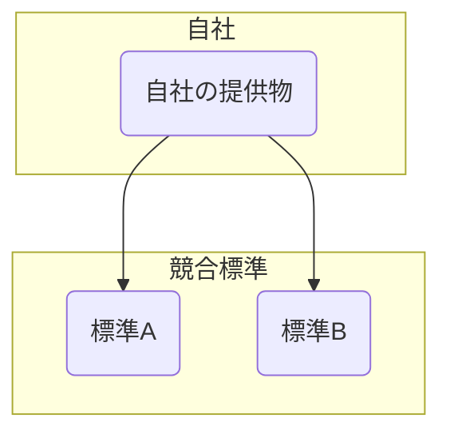

:::note
**両面張り**は、Simon Wardleyの[61種類の戦略的な駆け引きについて](https://blog.gardeviance.org/2015/05/on-61-different-forms-of-gameplay.html)で明示的には挙がっていません。
:::

**市場や標準争いの両陣営に関わり、どちらが勝っても利益を得られる位置に立つ戦略です。**

## 🤔 **解説**

### 両面張りとは何か

両面張りとは、競合する標準、プラットフォーム、陣営のどれか一つに賭け切らず、複数の側へ同時に関与する戦略です。どちらが勝っても自社が利益を得られるよう、自分を中立的な供給者、仲介者、あるいはエネーブラーとして配置します。

これは一種の戦略的裁定取引です。自社はどちらかの最終勝者になる必要はなく、争いそのものを支える位置に立ちます。両規格対応製品、クロスライセンス、競合企業への同時出資などが典型です。

### なぜ使うのか

もっとも大きな動機はリスク分散です。市場の将来が不確実なとき、一つの標準や技術に賭けるのは高リスクです。複数案を支えることで、どれか一つが外れても致命傷を避けられます。

加えて、この戦略は争いが続くほど利益が出る構造も作れます。標準戦争が続く間、自社は両側へ供給し続けられるため、不確実性そのものを脅威ではなく機会に変えられます。

## 🗺️ **実例**

### DVDとHD-DVDとBlu-ray

2000年代半ば、家庭向け映像市場ではHD-DVDとBlu-rayの標準争いが起きていました。Samsungのように両形式の再生機を出した企業は、どちらが勝っても市場に残れました。Warner Bros. も当初は両形式で映画を出し、Blu-ray勝利まで両方の利用者基盤から利益を得ていました。

### ARM Holdings

ARMはスマートフォンの大半に使われるCPUアーキテクチャを設計しています。Apple、Samsung、Qualcommなど、競合各社がARMの設計をライセンスしています。iPhoneが売れてもAndroidが売れてもARMにはロイヤルティが入るため、スマホ戦争の両側で利益を得ています。

### コーポレートベンチャーキャピタル

大企業が同じ新興市場で競う複数のスタートアップへ同時出資することがあります。どこが勝者になるかの賭けを分散しつつ、競争を促して技術進化を早める効果もあります。

## 🚦 **使いどころ**

<Assessment strategyName="両面張り">
 <MapSignals>
  <li>市場が二つ以上の競合標準やプラットフォームに分かれている。</li>
  <li>その勝敗がまだかなり不確実である。</li>
  <li>自社は全陣営へ中立的な仲介者や供給者として入れる。</li>
  <li>複数陣営を支えるコストが、外れた側へ賭ける損失より小さい。</li>
 </MapSignals>
 <Readiness>
  <li>複数の製品ラインや取り組みを支える資源がある。</li>
  <li>どちらかを明確に選ばない曖昧さに、ブランドが耐えられる。</li>
  <li>複雑なパートナー関係を管理する能力がある。</li>
  <li>関係者が、中立戦略を受け入れている。</li>
 </Readiness>
</Assessment>

### 向くとき

- 市場が流動的で、不確実性が高いとき
- 仲介者、供給者、基盤提供者として、すべての競合へサービスできるとき
- 特定陣営の勝利よりも、争い全体の拡大から利益を得られるとき

### 避けるとき

- 複数陣営対応のコストが高すぎるとき
- 主要プレイヤーが排他的コミットを求めているとき
- 不忠実だと見なされることで、関係やブランドが壊れるとき

## 🎯 **リーダーシップ**

### 中核課題

微妙な均衡を維持することです。対立する利害を同時に支えながら、機会主義的でも不誠実でもないと見せなければなりません。焦点と資源を薄めすぎず、関係管理も破綻させない設計が必要です。

### 必要なスキル

- [交渉とディールメイキング](/leadership-skills/negotiation-and-deal-making) — 競合する相手と関係を保つ
- [市場と顧客インサイト](/leadership-skills/market-and-customer-insight) — 市場変化の長期意味を読む
- [戦略的センスメイキング](/leadership-skills/strategic-sensemaking) — 競合施策へ資源をどう配るかを判断する
- [リスク管理とレジリエンス](/leadership-skills/risk-management-and-resilience) — 中立姿勢の損得を制御する

### 倫理面

この戦略は、対立から利益を得るため、冷笑的あるいは操作的と見られることがあります。市場の不確実性を自社利益のために長引かせるなら、評判リスクは高くなります。なぜ中立でいるのか、誰にどんな価値があるのかを明確に説明する必要があります。

## 📋 **進め方**

1. **対立構造を特定する:** 勝敗が不確実な複数陣営の市場状況を見つける
2. **損益を評価する:** 各陣営を支えるコストと、賭けを分散する利益を比べる
3. **中立位置を作る:** 全プレイヤーと働ける立場を設計する
4. **両対応の提供物を作る:** 製品、サービス、提携を各陣営向けに整える
5. **関係を管理する:** 偏りの疑いを避けつつ、全員との信頼を保つ
6. **市場を監視する:** どちらが優勢になるかを見つつ、資源配分を調整する

## 📈 **成功指標**

- 各陣営からの収益
- 支援しているプラットフォーム群の合計市場シェア
- 賭け分散による投資リスク低減効果
- 中立性に関するブランド認識

## ⚠️ **失敗しやすい点**

### 信頼の侵食

双方が、ライバル側にも関わる自社を警戒し、情報共有や協力が制限されることがあります。

### 資源流出

複数規格や複数製品線を支えることで、研究開発、製造、販売の資源が圧迫されます。

### 焦点の欠如

賭けを分散しすぎると、最終勝者側で十分な深さを持てず、その領域のリーダーになれません。

## 🧠 **戦略的示唆**

### 仲介者の力

この戦略は、バリューチェーン上で仲介者になることの強さを示します。最終消費者向けブランドとして勝つより、全プレイヤーへ不可欠な部品やサービスを提供する側へ回る方が、より広く価値を取れることがあります。

### 戦争を長引かせて利益化する

場合によっては、標準戦争が続くほど利益が出る構造もあります。これは高リスクで、露見すれば逆効果ですが、勝敗そのものよりも「戦争が続くこと」から利益を得る立場に自分を置く考え方です。

### 不確実性へのヘッジ

本質的には、未来を読めないことを認めたヘッジ戦略です。一つの大きな賭けではなく、もっとも可能性の高い複数の結果へリスクを分散します。荒れた市場で生き残るための、防御的で実利的な姿勢です。

## ❓ **問うべきこと**

- 今の市場対立の結果は、どの程度不確実か
- 各陣営を支えるコストとリスクは何か
- 競合プレイヤーと両方関わることで、ブランドはどう見られるか
- これは持続的戦略か、それとも一時的なヘッジか

## 🔀 **関連戦略**

- [協調](/strategies/accelerators/cooperation) - 複数の競合プレイヤーと同時に関わる協調を伴うことが多い
- [標準化ゲーム](/strategies/markets/standards-game) - 標準争いの中で取る一手の一つ
- [革新・活用・コモディティ化](/strategies/ecosystem/innovate-leverage-commoditize) - 中立供給者として市場動向を読み、次の層で活用することがある
- [奇襲](/strategies/competitor/ambush) - 信頼関係を作ってから両陣営へ競争的に仕掛けることがある
- [見せかけの競争](/strategies/user-perception/artificial-competition) - 競合が多いように見せ、交渉力を高めることがある

## ⛅ **関連する状勢パターン**

- [競合の行動はゲームを変える](/climatic-patterns/competitors-actions-will-change-the-game) – トリガー: 変わる同盟や標準争いの中で位置取りが重要になる
- [『戦争』は組織を進化させる](/climatic-patterns/a-war-causes-organisations-to-evolve) – 影響: 複数陣営へ関わることで適応速度が上がる

## 📚 **参考文献**

- *孫子*（孫武） - 複数の視点から競争地形を読むための古典
- *賭けの思考法*（Annie Duke） - 不確実性下の意思決定を扱う
