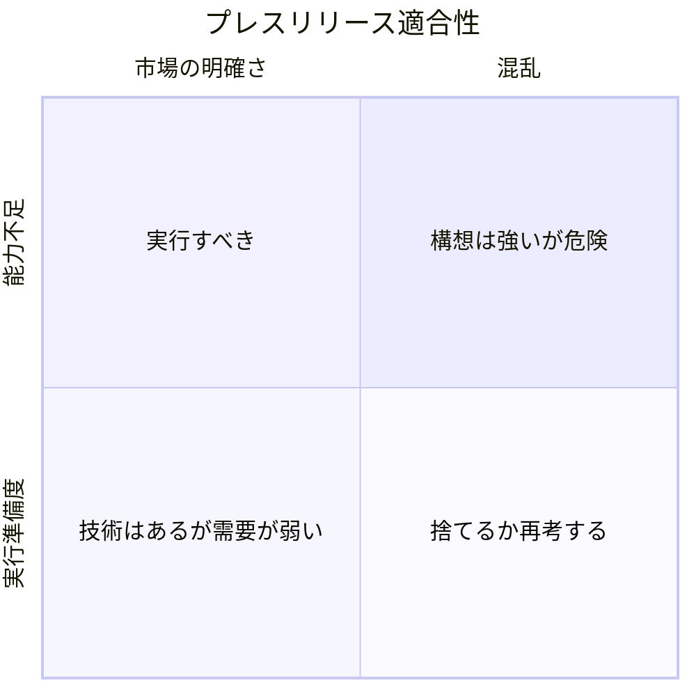

**Amazonの逆算思考を戦略道具として使い、ユーザーニーズを明確にし、進化したコンポーネントの産業化を加速する手法です。**

:::note
**プレスリリース・プロセス**は、Simon Wardleyの[61種類の戦略的な駆け引きについて](https://blog.gardeviance.org/2015/05/on-61-different-forms-of-gameplay.html)で明示的には触れられていません。
:::

## 🤔 **解説**

### プレスリリース・プロセスとは何か

プレスリリース・プロセスは、開発を始める前に、想定する製品やサービスのプレスリリースとFAQを先に書くやり方です。架空の発表文を先に作ることで、どのユーザーニーズを満たすのか、何が解決策なのか、どこが差別化なのかを最初から定義します。

地図の文脈では、これは次を意味します。

- バリューチェーンの上流であるユーザーニーズから考え始める
- 既存または十分に進化したコンポーネントの上に成果を描く
- 新奇さの追求ではなく、産業化に向けて活動を向ける

この方法は、市場で語る言葉を持たない製品を作ってしまう失敗を防ぎ、取り組みに説得力ある価値提案があるかを早い段階で確認させます。

<AssessmentToolAdvert strategyName="プレスリリース・プロセス" />

### 指針から戦略へ

プレスリリース・プロセスそのものは、明確化、整合、マッピングを促すという意味で、まずは指針に近い実践です。しかし、そこから見えたズレに対して意図的に動いたときに戦略になります。未成熟な能力に依存したプレスリリースは緊張を露わにします。そこで指揮が、その能力の進化を早めるのか、ユーザーニーズの定義を変えるのか、エコシステムを使うのか、対象範囲を絞るのかを決める。この判断が、位置取り、動き、意図を伴って初めて戦略になります。

### なぜ使うのか

この戦略は、戦略上の明確さと整合を強制します。

- 技術主導の迷走を避け、ユーザーに見える成果へ固定できる
- アイデアが成熟した能力を活かしているのか、曖昧な新規性を追っているのかが分かる
- バリューチェーン上の依存関係を可視化し、欠落や弱点を早く見つけられる

要するに、**何がコモディティ化へ向かう準備ができているかを見極め、それに合わせて効率よく作る**ための方法です。

### どう使うのか

- まずプレスリリースを書く: エンドユーザーにどんな成果が起きるのか。なぜ気にかけるのか。
- FAQを書く: 顧客や社内関係者は何を疑問に思うのか。
- 支えるバリューチェーンを地図化する: どのコンポーネントが既にあり、どれがカスタムで、どれが購入・再利用可能か。
- 価値があり、かつ既存能力で実現可能な内容になるまで発表文を磨く。

その後は、それに沿って実行します。プレスリリースは、進化の加速、チーム整合、戦略集中を促す強制装置になります。

## 🗺️ **実例**

### Amazon

AmazonではKindle、AWS、Echoなど多くの製品が、内部のプレスリリース草案から始まりました。たとえばAWS Lambdaでは、「サーバー管理なしでコードを実行する」という発表文が、開発の方向とローンチ時の説明を揃える役目を果たしました。

### Netflix

Netflixも近い手法を機能開発で使っています。たとえばオフライン視聴向けのダウンロード機能では、先に発表文や告知文を書くことで、競合より分かりやすく価値を伝えられました。

## 🚦 **使いどころ**

<Assessment strategyName="プレスリリース・プロセス">
 <MapSignals>
  <li>新しい製品、機能、ユーザー向けサービスの開発を始めようとしている。</li>
  <li>地図上ではユーザーへの可視性が高いのに、価値提案が曖昧である。</li>
  <li>支えるコンポーネントの多くが進化しており、産業化に向いている。</li>
  <li>過去に整合不足、スコープ肥大化、顧客牽引力の弱いローンチで苦労した。</li>
  <li>今のパイプラインで、技術側の熱量と市場の引力にズレがある。</li>
  <li>能力ギャップを早く見つけ、資源配分を修正する仕組みが必要である。</li>
 </MapSignals>
 <Readiness>
  <li>プレスリリースを先に書くような、物語起点の開発実践を採り入れられるチームがある。</li>
  <li>作り始める前に、物語レベルで製品案を反復できる。</li>
  <li>ユーザー向けの物語が、後付けではなくスコープと優先順位を決める規律がある。</li>
  <li>バリューチェーンを地図化し、コンポーネントの成熟度を見て実現性を確かめられる。</li>
  <li>マーケティング、プロダクト、エンジニアリングを早い段階で統合できる。</li>
  <li>プレスリリースが弱いと感じたこと自体を、見直しや中止の妥当なシグナルとして扱える。</li>
  <li>プレスリリースを、開始時の儀式ではなく、実行を導く生きた成果物として使える。</li>
 </Readiness>
</Assessment>

### 向くとき

- 新製品や大きな機能を開発するとき
- 市場起点の開発に戻したいとき
- 複数部門の足並みを揃えたいとき

### 避けるとき

- 極端に秘匿性の高い研究を進めているとき
- チームが文化的転換を受け入れず、形だけになるとき
- マーケット向けの物語を必要としない取り組みだけを扱うとき

## 🎯 **リーダーシップ**

### 中核課題

このプロセスを本気で扱い、製品設計に実際の影響を与えることです。指揮は、これを単なる形式ではなく、開発の土台として扱う文化を作らなければなりません。ユーザーニーズに合う、魅力的な発表文になるまでチームに反復を求める必要があります。

また、プレスリリースを開発ライフサイクル全体で生きた文書として使い続けることも重要です。そこへのコミットがないと、この方法は見栄えのよい儀式で終わります。

### 必要なスキル

- [ステークホルダー調整と影響力](/leadership-skills/stakeholder-alignment-and-influence) — ビジョンを揃える
- [市場と顧客インサイト](/leadership-skills/market-and-customer-insight) — 顧客中心で考える
- [戦略的コミュニケーションとストーリーテリング](/leadership-skills/strategic-communication-and-storytelling) — 物語として伝える

### 倫理面

実現できない機能を誇張したり、過度に期待を煽ったりしないことです。

## 📋 **進め方**

1. 製品のプレスリリースとFAQを草案化する
2. プレスリリースが魅力的になるまで製品案を反復する
3. 開発全体でプレスリリースを判断基準として使う
4. 製品の進化に合わせて内容も更新する

## 📈 **成功指標**

- 各施策に明確で魅力的なプレスリリースがある
- プロダクトと市場の適合が改善する
- 採用が速まり、顧客反応がよくなる
- チーム間の整合が高まる
- 機能の増殖が減る

## ⚠️ **失敗しやすい点**

### 形だけ作る

設計や投資判断に影響しないプレスリリースは、ほとんど意味がありません。

### フォロー不足

書いたあとに参照されなければ、工数だけが無駄になります。

### 過剰な約束

発表文で期待を上げすぎると、ローンチ時に現実との差が問題になります。

## 🧠 **戦略的示唆**

### バリューチェーンの整合を強制する

プレスリリース・プロセスは、資源を投じる前に、整合したバリューチェーンを定義させる強制装置です。顧客価値という終点を先に書くことで、その価値を実現するのに何が必要かを逆算させます。これにより、重要なコンポーネントや依存関係、産業化済みの土台に乗っているのか、そうでないのかが明確になります。

### バリューチェーンの上流に固定する

顧客向けの発表文から始めることで、チームは**バリューチェーン上流のユーザーニーズ**から考えざるを得ません。技術解に引きずられず、本当に満たすべき需要に焦点を保てます。

### 進化のギャップを露出させる

早い段階でローンチ文脈を仮想的に作ると、望む体験と、下支えするコンポーネントの成熟度のズレが見えます。コモディティ並みの可用性を匂わせているのに、実際はカスタムやプロダクト段階なら、それは戦略上の警告です。

### 制約そのものを戦略にする

プレスリリースは単なる物語ではなく制約です。宣言した価値に寄与しない道を捨てさせ、ノイズを減らし、スコープ肥大化を抑え、収束を早めます。

### 物語で慣性を作る

明快なプレスリリースは、社内外に慣性を生みます。社内では関係者を可視な成果へ揃え、社外では市場期待を先に形作ります。低コストで慣性を作る手です。

### 事前コミットでテンポを上げる

動きの速い市場では、遅れの原因は整合不足と手戻りです。明確なプレスリリースに先にコミットすると、チームは安定した引力点を得て、曖昧さが減り、実行速度が上がります。

### 試せる物語としての適合性

読んで弱いプレスリリースは、戦略的不適合を示す速いシグナルです。価値が本物でないか、差別化が弱いか、必要な能力が存在しない可能性があります。

## ❓ **問うべきこと**

- 顧客便益は明確に書けているか
- メッセージは単純で魅力的か
- 競合と何が違うのか

## 🔀 **関連戦略**

- [ブランドとマーケティング](/strategies/user-perception/brand-and-marketing) - 開発と市場への語りを結びつける
- [集中投資](/strategies/attacking/directed-investment) - プレスリリースで見えた能力に資源を寄せる
- [市場育成](/strategies/accelerators/market-enablement) - 顧客向け成果を支える下流の準備を整える
- [共創](/strategies/ecosystem/co-creation) - 価値提案を定義したあと、主要ユーザーやパートナーと磨ける
- [オープンアプローチ](/strategies/accelerators/open-approaches) - 標準化や利用可能性の前提を満たすのに有効
- [教育](/strategies/user-perception/education) - 行動変容が必要な物語を支える
- [差別化](/strategies/markets/differentiation) - 発表文が混雑市場での位置取りを定義する
- [ファストフォロワー](/strategies/positional/fast-follower) - 進化した能力を使って需要に素早く応える際にも使える

## ⛅ **関連する状勢パターン**

- [高次システムは新たな価値源を生む](/climatic-patterns/higher-order-systems-create-new-sources-of-worth) – 影響: 顧客向け成果から逆算することで、新しい上位価値の設計が見えやすくなる
- [効率がイノベーションを可能にする](/climatic-patterns/efficiency-enables-innovation) – トリガー: 進化したコンポーネントが揃うほど、PR/FAQで具体的な価値を描きやすい

## 📚 **参考文献**

- [ワーキング・バックワーズ](/books/working-backwards)
- [エブリシング・ストア](/books/the-everything-store)
- *ママ・テスト* - Rob Fitzpatrick
