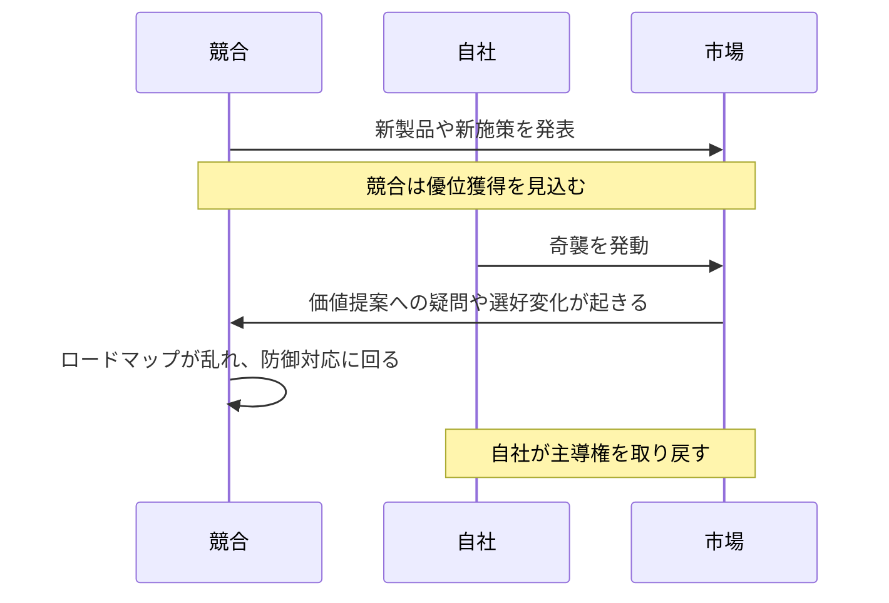

**特定の競合の進行を、タイミングを合わせた意外な一手で崩し、優位を打ち消す戦略です。**

:::note
**奇襲** は Wardley の [On 61 different forms of gameplay](https://blog.gardeviance.org/2015/05/on-61-different-forms-of-gameplay.html) で明示的には触れられていません。
:::

## 🤔 **解説**

### 奇襲とは何か

奇襲は、競合固有の動きに反応して行う、対象特化型のサプライズ攻撃です。目的は、相手の進捗を崩すこと、直近で得た優位を打ち消すこと、重要な局面で相手の事業モデルを乱すことにあります。市場全体の新規開拓を主眼とする戦略とは異なり、競合の取り組みを解体するための一点突破です。驚きは、新技術の新奇さよりも、タイミングと対抗手段の構成から生まれます。

### なぜ有効なのか

奇襲は、競合の脅威になる一手を直接打ち返し、相手の投資と勢いを空振りさせることができます。競合の強みだったはずのものを弱みに変え、防御姿勢へ追い込めます。失った地歩の回復、市場シェアの防衛、場合によっては相手の今後の計画そのものを狂わせる効果があります。

### どう機能するのか

奇襲は、優れた競合情報、忍耐、そして素早い実行に依存します。競合の行動、節目、弱点を見張り、そこへ最も効く瞬間を待ちます。引き金が見えたら、奇襲を発動します。典型例は次のようなものです。

- 競合が機能同等性へ追いついた瞬間に、自社の成熟機能をオープンソース化する
- 競合が有料で売っているものを、無料バンドルでぶつける
- 相手の新製品発表に合わせ、既存商材を大幅値下げする
- 競合の重要サプライヤや顧客を買収し、供給や市場アクセスを乱す
- 相手が高価格プレミアム案を発表した直後に、直接競合する低価格案を投入する

重要なのは計画の秘匿と、実行時の強さです。

## 🗺️ **実例**

### Microsoft による Internet Explorer の Windows 同梱

1990 年代、Netscape Navigator は単独製品として強い地位を持っていました。Microsoft はブラウザの重要性を見て、まず機能差で戦うのではなく、IE を Windows に無料同梱しました。これにより、Netscape の販売モデルは直接崩れ、無料で深く統合された IE へ市場が傾きました。これは新種の技術ではなく、バンドルと価格設計による奇襲でした。

### 中核機能のオープンソース化

仮にある Wardley Mapping ツール企業が、競合の機能追随を確認した直後に、自社の成熟した同等機能をオープン化したとします。競合がようやく手にした差分価値を、一瞬で消すことができます。

### 航空業界の価格奇襲

ある航空会社が高価格の新路線を出した直後に、競合が同一路線で大幅な低価格を打ち出すと、新路線の採算や高付加価値の物語は一気に揺らぎます。

## 🚦 **使いどころ**

<Assessment strategyName="Ambush">
  <MapSignals>
    <li>特定の競合が、自社の地位を脅かす製品を出そうとしている。</li>
    <li>競合が大きな投資を発表したが、自社にはそれを早く打ち返す余地がある。</li>
    <li>競合が節目へ達したことで、特定の対抗策に弱くなっている。</li>
    <li>競合の新しい提供に、すぐ突ける明確な弱点がある。</li>
    <li>市場状況を見ると、競合の勢いをここで止める必要がある。</li>
  </MapSignals>
  <Readiness>
    <li>高い競合情報収集能力がある。</li>
    <li>引き金を見た瞬間に、素早く決断して動ける。</li>
    <li>再構成や再投入できる既存資産や能力がある。</li>
    <li>準備中の奇襲を秘匿できる。</li>
    <li>相手からの報復に備えている。</li>
    <li>経営が大胆で攻撃的な一手を許容する。</li>
  </Readiness>
</Assessment>

## 🎯 **リーダーシップ**

### 中核課題

正確な瞬間まで待つ規律と、その瞬間に高速で強く打ち込む実行力を両立することです。競合の戦略、弱点、反応を深く理解しつつ、秘密裏に対抗策を準備しなければなりません。

### 必要なスキル

- [競争インテリジェンス](/leadership-skills/competitive-intelligence) — 競合の一手と弱点を読む
- [タイミングと戦略的忍耐](/leadership-skills/timing-and-strategic-patience) — 早すぎる行動を抑える
- [実行規律とオペレーショナルエクセレンス](/leadership-skills/execution-discipline-and-operational-excellence) — 発動時に強く実行する
- [リスク管理とレジリエンス](/leadership-skills/risk-management-and-resilience) — 強い反発を受け止める
- [情報統制とオペレーショナルセキュリティ](/leadership-skills/information-control-and-operational-security) — 計画を漏らさない
- [不確実性下での意思決定](/leadership-skills/decision-making-under-uncertainty) — 最後の状況変化へ合わせて調整する

### 倫理面

奇襲は攻撃的です。虚偽情報、違法な反競争行為、破壊工作に踏み込めば一線を越えます。正当な事業上の手段で、相手の優位を打ち消すことに留めるべきです。タイミングは 奇襲性 でも、実行内容は説明可能である必要があります。

## 📋 **進め方**

1. **対象競合を定めて監視する:** 製品計画、資金状況、提携、依存関係、発表予定を継続収集する
2. **引き金と弱点を特定する:** 何が起きたら奇襲が効くのかを見極める
3. **奇襲シナリオを準備する:** 値付け、バンドル、買収、オープン化、代替提案などを事前設計する
4. **秘匿を保つ:** 奇襲性 を壊さない
5. **引き金まで待つ:** 早撃ちはしない
6. **強く発動する:** 相手の勢いを止めるだけの強度で出す
7. **事後を管理する:** 競合反応、市場認識、次の一手をすぐ動かす

## 📈 **成功指標**

- 競合が防御反応や戦略修正を見せるか
- 競合の狙った施策が失速、撤回、低迷したか
- 対象セグメントでの市場シェア変化
- 競合の財務や株価への影響が観測できるか
- メディアやアナリストが力学変化を認識しているか

## ⚠️ **失敗しやすい点**

### タイミングを外す

競合が十分にコミットする前では効かず、遅すぎると既成事実化されます。

### 痛みが足りない

対抗策が弱いと、相手に簡単に受け流されます。

### 報復とエスカレーション

狙い撃ちの奇襲は、長く高コストな戦いを招くことがあります。

### 巻き添え被害

強すぎる奇襲は、パートナーや顧客、自社評判まで傷つけます。

### 規制・法務リスク

略奪的価格や特定の買収は、法的注視を招きます。

## 🧠 **戦略的示唆**

### 競合の ROI を無効化する

奇襲の主要目的は、競合の直近投資を無価値、または価値の低いものに変えることです。相手が資源を張り、発表し、期待を市場へ織り込ませたあとに打つことで、財務的にも心理的にも大きな痛みを与えられます。

### 攻勢を防勢へ反転させる

成功した奇襲は、相手の攻勢を止め、防御対応へ引き戻します。相手のロードマップは乱れ、こちらが競争の物語を握りやすくなります。

### 深い情報と忍耐が前提

奇襲は思いつきでは成立しません。競合の計画、能力、日程、脆弱性を深く理解し、最適な瞬間まで待つ必要があります。情報が粗いまま打つと、自ら意図を晒すだけです。

### Tech Drop との違い

[テックドロップ](/strategies/competitor/tech-drops) も 奇襲性 を含みますが、目的が違います。Tech Drop は新しい状況を作るための一手です。奇襲は、特定競合の優位を打ち消すための対抗策です。未来を作るのが Tech Drop、相手の未来獲得を妨げるのが奇襲です。

### 市場認識とエコシステムへの波及

奇襲は対象競合だけでなく、市場全体へシグナルを送ります。顧客は購買を止めて再評価し、パートナーや供給者も競合へ賭けることをためらうようになります。この波及が初撃の効果を増幅します。

### 勝っても消耗戦になる危険

奇襲は露骨に攻撃的なので、全面戦争へ発展しやすいです。短く決定打にできるか、それともピュロス的勝利になるかを見極める必要があります。

## ❓ **問うべきこと**

- どの競合のどの施策を狙うのか
- 発動の引き金は何か
- 用意した一手は本当に相手の優位を崩せるか
- 報復されたらどう返すか
- 公正かつ合法の範囲に収まっているか
- 実行後を支える資源はあるか

## 🔀 **関連戦略**

- [テックドロップ](/strategies/competitor/tech-drops) - 違いを理解すると奇襲の位置づけが明確になる
- [包囲と探り](/strategies/competitor/circling-and-probing) - 奇襲に必要な情報収集を支える
- [消耗戦](/strategies/competitor/sapping) - 競合の力や士気を削る点で近い
- [機動制限](/strategies/competitor/restriction-of-movement) - 奇襲が相手の選択肢をさらに狭めることがある
- [両面張り](/strategies/attacking/playing-both-sides) - 一方をコモディティ化して別の側を利する構図と組み合わせられる

## ⛅ **関連する状勢パターン**

- [競合の行動はゲームを変える](/climatic-patterns/competitors-actions-will-change-the-game) – トリガー: 奇襲は競合の一手への直接反応であり、再びゲームを変える
- [過去の成功は慣性を生む](/climatic-patterns/past-success-breeds-inertia) – 影響: 競合の慢心や硬直を奇襲が突ける
- [製品からユーティリティへの移行は断続平衡を示す](/climatic-patterns/shifts-from-product-to-utility-tend-to-demonstrate-a-punctuated-equilibrium) – 影響: オープン化やコモディティ化による奇襲が移行を早める

## 📚 **参考文献**

- [孫子兵法](/books/the-art-of-war) - 奇襲、タイミング、相手の備えを崩す考え方の古典
- [Judo Strategy](/books/judo-strategy) - 正面衝突を避けつつ相手の勢いを崩す競争戦略
- [Competition Demystified](/books/competition-demystified) - 競争反応と優位の崩し方を考える実務的な文脈
