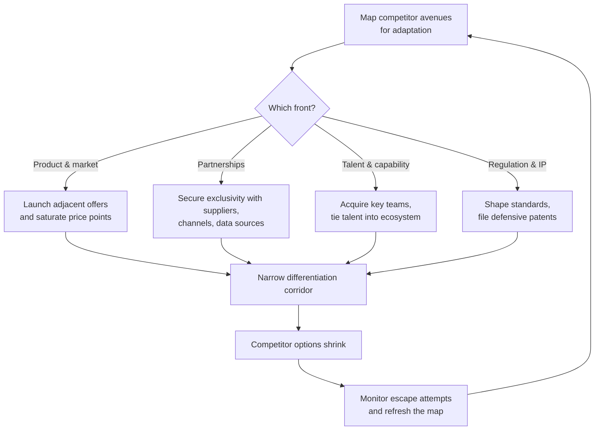

**Limiting a rival's ability to maneuver or adapt**.

> *"Limiting a competitors ability to adapt."*
>
> - Simon Wardley

This strategy, sometimes called "Circling," aims to constrain a competitor by blocking their options to evolve or react effectively.

## 🤔 **Explanation**

### What is Restriction of Movement?

Restriction of Movement, or Circling, involves strategically limiting a competitor's ability to adapt or maneuver. It's about cornering them within the market or ecosystem, constraining their choices. If they try to innovate, you've boxed them in with patents or standards. If they try to expand, you're already there. If they seek partnerships, you've secured exclusivity. The competitor faces obstacles at every turn, confined to a limited space.

### Why is Restriction of Movement a valuable leadership strategy?

This strategy doesn't necessarily eliminate a competitor but restricts their growth, change, or effective reaction, leading to stagnation while you capitalize.

### How?

By strategically controlling key aspects of the market, a business can limit a competitor's ability to grow or adapt. This can involve securing exclusive deals, establishing dominant standards, or creating patent thickets. The effect is to limit the competitor's options, forcing them into a constrained position.

### Mapping the encirclement

This view shows how multiple coordinated moves progressively reduce the viable moves available to a rival, making constant monitoring essential to keep the containment tight without overreaching.

## 🗺️ **Real-World Examples**

- **Facebook "Circling" Snapchat:** Facebook copied Snapchat's core features across its apps after failing to acquire Snapchat. Instagram Stories, WhatsApp Status, and Facebook Stories effectively encircled Snapchat's niche. This limited Snapchat's growth by restricting its room to maneuver.

- **Exclusive Deals and Ecosystem Control:** Apple's App Store policies restrict competitors on its platform by prohibiting alternative app stores and certain third-party functionalities. Microsoft's exclusive licensing deals with PC manufacturers in the 1990s limited rival operating systems' distribution.

- **Patent Fencing:** Companies create "patent thickets" by patenting a broad array of technologies, not just core inventions. This restricts competitors' innovation paths, as seen in the smartphone patent wars.

## 🚦 **When to Use / When to Avoid**

<Assessment strategyName="Restriction of Movement">
  <MapSignals>
    <li>The competitor depends heavily on a limited set of suppliers, channels, technologies, or partnerships to compete.</li>
    <li>The ecosystem shows signs of centralisation: critical enablers (e.g., platforms, standards, IP, influencers) can be controlled or preempted.</li>
    <li>Market boundaries are shifting, making it possible to act ahead of the competitor in adjacent segments.</li>
    <li>Your mapping reveals vulnerable access points (e.g., talent hubs, regulatory choke points, key APIs or standards) that the competitor relies on.</li>
    <li>The competitor has made recent moves that expose overdependence or lack of diversification in their strategic options.</li>
    <li>You have identified untapped user needs or areas where you can over-service the market to preempt lateral moves.</li>
  </MapSignals>
  <Readiness>
    <li>We have the operational scale or ecosystem reach to preemptively lock in key resources (e.g., suppliers, partners, infrastructure).</li>
    <li>We can coordinate across functions (product, legal, partnerships, marketing) to execute a coherent constraint strategy.</li>
    <li>We maintain strong intelligence on competitor movements and ecosystem dynamics to detect shifts quickly.</li>
    <li>We understand how to frame our actions to avoid regulatory or reputational blowback (e.g., as innovation or customer service).</li>
    <li>We have diversified capabilities that allow us to respond flexibly while restricting the movement of others.</li>
    <li>We can model and monitor multiple fronts of competitive interaction (technology, market access, partnerships, talent).</li>
    <li>We maintain ethical and strategic clarity to avoid escalation or overreach that damages long-term position.</li>
  </Readiness>
</Assessment>

### Use when

Leadership should use this strategy when they want to holistically control the competitive landscape.

### Avoid when

Leaders should be cautious of harming industry relationships or attracting regulatory scrutiny.

## 🎯 **Leadership**

### Core challenge

To pursue this strategy, leadership must think holistically and "surround" the competitive landscape. Leaders identify and control the competitor's critical enablers of flexibility, such as access to suppliers, distribution channels, talent, and technology. This often involves preemptive strikes, like securing exclusive partnerships.

### Key leadership skills required

- [Strategic sensemaking](/leadership-skills/strategic-sensemaking) — proactive.
- [Timing and strategic patience](/leadership-skills/timing-and-strategic-patience) — preemptive.
- [Decision-making under uncertainty](/leadership-skills/decision-making-under-uncertainty) — highly strategic.

## 📋 **How to Execute**

1. **Map avenues of competitor growth**: Identify new markets, target customers, and potential innovations.
2. **Devise actions to block or limit each avenue**: This could involve securing distribution rights, introducing competing products, or locking in key partners.
3. **Product/Market Front**: Ensure offerings in adjacent spaces to prevent competitor diversification. Maintain multiple brands to cover market segments and eliminate pricing gaps for competitors.
4. **Contract/Partnership Front**: Secure exclusive deals with suppliers or channels. Sign rising technology providers to exclusive agreements.
5. **Talent Front**: Poach or occupy talent to limit the competitor's access to expertise.
6. **Legal/IP Front**: File patents and assert IP to block competitor innovation. Lobby for regulations and standards that favor your approach.
7. **Gather information**: Monitor the competitor's plans through sales teams, industry gossip, and hiring patterns.
8. **Accelerate encirclement**: Quickly address any gaps in containment.
9. **Maintain core business strength**: Do not neglect customers or overextend the organization.
10. **Programmatic execution**: Create a checklist of potential competitor actions and systematically address each.

### Ethical considerations

Leaders should balance aggression with fair play within legal bounds.

## 📈 **Measuring Success**

Success is often seen in what doesn't happen, such as a competitor's failure to gain market share or launch new products. Proxy metrics include:

- Share of key partnerships secured
- Breadth of product portfolio
- Customer churn to competitors

## ⚠️ **Common Pitfalls and Warning Signs**

- **Competitor escape attempts**: Leaders must continually monitor competitors and respond quickly to plug any gaps in containment.
- **Overkill**: Completely encircling a non-threatening competitor can waste resources.
- **Dynamic markets**: Focus on a current competitor might blind you to new entrants or shifts.
- **Competitor changing the game**: Competitors might bypass your restrictions by introducing different business models.

## 🧠 **Strategic Insights**

Restriction of movement is fundamentally about **controlling the competitive landscape** to neutralize competitors.

### Competitor Behavior

This strategy can force competitors into strategic errors.

When restricted, competitors might attempt high-risk moves or focus on narrow market segments. If the company using restriction of movement is prepared, these reactions can weaken the competitor. For example, competitors blocked from traditional channels might try unconventional methods that fail, or focus on a small customer group. This strategy can funnel competitors into unfavorable spaces.

### External Perception

A well-executed restriction of movement can be perceived as market leadership.

Externally, the company appears omnipresent and customer-focused. Competitor complaints about being boxed out may not resonate, as actions can be framed as better service or innovation. This can make the strategy sustainable, if legal.

### Strategic Prudence

Prudence is needed to avoid counterproductivity and maintain vigilance.

Completely encircling a non-threatening competitor can waste resources. The strategy is most effective against potentially challenging competitors. It's vital to consider market dynamics, as focusing on a current competitor might create blindness to new entrants or technological shifts. Competitors might bypass restrictions with different business models. It's strategically prudent to regularly revisit and update the competitive landscape analysis as markets evolve.

Ultimately, restriction of movement can create a **stalemate favoring the stronger party**. The competitor remains, but their threat is limited. The company wins by controlling the status quo. It's a strategy of control and denial, limiting competitor options to erode their strength.

## ❓ **Key Questions to Ask**

- What are the competitor's potential avenues for growth or adaptation?
- How can we effectively block or limit each of these avenues?
- What are the potential unintended consequences of this strategy?
- How will we measure the success of this strategy?
- How can we adapt this strategy as the market evolves?

## 🔀 **Related Strategies**

- [**Alliances**](/strategies/ecosystem/alliances) - Forming alliances can be a way to restrict a competitor's access to partners.
- [**Co-opting**](/strategies/ecosystem/co-opting) - Can be used to influence the ecosystem to restrict a competitor.
- [**Raising Barriers to Entry**](/strategies/defensive/raising-barriers-to-entry) - Aims to restrict new competitors, similar to restricting existing ones.
- [**Embrace and Extend**](/strategies/ecosystem/embrace-and-extend) - Can be used to control standards and limit competitor options.
- [**Talent Raid**](/strategies/competitor/talent-raid) - Limits a competitor's movement by restricting access to talent.
- [**Limitation of Competition**](/strategies/defensive/limitation-of-competition) - The overarching goal of restriction of movement.

- [Threat Acquisition](/strategies/defensive/threat-acquisition) - absorbing potential competitors or disruptive technologies to remove threats and limit their strategic options.
- [sapping](/strategies/competitor/sapping) - gradually eroding a competitor’s resources and alliances to reduce their operational flexibility.
- [fragmentation](/strategies/competitor/fragmentation) - breaking a competitor’s cohesive structure into isolated segments, constraining their ability to respond.
- [Ambush](/strategies/competitor/ambush) - launching sudden strikes when competitors are restricted and unable to manoeuvre effectively.

## ⛅ **関連する状勢パターン**

- [Past success breeds inertia](/climatic-patterns/past-success-breeds-inertia) – influence: blocking options keeps rivals tied to outdated approaches.
- [Capital flows to new areas of value](/climatic-patterns/capital-flows-to-new-areas-of-value) – trigger: constrained players may drive investment elsewhere.

## 📚 **Further Reading & References**

- *United States v. Microsoft Corp.* - Microsoft's bundling of Internet Explorer with Windows limited Netscape's access to the market.
- *Antitrust Division | U.S. V. Microsoft: Proposed Findings Of Fact* - Detailed evidence of how Microsoft restricted competitor movement.
