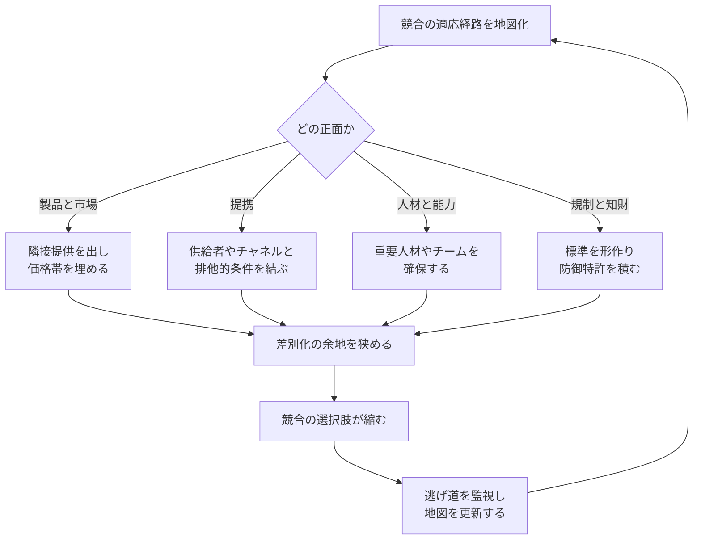

**競合が動ける経路を一つずつ塞ぎ、適応や拡張の余地を狭める戦略です。**

> *「競合の適応能力を制限すること。」*
>
> - Simon Wardley

この戦略は「囲い込み」とも呼べます。競合が前へ出ようとするたびに別の壁に当たる状態を作ります。

## 🤔 **解説**

### 機動制限とは何か

機動制限、あるいは Circling は、競合が動ける方向を戦略的に制限するやり方です。市場、供給、提携、標準、人材、知財などの要所を押さえ、相手が進化したり、隣接領域へ広がったりする余地を狭めます。相手が何かを試そうとすると、どこかが既に埋まっている。そんな状態を狙います。

### なぜ有効なのか

必ずしも競合を消す必要はありません。相手の成長、変化、反応を鈍らせ、自分がその間に市場を取りやすくすることが目的です。

### どう進めるのか

排他的契約、支配的標準、知財の壁、隣接市場への先回り、人材の確保などを組み合わせて、競合の選択肢を減らします。効果は単発ではなく、複数面からの包囲で強まります。

### 囲い込みを地図化する

## 🗺️ **実例**

### Facebook による Snapchat の囲い込み

Facebook は Snapchat の買収に失敗した後、Instagram Stories、WhatsApp Status、Facebook Stories などを展開し、Snapchat の独自性が生きる空間を狭めました。成長の余地を減らした典型例です。

### 排他的契約とエコシステム支配

Apple の App Store ポリシーは、代替ストアや第三者機能を制限し、競争相手の動きを抑えています。1990 年代の Microsoft の PC メーカーとの契約も、競合 OS の流通を狭めました。

### 特許フェンス

企業が広範な特許網を作り、競合の技術的進路を狭めるやり方です。スマートフォン特許戦争はその典型です。

## 🚦 **使いどころ**

<Assessment strategyName="Restriction of Movement">
  <MapSignals>
    <li>競合が、限られた供給者、チャネル、技術、提携に大きく依存している。</li>
    <li>重要な実現要素を先回りして押さえられるだけの集中性がエコシステムにある。</li>
    <li>市場境界が動いており、競合より先に隣接セグメントへ打てる。</li>
    <li>規制、標準、API、インフルエンサーなど、競合依存の接点が見えている。</li>
    <li>競合の最近の動きが、依存の偏りや戦略選択肢の狭さを示している。</li>
    <li>競合の横展開を先回りできる未充足ニーズがある。</li>
  </MapSignals>
  <Readiness>
    <li>重要資源を先回りして押さえられる運営規模や到達範囲がある。</li>
    <li>プロダクト、法務、提携、マーケティングを横断して動ける。</li>
    <li>競合の動きとエコシステム変化を継続監視できる。</li>
    <li>規制や評判の反発を避ける語り方と設計ができる。</li>
    <li>相手を塞ぎつつ自分は柔軟に動ける能力がある。</li>
    <li>技術、市場アクセス、提携、人材の複数正面を同時に見られる。</li>
    <li>長期的立場を損なう過剰反応を避ける判断力がある。</li>
  </Readiness>
</Assessment>

### 向くとき

- 競争地形を全体として制御したいとき
- 競合の成長経路が比較的読みやすいとき
- 重要資源を押さえる力があるとき

### 避けるとき

- 業界関係を不必要に損ないそうなとき
- 規制当局の注目を強く集めるとき
- 競合より自社のほうが機動性を失いかねないとき

## 🎯 **リーダーシップ**

### 中核課題

全体を俯瞰し、競合の柔軟性を支える実現要素を押さえることです。供給者、流通、人材、技術、規制などの複数面を「囲む」発想が要ります。

### 必要なスキル

- [戦略的センスメイキング](/leadership-skills/strategic-sensemaking) — 包囲すべき地形を読む
- [タイミングと戦略的忍耐](/leadership-skills/timing-and-strategic-patience) — 先回りして押さえる
- [不確実性下での意思決定](/leadership-skills/decision-making-under-uncertainty) — 複数正面の賭けを組み立てる

### 倫理面

攻撃性と公正の境界管理が必要です。合法でも、過度な封じ込めは長期的な信頼や業界健全性を損なうことがあります。

## 📋 **進め方**

1. 競合が成長・適応できる経路を洗い出す
2. それぞれを塞ぐ手を設計する
3. **製品・市場面:** 隣接空間へ先回りし、価格帯や用途を埋める
4. **契約・提携面:** 供給者やチャネルとの排他条件を押さえる
5. **人材面:** 必要人材やチームを確保する
6. **法務・知財面:** 特許、防御策、標準、政策形成を使う
7. 情報を集め、競合の逃げ道を監視する
8. 包囲の隙間を見つけたら早く埋める
9. 自社の中核事業を弱らせない
10. 想定される競合の一手に対し、プログラムとして対抗策を準備する

## 📈 **成功指標**

- 重要提携をどれだけ押さえられたか
- 製品ポートフォリオの幅
- 競合への顧客流出率
- 競合が新製品や新市場を出せない状態が続いているか

## ⚠️ **失敗しやすい点**

### 競合の脱出

囲い込みには継続監視が必要です。抜け道は必ず探されます。

### やりすぎ

脅威でない競合まで完全包囲しようとすると、資源浪費です。

### 市場変化の見落とし

いまの競合に意識を向けすぎると、新規参入者や技術転換を見逃します。

### ゲームそのものを変えられる

競合が別の事業モデルへ飛ぶと、包囲線が無意味になることがあります。

## 🧠 **戦略的示唆**

### 競争地形そのものを制御する

機動制限の本質は、競争相手ではなく競争地形を支配することです。相手がどう動くか以前に、動ける空間自体を狭くします。

### 追い詰められた相手は誤る

選択肢が減ると、競合は過大な賭けや狭い市場への逃避など、悪手を打ちやすくなります。こちらがそこまで読めていれば、さらに有利になります。

### 外部からは市場リーダーに見える

うまく実行すると、外からは「顧客にとって便利な総合提供者」に見え、競合の不満は届きにくくなります。ただし法的に持続可能であることが前提です。

### 常に包囲図を更新する

市場は動きます。囲い込みは一度やれば終わりではなく、継続的に地図を更新して維持する戦略です。

## ❓ **問うべきこと**

- 競合が成長または適応できる経路は何か
- その経路をどう塞ぐか
- どんな副作用がありうるか
- 成功を何で測るか
- 市場変化に合わせてどう更新するか

## 🔀 **関連戦略**

- [アライアンス](/strategies/ecosystem/alliances) - 提携で競合の接点を狭める
- [取り込み](/strategies/ecosystem/co-opting) - 参加者を取り込み、相手の余地を減らす
- [参入障壁の引き上げ](/strategies/defensive/raising-barriers-to-entry) - 新規参入の動きを止める面で近い
- [抱き込みと拡張](/strategies/ecosystem/embrace-and-extend) - 標準支配で競合の選択肢を狭める
- [人材引き抜き](/strategies/competitor/talent-raid) - 人材面の機動を奪う
- [競争制限](/strategies/defensive/limitation-of-competition) - より広い目的概念
- [脅威の買収](/strategies/defensive/threat-acquisition) - 脅威を吸収して相手の選択肢を消す
- [消耗戦](/strategies/competitor/sapping) - 資源や同盟を徐々に削る
- [断片化](/strategies/competitor/fragmentation) - 相手の一体性を壊し対応力を下げる
- [奇襲](/strategies/competitor/ambush) - 動けなくなった瞬間に奇襲をかける

## ⛅ **関連する状勢パターン**

- [過去の成功は慣性を生む](/climatic-patterns/past-success-breeds-inertia) – 影響: 選択肢を塞がれると競合は旧来路線に縛られやすい
- [資本は新しい価値領域へ流れる](/climatic-patterns/capital-flows-to-new-areas-of-value) – トリガー: 封じ込められた競合の外側へ投資が移ることがある

## 📚 **参考文献**

- [United States v. Microsoft Corp.](https://en.wikipedia.org/wiki/United_States_v._Microsoft_Corp.)
- [Antitrust Division | U.S. V. Microsoft: Proposed Findings Of Fact](https://www.justice.gov/atr/us-v-microsoft-courts-findings-fact)
