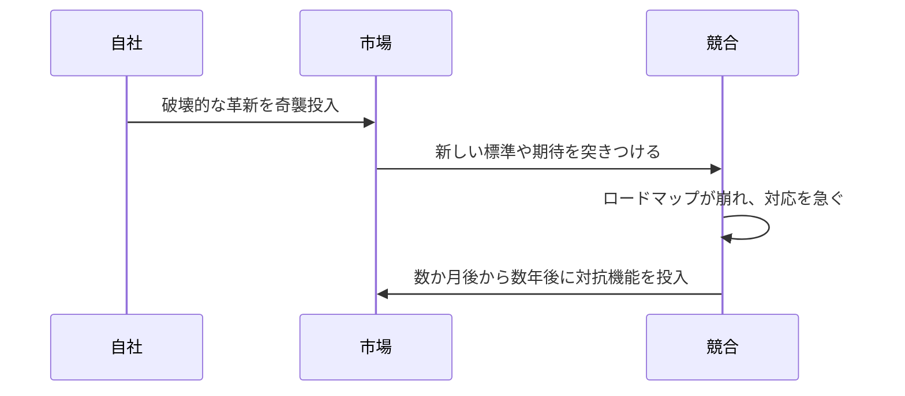

**大規模で予想外の技術革新を市場へ投入し、主導権を握って競争の前提を塗り替える戦略です。**

> *「『私に続け』という状況を作り、無防備な市場へ大規模な技術変化を投下すること。」*
>
> - Simon Wardley

## 🤔 **解説**

### テックドロップとは何か

テックドロップは、市場を形作るほど大規模な技術革新を、事前予告をほとんどせずに投入する先制的な競争戦略です。目的は、新たなパラダイムを生み出すか市場の期待を根本から変え、競合に自社が定義した現実への適応を迫ることにあります。漸進的な開発サイクルを飛び越え、能力や価値の大幅な向上を一気に示す点が特徴です。成功すれば、新たな技術標準を定め、市場全体の競争環境を作り替えられます。

### なぜ有効なのか

- 市場が進む将来の方向を、自ら主導して定義できる
- 先行者優位と市場の認知を、競合が対応する前に獲得できる
- 既存の競争優位やロードマップを無効化できる
- 持続的な市場主導権と成長の基盤を作れる

これは現在への反応ではなく、**未来を作る** 戦略です。

### どう機能するのか

成功には、先見性のある発想、秘密裏での厳格な開発、そして隙のない実行が必要です。多くの場合、専用の研究開発ラボやスカンクワークスで構想を外部から隠して育てます。同時に、供給網、インフラ、マーケティング、サポートを大規模な採用に備えます。製品と情報の公開を一つの高インパクトなイベントへ同期し、技術の新規性や優位性を示して顧客の期待を一気に塗り替えます。

## 🗺️ **実例**

### AppleのiPhone（2007）

Nokia、BlackBerry、Microsoftが物理キーボードや企業向け機能を漸進的に改善していた中で、Appleはマルチタッチ画面、フル機能のウェブブラウザ、iPodを一つの製品に統合しました。この発表は業界全体を驚かせ、当時のスマートフォンを一気に時代遅れに見せ、競合にロードマップの作り直しを迫りました。

### AWS Lambda（2014）

業界が仮想マシンとコンテナに集中していた中で、AWSはre:Inventでサーバーレスコンピューティングを市場へ投入しました。これにより新しい市場カテゴリが生まれ、AWSが主導権を握り、GoogleやMicrosoftは対抗サービスの開発に数年を費やすことになりました。

## 🚦 **使いどころ**

<Assessment strategyName="テックドロップ">
 <MapSignals>
  <li>競合が進化の初期段階にあると見ている能力を、自社はすでに産業化している。</li>
  <li>競合が、予測可能なロードマップや公開された開発サイクルに縛られている。</li>
  <li>停滞または未充足のニーズが見られる市場セグメントへ、驚きをもたらせる。</li>
  <li>奇襲を可能にする重要なボトルネックや依存関係を、自社が管理している。</li>
 </MapSignals>
 <Readiness>
  <li>強い情報統制とセキュリティのもとで、秘密裏に開発している。</li>
  <li>インフラ、供給網、サポートチームが、ローンチ初日から大規模な需要に対応できる。</li>
  <li>マーケティングとローンチを同期し、高インパクトな公開を実現できる。</li>
  <li>競合が予想以上に速く、または否定的に反応した場合の代替策がある。</li>
  <li>その革新が、単なる漸進的な機能ではなく、意味のある飛躍であり防御可能である。</li>
 </Readiness>
</Assessment>

## 🎯 **リーダーシップ**

### 中核課題

中核となる課題は、秘匿性と速度の間にある大きなリスクを管理することです。大規模な革新を秘密裏に育てるには時間と費用がかかり、プロジェクトが市場のニーズから切り離される危険もあります。リーダーは、非主流の構想へ資金を投じて守りながら、組織全体を隙のない高インパクトなローンチへ備えさせなければなりません。

### 必要なスキル

- [戦略的センスメイキング](/leadership-skills/strategic-sensemaking) — 秘密裏に進める、非主流の構想へ賭ける
- [実行規律とオペレーショナルエクセレンス](/leadership-skills/execution-discipline-and-operational-excellence) — 組織の全部門を、予告のない大規模ローンチへ備える
- [情報統制とオペレーショナルセキュリティ](/leadership-skills/information-control-and-operational-security) — 厳格な秘匿性を保ち、奇襲の効果を守る
- [イノベーションとプロダクトリーダーシップ](/leadership-skills/innovation-and-product-leadership) — 最大の効果を得られる公開の瞬間を見極める
- [戦略的コミュニケーションとストーリーテリング](/leadership-skills/strategic-communication-and-storytelling) — ローンチを取り巻く物語を形作り、自社の言葉で市場を定義する

### 倫理面

奇襲は本物のイノベーションに基づくべきであり、競合についての誤情報や市場を欺く行為に頼るべきではありません。優れた革新によって競争に勝つのであって、誤解を招く手段によって市場を動かすのではないという境界を守る必要があります。

## 📋 **進め方**

1. **梃子の効く場所を見つける:** 地図から、未充足のニーズや既存勢力の慣性が奇襲の機会を生む場所を探す
2. **秘密裏に進める:** 隔離したスカンクワークスチームと厳格な情報統制によって、情報漏えいを防ぐ
3. **受け入れ態勢を整える:** ローンチ後の需要に対応できるよう、供給網、インフラ、顧客サポートを事前に準備する
4. **公開を同期する:** 製品、マーケティング、広報を一つの高インパクトなローンチイベントへ揃える
5. **反応を観測し、機会を捉える:** 競合の反応と市場の受け止め方を追い、ローンチ後の混乱の間に顧客とパートナーを獲得する
6. **優位を維持する:** 革新をすぐに改善し、追随者との差を保つ

## 📈 **成功指標**

- **市場シェアの変化:** ローンチ後に自社の市場シェアが測定可能なほど増えたか
- **競合の反応時間:** 競合が同等の製品やサービスを投入するまで、どれだけ時間がかかったか
- **採用率:** 顧客が新しい革新をどれだけ速く採用したか
- **メディアと物語の主導権:** 発表が議論をどの程度支配し、市場の捉え方を形作ったか
- **顧客からの評価:** 革新の価値を裏付ける肯定的なレビューやフィードバックを得られたか

## ⚠️ **失敗しやすい点**

### 革新が弱い

「驚き」に十分な新規性や価値がなければ、競合は無視でき、テックドロップは不発に終わります。

### 実行が弱い

製品の不具合、脆弱な供給網、不十分な顧客サポートは、華やかなローンチを公然たる失敗に変え、ブランドの評判も損ないます。

### ファストフォロワーに抜かれる

十分に防御できない革新は、機敏な競合にすぐ模倣されます。ローンチ後も改善を続けなければ、得られた優位は短命に終わります。

## 🧠 **戦略的示唆**

### 競争時計をリセットする

成功したテックドロップは、自社を先行させるだけでなく、競争の開始線そのものを引き直します。自社が定義した新しい地点へ全参加者を戻し、既存勢力の投資やロードマップを無効にできます。

### 予測可能なロードマップを狙う

競合が公開ロードマップや漸進的な更新を通じて計画を予告するほど、この戦略は有効です。競合が次に予定している一手を、実行される前に時代遅れにする機会が生まれます。

### 物語兵器としてのテックドロップ

ローンチの奇襲性は、自社を「大胆な革新者」として印象づけ、競合を動きの遅い追随者に見せる物語を生みます。この認識が人材やパートナーを自社のエコシステムへ引き寄せれば、物語が現実を強める循環になります。

### 秘密のコストは高い

秘密開発はチームを有益な顧客フィードバックから切り離し、市場が実際には求めていないものを作る危険を高めます。成功には、ユーザーニーズへの深い理解か、その技術がもたらす変革への強い確信が必要です。

### 奇襲との違い

[奇襲](/strategies/competitor/ambush)も驚きを利用しますが、意図と性質が異なります。

| 特徴 | テックドロップ | 奇襲 |
| --- | --- | --- |
| 主な意図 | 新しい市場やパラダイムを先制的に作る | 特定の競合が持つ優位を反応的に打ち消す |
| 引き金 | 組織内部のビジョンや機会 | 競合の行動、脅威、または目前の成功 |
| 投入するもの | 新しく大規模な技術革新 | 既存または改変した資産の再配置や武器化 |
| 対象 | 市場全体と顧客の期待 | 特定の競合の戦略、ロードマップ、または事業モデル |
| 奇襲の源 | 革新そのものの規模と新規性 | 対抗策のタイミングと性質 |

## ❓ **問うべきこと**

- **重要性:** この革新は本当に飛躍なのか、それとも単なる漸進的な改善なのか
- **防御可能性:** 奇襲の効果が薄れた後、どのように自社の地位を守るのか
- **実行準備:** 組織の全部門は、ローンチ後の大規模な需要を本当に支えられるか
- **競合の反応:** 主要な競合はどのように対応する可能性が最も高く、それへどう対抗するか
- **倫理的な立場:** 優れた革新によって勝とうとしているのか、それとも評判を損なう手段に頼っていないか

## 🔀 **関連戦略**

- [包囲と探り](/strategies/competitor/circling-and-probing) - 大規模な投入へ踏み切る前に、市場の弱点やシグナルに対する競合の反応を探れる
- [陽動](/strategies/competitor/misdirection) - 中核となる革新を秘密裏に開発している間、市場の注意を別方向へそらせる
- [参入障壁の切り崩し](/strategies/attacking/undermining-barriers-to-entry) - 新しい競争環境を作り、従来の優位を無効化することで既存の参入障壁を崩せる
- [奇襲](/strategies/competitor/ambush) - 特定の競合へ反応する戦略であり、先制的に市場を作るテックドロップと対照をなす
- [切り崩し](/strategies/competitor/sapping) - 競合の資源や協力関係を消耗させ、テックドロップへの抵抗を弱める
- [競合他社の惰性の強化](/strategies/competitor/reinforcing-competitor-inertia) - 競合の慢心を深め、破壊的なローンチへの有効な対応を遅らせる
- [人材の引き抜き](/strategies/competitor/talent-raid) - 専門人材を確保し、テックドロップの開発と実行を加速する

## ⛅ **関連する状勢パターン**

- [変化は必ずしも線形ではない](/climatic-patterns/change-is-not-always-linear) – 影響: テックドロップは断続平衡のような、進化の突然の跳躍を作る
- [競合の行動はゲームを変える](/climatic-patterns/competitors-actions-will-change-the-game) – 引き金: 自らが定めた条件でゲームを変えるための一手となる

## 📚 **参考文献**

- [イノベーションのジレンマ](/books/the-innovators-dilemma) - テックドロップの基礎となり得る、破壊的イノベーションの理論を解説する書籍
- [孫子](/books/the-art-of-war) - 奇襲と欺瞞の重要性を含む、戦略に関する古典
- [AppleのiPhone発表（2007年）](https://www.youtube.com/watch?v=vN4U5FqrOdQ) - 周到に実行されたテックドロップが業界を作り替える様子を示す、発表イベントの映像
