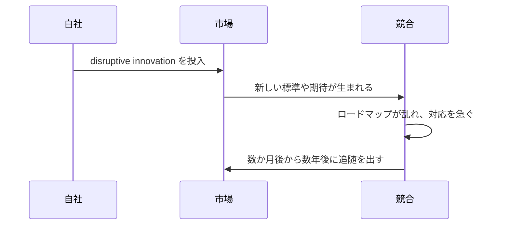

**大きく予想外な技術変化を市場へ投下し、主導権を奪って競争の時計をリセットする戦略です。**

> *「follow me の状況を作り、無防備な市場へ大きな技術変化を落とすこと。」*
>
> - Simon Wardley

## 🤔 **解説**

### テックドロップとは何か

テックドロップは、企業が市場を塗り替える規模の技術革新を、事前予告をほとんどせずに投入する proactive な競争戦略です。目的は、新しい市場パラダイムを作り、競合を自分が定義した現実へ適応させることにあります。単なる漸進改善ではなく、能力や価値の飛躍を一気に見せる点が特徴です。

### なぜ有効なのか

- 市場の未来方向を、自ら主導して定義できる
- 先行者優位と mindshare を短期間で取れる
- 既存の競争優位やロードマップを無効化できる
- 長期の指揮権と成長基盤を作れる

これは現在への反応ではなく、**未来を作る** 戦略です。

### どう機能するのか

成功には、先見的な発想、秘密裏の開発、そして flawless な実行が必要です。多くの場合、R&D ラボやスカンクワークスで秘密裏に育て、同時に供給、インフラ、サポート、マーケを大規模採用へ備えます。発表は一つの高インパクトイベントとして行い、顧客期待を一気に塗り替えます。

## 🗺️ **実例**

### Apple の iPhone（2007）

Nokia、BlackBerry、Microsoft が物理キーボードや enterprise 機能の延長戦をしていた中で、Apple はマルチタッチ、フルブラウザ、iPod 統合を一気に投下しました。既存スマートフォンの価値基準をその場で古く見せた典型です。

### AWS Lambda（2014）

業界が VM と container に集中していた中で、AWS は re:Invent で serverless を市場へ投下しました。これにより新しいカテゴリが生まれ、Google や Microsoft は数年単位で追随を強いられました。

## 🚦 **使いどころ**

<Assessment strategyName="Tech Drops">
  <MapSignals>
    <li>競合が低進化と見ている能力を、自社は産業化できている。</li>
    <li>競合が予測可能な公開ロードマップへ縛られている。</li>
    <li>停滞感や unmet need がある市場へ surprise を与えられる。</li>
    <li>サプライズを支える重要ボトルネックや依存関係を自社が握っている。</li>
  </MapSignals>
  <Readiness>
    <li>強い情報統制のもとで秘密開発できている。</li>
    <li>インフラ、供給、サポートがローンチ日に scale へ備えている。</li>
    <li>高インパクトな coordinated release の準備が整っている。</li>
    <li>競合が予想より速く返した場合の fallback がある。</li>
    <li>それが incremental feature ではなく、意味ある飛躍である。</li>
  </Readiness>
</Assessment>

## 🎯 **リーダーシップ**

### 中核課題

秘密と速度の高リスクな両立です。大きな革新を秘密裏に育てるのは遅く高くつきやすく、市場ニーズから切れる危険もあります。指揮は、この賭けを守り、なおかつ完璧な発表へ持ち込まなければなりません。

### 必要なスキル

- [Strategic sensemaking](/leadership-skills/strategic-sensemaking) — 非コンセンサスの秘密案へ賭ける
- [Execution discipline and operational excellence](/leadership-skills/execution-discipline-and-operational-excellence) — 突然の大規模発表へ備える
- [Information control and operational security](/leadership-skills/information-control-and-operational-security) — surprise を守る
- [Innovation and product leadership](/leadership-skills/innovation-and-product-leadership) — 出すべき瞬間を見極める
- [Strategic communication and storytelling](/leadership-skills/strategic-communication-and-storytelling) — 市場の語りを自分の言葉で定義する

### 倫理面

驚きは genuine innovation に基づくべきで、競合への misinformation ではありません。勝つべき理由は優れた革新である必要があります。

## 📋 **進め方**

1. **梃子点を見つける:** 地図から unmet needs や incumbents の慣性を突ける場所を探す
2. **秘密で進める:** スカンクワークスと情報統制で leaks を防ぐ
3. **受け皿を整える:** 供給、インフラ、サポートを事前に準備する
4. **発表を同期する:** 製品、マーケ、PR を単一イベントへ揃える
5. **反応を観測して刈り取る:** 市場混乱の間に顧客とパートナーを取る
6. **追撃する:** すぐ改善し、追随者との差を維持する

## 📈 **成功指標**

- 市場シェアの変化
- 競合が comparable offering を出すまでの時間
- 新しい革新の adoption rate
- 発表が市場の語りをどれだけ支配したか
- 顧客の強い肯定反応

## ⚠️ **失敗しやすい点**

### 革新が弱い

surprise 自体に十分な価値がなければ、競合は無視して終わります。

### 実行が弱い

製品不具合、供給不足、サポート崩壊は、華やかな発表を public failure に変えます。

### Fast Follower に抜かれる

防御不能な革新でなければ、機敏な競合にすぐ真似されます。

## 🧠 **戦略的示唆**

### 競争時計をリセットする

成功したテックドロップは、自社が前に出るだけでなく、競争の開始線そのものを引き直します。これまでの投資やロードマップを無効にできます。

### 予測可能なロードマップを狙う

競合の計画が読めるほど、この戦略は効きます。次の一手を obsolete にしてから出させるのが理想です。

### 物語兵器としてのテックドロップ

surprise は「大胆な革新者」という認識を作り、競合を鈍い追随者に見せます。この印象は talent や partners を引き寄せる自己強化ループになります。

### 秘密のコストは高い

秘密開発は顧客フィードバックから切れやすいので、本当に欲しいものを孤立状態で当てる深い理解が要ります。

### 奇襲との違い

[奇襲（Ambush）](/strategies/competitor/ambush) も surprise を使いますが、狙いが違います。

| 特徴 | テックドロップ | 奇襲 |
| --- | --- | --- |
| 主な意図 | 新しい市場やパラダイムを proactive に作る | 特定競合の優位を reactive に打ち消す |
| 引き金 | 内部ビジョンや機会 | 競合の行動や脅威 |
| 落とすもの | 新しく大きな技術革新 | 既存資産の再配置や weaponization |
| 対象 | 市場全体と顧客期待 | 特定競合の戦略や事業モデル |
| surprise の源 | 革新の規模と新規性 | 対抗の timing と性質 |

## ❓ **問うべきこと**

- これは本当に leap forward か
- surprise 後にどう守るか
- 組織全体は scale を支えられるか
- 主要競合はどう返すか
- reputational damage を伴う手ではないか

## 🔀 **関連戦略**

- [包囲と探り（Circling and Probing）](/strategies/competitor/circling-and-probing) - 大きな投下前に反応を見られる
- [Misdirection](/strategies/competitor/misdirection) - 開発中の注意を逸らせる
- [Undermining Barriers to Entry](/strategies/attacking/undermining-barriers-to-entry) - 新しい競争地形を作り、古い障壁を無力化する
- [奇襲（Ambush）](/strategies/competitor/ambush) - reactive な surprise と対照的
- [消耗戦（Sapping）](/strategies/competitor/sapping) - 競合資源を消耗させ、抵抗を弱めたうえで投下する
- [競合の慣性を強める](/strategies/competitor/reinforcing-competitor-inertia) - complacency を深め、効果的な返しを遅らせる
- [人材引き抜き（Talent Raid）](/strategies/competitor/talent-raid) - specialized talent を確保して開発速度を上げる

## ⛅ **関連する状勢パターン**

- [変化は常に線形ではない](/climatic-patterns/change-is-not-always-linear) – 影響: テックドロップは断続平衡のような跳躍を作る
- [競合の行動はゲームを変える](/climatic-patterns/competitors-actions-will-change-the-game) – トリガー: 自らの条件でゲームを変えるための一手

## 📚 **参考文献**

- [The Innovator's Dilemma](/books/the-innovators-dilemma)
- [The Art of War](/books/the-art-of-war)
- [Apple's iPhone launch 2007](https://www.youtube.com/watch?v=vN4U5FqrOdQ)
