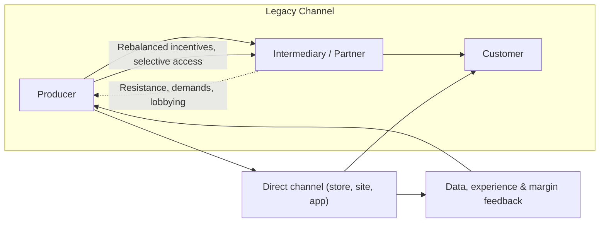

**A strategy of deliberately creating tension between distribution channels to gain control, reshape value flows, and own the customer relationship.**

> *"Exploiting new channels and conflict within existing channels to create favourable terms."*
>
> - Simon Wardley

## 🤔 **Explanation**

### What is Channel Conflict and Disintermediation?

**Channel Conflict** is the act of intentionally creating competition and tension between your different routes to market. This often takes the form of launching a direct-to-consumer (DTC) channel that competes with your existing network of partners, resellers, or distributors.

**Disintermediation** is the most common form of this conflict, where a company bypasses its traditional intermediaries to sell directly to the end customer. The goal is not just to create conflict, but to use that conflict as a lever to achieve a strategic objective, such as gaining more control over pricing, branding, and the customer relationship.

### Why use this strategy?

While it can be disruptive, creating channel conflict is a powerful way to:

- **Take Control of the Customer Relationship:** Bypassing intermediaries gives you direct access to your customers, allowing you to build a relationship, gather data, and control the brand experience.
- **Increase Margins:** By cutting out the middleman, you can capture a larger share of the profit from each sale.
- **Accelerate Market Evolution:** A direct channel allows you to innovate and iterate on your product and messaging much faster than if you had to work through partners.
- **Shift Power Dynamics:** It can be used to weaken the power of entrenched distributors or retailers, forcing them to accept more favorable terms.

### Visualising the conflict you are creating

The diagram highlights how launching a direct route introduces a new feedback loop with customers while simultaneously creating tension with incumbent intermediaries that leaders must proactively manage.

## 🗺️ **Real-World Examples**

### Apple's Retail Stores

When Apple launched its own retail stores, it created massive channel conflict with its existing network of authorized resellers and big-box electronics stores. By selling directly to consumers, Apple gained complete control over the customer experience, captured higher margins, and built one of the most powerful brands in the world. The move ultimately forced resellers to compete on Apple's terms.

### Tesla's Direct-to-Consumer Model

Tesla famously rejected the traditional automotive dealership model and chose to sell its cars directly to consumers through its own showrooms and website. This created intense conflict with powerful dealership lobbies but gave Tesla full control over pricing, branding, and the customer journey. It allowed them to educate consumers about electric vehicles in a way that traditional dealerships, with their focus on gasoline cars, would not have done.

### Nike's DTC Push

In recent years, Nike has deliberately reduced its reliance on wholesale partners like Foot Locker and Amazon, choosing instead to focus on its own direct-to-consumer channels, such as its website, apps, and flagship stores. This has created conflict with its former partners but has given Nike higher margins, direct access to customer data, and greater control over its brand image.

## 🚦 **When to Use / When to Avoid**

<Assessment strategyName="Channel Conflict and Disintermediation">
  <MapSignals>
    <li>Your map shows that powerful intermediaries (distributors, retailers) control access to your end users.</li>
    <li>Your partners are slow-moving, have high margins, or are resistant to innovation.</li>
    <li>There is a significant gap between your desired customer experience and what your partners are delivering.</li>
    <li>A direct-to-consumer model is becoming viable in your industry due to new technology (e.g., e-commerce platforms).</li>
  </MapSignals>
  <Readiness>
    <li>We have a brand that is strong enough to attract customers directly.</li>
    <li>We have the operational capability to manage logistics, customer service, and e-commerce.</li>
    <li>Our leadership has the conviction to manage the inevitable backlash from our existing partners.</li>
    <li>We have a clear plan for how to manage pricing and product availability across different channels.</li>
  </Readiness>
</Assessment>

### Use when

- You have a strong brand and can attract customers without relying on partners.
- You need direct access to customer data to drive your business.
- Your partners are holding you back or capturing too much value.
- You have the operational capability to handle direct sales and fulfillment.

### Avoid when

- You are heavily dependent on your channel partners for sales and market access.
- Your customers rely on the value-added services provided by your partners (e.g., complex installation, local support).
- You lack the brand strength or operational capacity to go direct.
- The backlash from your partners would be too damaging to your business.

## 🎯 **Leadership**

### Core challenge

The core leadership challenge is managing the fallout. This strategy will inevitably anger your existing partners, and they will likely retaliate. Leaders must have the courage to withstand this pressure and the strategic clarity to communicate why the move is necessary for the long-term health of the business. It requires a willingness to break old relationships to build new, more valuable ones.

### Key leadership skills required

- [Conflict management and diplomacy](/leadership-skills/conflict-management-and-diplomacy) — The ability to stay the course in the face of intense pressure and criticism from partners.
- [Strategic communication and storytelling](/leadership-skills/strategic-communication-and-storytelling) — The skill to craft and deliver a clear narrative that explains the rationale for the change to all stakeholders.
- [Change leadership and transformation](/leadership-skills/change-leadership-and-transformation) — The ability to manage the internal and external transition to a new channel model.
- [Decision-making under uncertainty](/leadership-skills/decision-making-under-uncertainty) — The willingness to make a bold, potentially risky move and see it through.

### Ethical considerations

This strategy can have a significant negative impact on the businesses of your partners. It is crucial to be transparent and fair in your dealings, even as you are creating conflict. Blindsiding long-term partners or using your power to crush them can be seen as unethical and can damage your reputation. While the goal is to shift the power dynamic, it should be done with a degree of professionalism and respect.

## 📋 **How to Execute**

1. **Analyze the Value Chain:** Map out your current routes to market and identify the costs and benefits of each. Where is value being created, and where is it being captured?
2. **Develop the Direct Channel:** Build the infrastructure for your direct channel. This could be an e-commerce website, a physical store, or a direct sales team.
3. **Define the Rules of Engagement:** Decide how you will manage the conflict. Will you offer different products or pricing in your direct channel? How will you handle leads that come through your website but are in a partner's territory?
4. **Launch and Communicate:** Launch your direct channel and clearly communicate the new reality to your partners. Be prepared for a negative reaction.
5. **Manage the Transition:** Carefully manage the transition period. You may need to offer incentives to partners to keep them on board, or you may need to be prepared to lose some of them.
6. **Optimize the Direct Channel:** Continuously invest in and improve your direct channel to make it the preferred route to market for your customers.

## 📈 **Measuring Success**

- **Direct Revenue Growth:** Is the revenue from your direct channel growing and becoming a significant part of your business?
- **Margin Improvement:** Are your overall profit margins improving as you shift sales to the direct channel?
- **Customer Data:** Are you gathering valuable customer data that you can use to improve your products and marketing?
- **Brand Strength:** Is your brand becoming stronger and more recognized in the market?

## ⚠️ **Common Pitfalls and Warning Signs**

### Underestimating Partner Backlash

Your partners will not be happy, and they may actively work to undermine your business. Be prepared for a fight.

### Operational Failures

If you are not ready to handle the complexities of e-commerce, logistics, and customer service, your direct channel will fail and damage your brand.

### Channel Confusion

If customers are confused about where to buy your product or see inconsistent pricing across channels, it can create a negative experience.

### Half-Measures

A hesitant or poorly executed move into a direct channel can give you the worst of both worlds: you anger your partners without gaining the full benefits of going direct.

## 🧠 **Strategic Insights**

### The Inevitability of Disintermediation

In many industries, the internet has made disintermediation inevitable. The companies that embrace this shift and build direct relationships with their customers are the ones that are most likely to succeed in the long run.

### Conflict as a Catalyst

Channel conflict is not just about cutting costs; it's about forcing change. It can be a powerful catalyst for innovation and a way to break free from the inertia of legacy business models.

## ❓ **Key Questions to Ask**

- **The Power Dynamic:** Who currently owns the customer relationship in our market, and why?
- **The Value of Intermediaries:** What value are our partners providing, and can we provide that value ourselves?
- **The Risk of Inaction:** What is the long-term risk of allowing our partners to control our destiny?
- **The Operational Readiness:** Are we truly ready to handle the operational complexities of a direct-to-consumer business?
- **The Transition Plan:** How will we manage the transition and the inevitable conflict with our existing partners?

## 🔀 **Related Strategies**

- **[Buyer-Supplier Power](/strategies/markets/buyer-supplier-power)**: This strategy is a direct attempt to shift the balance of power between you and your buyers (in this case, your channel partners).
- **[Vertical Integration](/terms/value-chain)**: Disintermediation is a form of vertical integration, as you are taking on a part of the value chain that was previously outsourced.
- **[Direct-to-Consumer (DTC)](https://en.wikipedia.org/wiki/Direct-to-consumer)**: This is the most common manifestation of a disintermediation strategy.

- [Two-Sided Markets](/strategies/ecosystem/two-factor-markets) - creating platforms that directly connect supply and demand sides, bypassing traditional channel partners.

## ⛅ **関連する状勢パターン**

- [Shifts from product to utility tend to demonstrate a punctuated equilibrium](/climatic-patterns/shifts-from-product-to-utility-tend-to-demonstrate-a-punctuated-equilibrium) – trigger: direct channels emerge as industries commoditise.
- [Capital flows to new areas of value](/climatic-patterns/capital-flows-to-new-areas-of-value) – influence: investment follows successful disintermediation efforts.

## 📚 **Further Reading & References**

- **[The Direct-to-Consumer Playbook](/books/the-direct-to-consumer-playbook)** by Mike Stevens. A guide to building a DTC business.
- **[Unlocking the Customer Value Chain: How Decoupling Drives Consumer Disruption](/books/unlocking-the-customer-value-chain)** by Thales S. Teixeira and Greg Piechota. Analysis of how decoupling shifts value and drives disintermediation.
