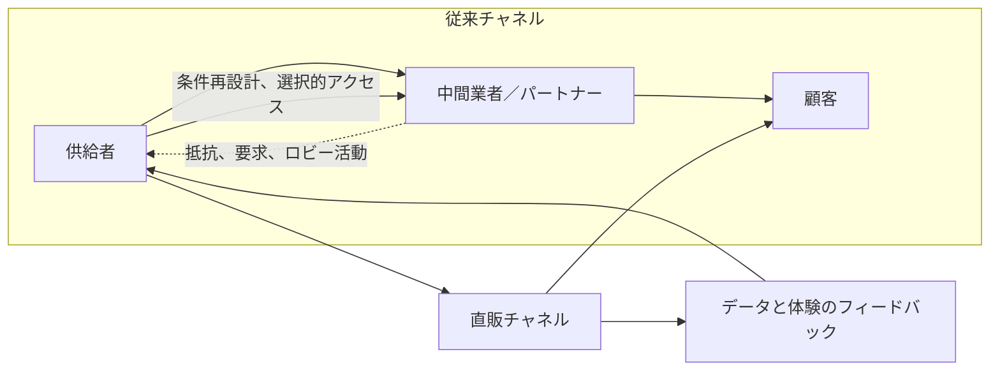

**流通チャネル間に意図的な競合を生み出し、顧客関係、価格、価値の流れに対する主導権を取り戻す戦略です。**

> *「新しいチャネルと既存チャネル内の競合を利用し、有利な条件を作ること。」*
>
> - Simon Wardley

## 🤔 **解説**

### チャネル競合と中間排除とは何か

**チャネル競合** とは、市場への経路同士にあえて緊張関係を作ることです。典型例は、既存の代理店、再販業者、流通業者のネットワークと競合する直販チャネルを立ち上げることです。

**中間排除** はその代表形で、従来の中間業者を迂回し、最終顧客へ直接販売するやり方です。目的は衝突そのものではなく、その衝突を梃子にして、価格、ブランド、顧客接点を自社で握り直すことにあります。

### なぜ使うのか

- **顧客関係を自分で持てる:** 顧客データを直接取り、ブランド体験を統制できる
- **粗利を改善できる:** 中間マージンを減らし、より多くの利益を確保できる
- **市場進化を速められる:** パートナー経由より速く製品やメッセージを変えられる
- **力関係を変えられる:** 既存流通の交渉力を下げ、自社に有利な条件を作れる

### 作り出す競合を地図化する

この図は、直販経路を作ることで顧客との新しいフィードバックループが生まれ、同時に既存中間業者との緊張管理が必要になることを示しています。

## 🗺️ **実例**

### Appleの直営店

Appleが自社直営店を始めたとき、既存の認定販売店や量販店とは大きなチャネル競合が生まれました。Appleは顧客体験を完全に管理し、粗利を高め、強いブランドを築きました。結果として販売店はAppleの条件で競争するしかなくなりました。

### TeslaのDTCモデル

Teslaは従来の自動車ディーラー方式を採らず、自社ショールームとサイトで直接販売しました。ディーラー業界との激しい対立を招きましたが、価格、ブランド、顧客体験を自社で握れたことで、EVの価値提案を自分たちの言葉で市場へ伝えられました。

### NikeのDTCシフト

Nikeは近年、Foot LockerやAmazonなどの卸依存を減らし、自社サイト、アプリ、旗艦店へ寄せています。旧来パートナーとの摩擦はありましたが、粗利改善、顧客データ取得、ブランド統制という果実を得ました。

## 🚦 **使いどころ**

<Assessment strategyName="Channel Conflict and Disintermediation">
 <MapSignals>
  <li>強い中間業者が、エンドユーザーへのアクセスを握っている。</li>
  <li>パートナーが遅く、高マージンで、イノベーションにも抵抗している。</li>
  <li>望む顧客体験と、パートナー経由で実際に提供される体験の間に大きな差がある。</li>
  <li>新技術により、直販モデルが実行可能になってきた。</li>
 </MapSignals>
 <Readiness>
  <li>顧客を直接引き寄せられるだけのブランド力がある。</li>
  <li>物流、顧客対応、EC運営を担える能力がある。</li>
  <li>既存パートナーからの反発を受け止める覚悟がある。</li>
  <li>価格、商品供給、案件配分をチャネル横断で設計できる。</li>
 </Readiness>
</Assessment>

### 向くとき

- 強いブランドがあり、パートナーなしでも顧客を集められるとき
- 顧客データを直接取りたいとき
- パートナーが進化を妨げたり、価値を取りすぎたりしているとき
- 直販運営を回せる能力があるとき

### 避けるとき

- チャネルパートナーへの依存が大きすぎるとき
- パートナーが提供する導入、保守、地域支援が不可欠なとき
- ブランド力や運営能力が不足しているとき
- パートナー反発が事業へ致命傷になるとき

## 🎯 **リーダーシップ**

### 中核課題

最大の課題は、必ず起こる反発を管理することです。既存パートナーは怒り、報復してくる可能性があります。指揮は、その圧力に耐えつつ、なぜこの移行が事業の長期的健全性に必要なのかを明確に語らなければなりません。

### 必要なスキル

- [対立管理と外交](/leadership-skills/conflict-management-and-diplomacy) — パートナーからの強い圧力に耐える
- [戦略的コミュニケーションとストーリーテリング](/leadership-skills/strategic-communication-and-storytelling) — 変化の理由を関係者へ説明する
- [変革リーダーシップ](/leadership-skills/change-leadership-and-transformation) — 新しいチャネルモデルへの移行を進める
- [不確実性下での意思決定](/leadership-skills/decision-making-under-uncertainty) — リスクのある一手をやり切る

### 倫理面

この戦略はパートナー事業へ大きな悪影響を与える可能性があります。対立を作るとしても、透明で、公正で、敬意ある進め方が必要です。長年のパートナーを不意打ちし、力で押し潰すような振る舞いは、評判を傷つけます。

## 📋 **進め方**

1. **バリューチェーンを分析する:** 現在の販売経路ごとの価値創出と価値取得を整理する
2. **直販チャネルを構築する:** EC、直販チーム、実店舗など必要な基盤を作る
3. **交戦規則を決める:** 価格差、品揃え、案件配分、地域対応をどう扱うか決める
4. **立ち上げて伝える:** 新しい現実をパートナーへ明確に伝え、反応に備える
5. **移行を管理する:** 必要なら誘因を設け、失うパートナーも想定しておく
6. **直販を磨き続ける:** 顧客にとって最良の経路になるよう継続投資する

## 📈 **成功指標**

- 直販売上の成長
- 全体粗利の改善
- 取得できる顧客データの質と量
- ブランド認知とブランド統制の向上

## ⚠️ **失敗しやすい点**

### 反発の過小評価

パートナーは不満を持つだけでなく、積極的に妨害してくることがあります。

### 運営破綻

物流、EC、顧客サポートを回せない直販は、ブランドを傷つけます。

### チャネル混乱

どこで買うべきか、価格がなぜ違うのかが分からないと、顧客体験が悪化します。

### 半端な実行

中途半端に直販へ入ると、パートナーは怒るのに、直販の果実は得られません。

## 🧠 **戦略的示唆**

### 中間排除は多くの業界で不可避

インターネットによって、多くの業界では中間排除が避けがたい流れになりました。顧客との直接関係を築く企業ほど、長期的に強くなりやすいです。

### 競合は変化の触媒にもなる

チャネル競合は単なるコスト削減ではなく、変化を強制する手でもあります。旧来モデルの慣性を破り、新しい提供形態へ進むきっかけになります。

## ❓ **問うべきこと**

- 今の市場で顧客関係を誰が握っているのか
- 中間業者はどの価値を提供しており、それを自社で再現できるのか
- パートナーに運命を委ね続ける長期リスクは何か
- 直販の運営複雑性に本当に耐えられるか
- 既存パートナーとの衝突をどう移行管理するか

## 🔀 **関連戦略**

- [買い手と供給者の力関係](/strategies/markets/buyer-supplier-power) - 買い手との力関係を変える直接の一手
- [バリューチェーン](/terms/value-chain) - 中間排除はバリューチェーンの再統合でもある
- [消費者直接取引（DTC）](https://en.wikipedia.org/wiki/Direct-to-consumer) - 中間排除の代表的な実装形
- [両面市場](/strategies/ecosystem/two-factor-markets) - 従来の流通を飛ばし、供給側と需要側を直接つなぐ

## ⛅ **関連する状勢パターン**

- [製品からユーティリティへの移行は断続平衡を示す](/climatic-patterns/shifts-from-product-to-utility-tend-to-demonstrate-a-punctuated-equilibrium) – トリガー: コモディティ化が進むと直販経路が現れやすい
- [資本は新しい価値領域へ流れる](/climatic-patterns/capital-flows-to-new-areas-of-value) – 影響: 成功した中間排除へ投資が流れやすい

## 📚 **参考文献**

- [DTCプレイブック](/books/the-direct-to-consumer-playbook)
- [顧客バリューチェーンを解き放つ](/books/unlocking-the-customer-value-chain)
