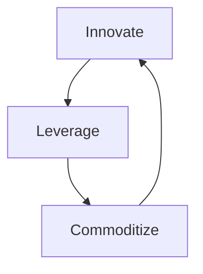

**エコシステムを sensing engine として使い、革新を誘導し続ける循環戦略です。**

> *「消費データを使って将来の成功を検知すること。」*
>
> - Simon Wardley

## 🤔 **解説**

### ILC とは何か

ILC は、継続革新と市場主導権のための循環戦略です。3 段階で回ります。

1. **Innovate:** 新しい component や platform を作って市場へ出す
2. **Leverage:** 顧客、パートナー、開発者など第三者 ecosystem に、その上で build してもらう
3. **Commoditize:** sensing engine で ecosystem を観察し、成功した pattern を core platform の標準・安価・信頼できる component に取り込む

これにより、市場自身が次に何を作るべきかを教えてくれる feedback loop ができます。

### なぜ使うのか

- **革新のリスクを下げる:** 市場が何千もの実験を行い、勝ち筋だけを自社が取れる
- **継続的 relevance:** 価値ある新機能を絶えず core platform へ取り込める
- **市場主導権:** emerging standard を commoditize し、競合 foothold を防げる
- **ecosystem value:** commoditize された土台の上でも第三者が新しい価値を作れる

## 🗺️ **実例**

### Amazon Web Services（AWS）

AWS は EC2 や S3 で primitives を **Innovate** し、その上で startup や企業の膨大な ecosystem を **Leverage** しました。顧客が EC2 上でデータベース運用に苦しむ pattern を sensing し、それを Amazon RDS として **Commoditize** しました。同じ流れが Redshift、Lambda、SageMaker でも繰り返されています。

### Apple の iOS

Apple は iPhone と App Store を **Innovate** し、巨大な開発者コミュニティを **Leverage** しました。そして App Store を sensing engine にして、人気の app concept を iOS へ **Commoditize** してきました。懐中電灯、podcast、screen time などが典型です。

### Microsoft と GitHub

GitHub は開発者向け協働基盤を **Innovate** しました。Microsoft はその ecosystem を **Leverage** し、最終的に GitHub を獲得することで、developer trend を sensing し、Azure や関連サービスへ **Commoditize** しやすい立場に入りました。

### AWS Rekognition

AWS は、fraud detection 向けに顧客が EC2 上で facial recognition を作っているのを見ていました。それをより広い user authentication 用途へ広げ、最終的に Rekognition としてサービス化し、元のプレイヤーの価値市場を commoditize しました。

Credit: John Duffy, original thread: [https://x.com/jduffy/status/1440320398738870275](https://x.com/jduffy/status/1440320398738870275)

## 🚦 **使いどころ**

<Assessment strategyName="Innovate, Leverage, Commoditize (ILC)">
  <MapSignals>
    <li>他者が build したくなる新しい platform や utility を作れる。</li>
    <li>大きく活気ある third-party ecosystem を形成できる可能性がある。</li>
    <li>バリューチェーンが多層で、既存 component の上に新しい component が乗りやすい。</li>
    <li>市場が速く動き、次の winning feature を予測しにくい。</li>
  </MapSignals>
  <Readiness>
    <li>信頼性とスケールを持つ platform を作り運営できる。</li>
    <li>usage data を収集・分析して trend を見つける sensing engine がある。</li>
    <li>成功 pattern を見つけたら、素早く commoditize できる。</li>
    <li>自社利益と ecosystem 健全性の均衡を理解している。</li>
  </Readiness>
</Assessment>

### 向くとき

- 大きな ecosystem を引き寄せる platform や utility を作れるとき
- 顧客ニーズが絶えず変化する fast-moving market にいるとき
- ILC cycle を何度も回せる資源と俊敏性があるとき

### 避けるとき

- platform の上に ecosystem を引き寄せられないとき
- sensing engine の signal を読んでも、行動が遅すぎるとき
- とても安定した slow-moving market で、そこまで動的革新が不要なとき

## 🎯 **リーダーシップ**

### 中核課題

この循環の delicate balance を保つことです。open platform を作り、tight control を我慢し、成功した pattern を commoditize しても ecosystem を殺さないようにしなければなりません。golden goose を殺さないことが最難関です。

### 必要なスキル

- [Platform strategy and network effects](/leadership-skills/platform-strategy-and-network-effects) — platform として事業を見る
- [Community and ecosystem stewardship](/leadership-skills/community-and-ecosystem-stewardship) — feedback loop を理解する
- [Strategic sensemaking](/leadership-skills/strategic-sensemaking) — 勝ち pattern を素早く commoditize する
- [Governance and policy design](/leadership-skills/governance-and-policy-design) — どこで介入し、どこは ecosystem に任せるかを決める

### 倫理面

主要論点は ecosystem との関係です。共生的なのか、搾取的なのか。Apple が popular app feature を OS に取り込む “Sherlocking” はその緊張をよく示します。ecosystem へ返す価値より取り過ぎれば、ILC engine は止まります。

## 📋 **進め方**

1. **Innovate:** utility 化できる component を見つけ、 robust platform を作る
2. **Leverage:** documentation、API、support で third party を呼び込む
3. **Sense:** API usage、transaction volume、community feedback などを測る
4. **Identify the winner:** breakout success と unmet need を示す pattern を見つける
5. **Commoditize:** 勝ち pattern を core platform の integrated feature にする
6. **Repeat:** 新しい commoditized layer を次の innovation wave の土台にする

## 📈 **成功指標**

- ecosystem の active participant 成長
- ecosystem signal をもとにした commoditized feature の投入速度
- core platform と新 commoditized service の adoption 成長
- 価値ある新機能の統合を通じて、競合に先行し続けられているか

## ⚠️ **失敗しやすい点**

### sensing engine が弱い

ecosystem を十分観測できなければ、この戦略全体が成り立ちません。

### ecosystem を殺す

成功したアイデアを片っ端から commoditize すると、開発者は恐れて platform 上で innovating しなくなります。

### 行動が遅い

trend を読めても commoditize が遅ければ、競合に先を越されます。

### platform 放置

Commoditize 側に偏りすぎると、次の innovators を引きつける土台が痩せます。

## 🧠 **戦略的示唆**

### 事業全体を learning machine にする

ILC は、事業全体を learning machine に変えます。ecosystem が problem space を parallel に探索し、sensing engine がその学習を core へ戻します。

### 未来は commodity になる

今日の innovation は明日の commodity です。ILC を回す側になれば、creative destruction の被害者ではなく推進者になれます。

## ❓ **問うべきこと**

- どの component を platform にすると、他者がその上に build したくなるか
- successful pattern を見つける sensing engine は何で、主要 metric は何か
- ecosystem との rules of engagement をどう定めるか
- 各ターンが次のターンをさらに速く強くする flywheel をどう作るか
- ecosystem を壊さずに、どこまで価値を回収するのか

## 🔀 **関連戦略**

- [**Harvesting**](/strategies/markets/harvesting) - Commoditize フェーズの主要 tactic
- [**オープンアプローチ（Open Approaches）**](/strategies/accelerators/open-approaches) - vibrant ecosystem を引き寄せる基盤になりやすい
- [**塔と堀（Tower and Moat）**](/strategies/ecosystem/tower-and-moat) - platform が塔で、complements の commoditize が堀になる
- [**Fast Follower**](/strategies/positional/fast-follower) - 自社 ecosystem の innovation を追随する形でもある
- [Weak Signal (Horizon)](/strategies/positional/weak-signal-horizon) - innovation phase へ feed する emerging pattern を sensing する
- [共創（Co-creation）](/strategies/ecosystem/co-creation) - ecosystem member と prototype を生む
- [Sweat & Dump](/strategies/dealing-with-toxicity/sweat-and-dump) - 非中核資産を外へ出し、innovation へ集中する
- [両面張り（Playing Both Sides）](/strategies/attacking/playing-both-sides) - 複数 front で leverage を最大化する
- [Value Chain Disaggregation and Re-aggregation](/strategies/dealing-with-toxicity/value-chain-disaggregation-and-re-aggregation) - 新機能 emergence と commoditize による再編を促す
- [プラットフォーム包摂（Platform Envelopment）](/strategies/ecosystem/platform-envelopment) - Commoditize phase は platform envelopment の一形態でもある

## ⛅ **関連する状勢パターン**

- [コンポーネントは共進化しうる](/climatic-patterns/components-can-co-evolve) – トリガー: ecosystem を育てると相互改善が加速する
- [効率がイノベーションを可能にする](/climatic-patterns/efficiency-enables-innovation) – 影響: commoditization が次の波の資源を生む

## 📚 **参考文献**

- [Wardley Maps (the book)](https://medium.com/wardleymaps/on-being-lost-2ef5f05eb1ec) - ILC を理解する基礎
- [The Innovator's Dilemma](/books/the-innovators-dilemma) - incumbents が disruptive innovation で苦しむ理論背景
