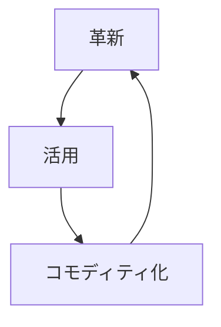

**エコシステムを感知エンジンとして使い、革新を誘導し続ける循環戦略です。**

> *「消費データを使って将来の成功を検知すること。」*
>
> - Simon Wardley

## 🤔 **解説**

### 革新・活用・コモディティ化（ILC）とは何か

革新・活用・コモディティ化（ILC）は、継続的なイノベーションと市場主導権の維持を狙う循環戦略です。次の 3 段階で回ります。

1. **革新:** 新しいコンポーネントやプラットフォームを作って市場へ出す
2. **活用:** 顧客、パートナー、開発者など第三者エコシステムに、その上で構築してもらう
3. **コモディティ化:** 感知エンジンでエコシステムを観察し、成功したパターンを中核プラットフォームの標準的で安価かつ信頼できるコンポーネントに取り込む

この循環によって、市場自身が次に何を作るべきかを教えてくれるフィードバックループが生まれます。

### なぜ使うのか

- **革新のリスクを下げる:** 市場が何千もの実験を行い、勝ち筋だけを自社が取れる
- **継続的な競争力:** 価値ある新機能を絶えず中核プラットフォームへ取り込める
- **市場主導権:** 台頭する標準をコモディティ化し、競合が足場を築くのを防げる
- **エコシステム価値:** コモディティ化された土台の上でも第三者が新しい価値を作れる

## 🗺️ **実例**

### Amazon Web Services（AWS）

AWS は EC2 や S3 で基本コンポーネントを**革新**し、その上でスタートアップや企業からなる膨大なエコシステムを**活用**しました。顧客が EC2 上でデータベース運用に苦しむパターンを感知し、それを Amazon RDS として**コモディティ化**しました。同じ流れが Redshift、Lambda、SageMaker でも繰り返されています。

### Apple の iOS

Apple は iPhone と App Store を**革新**し、巨大な開発者コミュニティを**活用**しました。そして App Store を感知エンジンとして使い、人気アプリの機能を iOS へ**コモディティ化**してきました。懐中電灯、ポッドキャスト、スクリーンタイムなどが典型です。

### Microsoft と GitHub

GitHub は開発者向け協働基盤を**革新**しました。Microsoft はそのエコシステムを**活用**し、最終的に GitHub を買収することで、開発者の傾向を感知し、Azure や関連サービスへ**コモディティ化**しやすい立場に入りました。

### AWS Rekognition

AWS は、不正検知向けに顧客が EC2 上で顔認識を作っていることを把握していました。その用途をより広い利用者認証へ拡張し、最終的に Rekognition としてサービス化することで、既存プレイヤーの高価値市場をコモディティ化しました。

出典: John Duffy、元スレッド: [https://x.com/jduffy/status/1440320398738870275](https://x.com/jduffy/status/1440320398738870275)

## 🚦 **使いどころ**

<Assessment strategyName="Innovate, Leverage, Commoditize (ILC)">
 <MapSignals>
  <li>他者がその上に構築したくなる、新しいプラットフォームやユーティリティを作れる。</li>
  <li>大きく活気ある第三者エコシステムを形成できる可能性がある。</li>
  <li>バリューチェーンが多層で、既存コンポーネントの上に新しいコンポーネントが乗りやすい。</li>
  <li>市場が速く動き、次の勝ち筋となる機能を予測しにくい。</li>
 </MapSignals>
 <Readiness>
  <li>信頼性とスケールを持つプラットフォームを作り運営できる。</li>
  <li>利用データを収集・分析して傾向を見つける感知エンジンがある。</li>
  <li>成功パターンを見つけたら、素早くコモディティ化できる。</li>
  <li>自社利益とエコシステム健全性の均衡を理解している。</li>
 </Readiness>
</Assessment>

### 向くとき

- 大きなエコシステムを引き寄せるプラットフォームやユーティリティを作れるとき
- 顧客ニーズが絶えず変化する変化の速い市場にいるとき
- 革新・活用・コモディティ化の循環を何度も回せる資源と俊敏性があるとき

### 避けるとき

- プラットフォームの上にエコシステムを引き寄せられないとき
- 感知エンジンのシグナルを読んでも、行動が遅すぎるとき
- 安定していて変化が遅く、動的なイノベーションがそれほど必要ない市場にいるとき

## 🎯 **リーダーシップ**

### 中核課題

この循環の繊細な均衡を保つことです。オープンプラットフォームを作り、過度に統制したい誘惑を抑え、成功パターンをコモディティ化してもエコシステムを壊さないようにしなければなりません。金の卵を産むガチョウを殺さないことが最大の難関です。

### 必要なスキル

- [プラットフォーム戦略とネットワーク効果](/leadership-skills/platform-strategy-and-network-effects) — 他者を可能にする基盤として事業を見る
- [コミュニティとエコシステムの育成](/leadership-skills/community-and-ecosystem-stewardship) — プラットフォームとエコシステムのフィードバックループを理解する
- [戦略的センスメイキング](/leadership-skills/strategic-sensemaking) — 成功パターンを見抜き、素早くコモディティ化する
- [ガバナンスと政策設計](/leadership-skills/governance-and-policy-design) — どこで介入し、どこはエコシステムに任せるかを決める

### 倫理面

主要な倫理的論点は、エコシステムとの関係が共生的か、搾取的かという点です。Apple が人気アプリの機能を OS に取り込む「シャーロッキング」は、その緊張をよく示します。エコシステムへ返す価値以上に取り込めば、革新・活用・コモディティ化の感知エンジンはいずれ止まります。

## 📋 **進め方**

1. **革新:** ユーティリティ化できるコンポーネントを見つけ、堅牢なプラットフォームを作る
2. **活用:** 文書、API、サポートで第三者を呼び込む
3. **感知:** API 利用量、取引量、コミュニティのフィードバックなどを測る
4. **勝ち筋の特定:** 目立つ成功と未充足ニーズを示すパターンを見つける
5. **コモディティ化:** 勝ちパターンを中核プラットフォームの統合機能にする
6. **反復:** 新しいコモディティ化された層を次のイノベーションの波の土台にする

## 📈 **成功指標**

- エコシステムで活動する参加者数の伸び
- エコシステムのシグナルをもとに機能をコモディティ化し、市場投入するまでの速度
- 中核プラットフォームと新たにコモディティ化したサービスの採用増加
- 価値ある新機能の統合を通じて、競合に先行し続けられているか

## ⚠️ **失敗しやすい点**

### 感知エンジンが弱い

エコシステムを十分観測できなければ、この戦略全体が成り立ちません。

### エコシステムを殺す

成功したアイデアを片っ端からコモディティ化すると、開発者は恐れてプラットフォーム上で革新しなくなります。

### 行動が遅い

傾向を読めてもコモディティ化が遅ければ、競合に先を越されます。

### プラットフォームの軽視

コモディティ化側に偏りすぎると、次の革新者を引きつける土台が痩せます。

## 🧠 **戦略的示唆**

### 事業全体を学習装置にする

革新・活用・コモディティ化は、事業全体を学習装置に変えます。エコシステムは問題空間を並行して探索する巨大な仕組みであり、感知エンジンはそこで得た学習を中核事業へ戻します。

### 未来はコモディティになる

今日のイノベーションは明日のコモディティです。革新・活用・コモディティ化を回す側になれば、創造的破壊の被害者ではなく推進者になれます。

## ❓ **問うべきこと**

- どのコンポーネントをプラットフォームにすると、他者がその上に構築したくなるか
- 成功パターンを見つける感知エンジンは何か。主要指標は何か
- エコシステムとの関与ルールをどう定めるか
- 各ターンが次のターンをさらに速く強くするフライホイールをどう作るか
- エコシステムを壊さずに、どこまで価値を回収するのか

## 🔀 **関連戦略**

- [収穫](/strategies/markets/harvesting) - コモディティ化フェーズの主要戦術
- [オープンアプローチ](/strategies/accelerators/open-approaches) - 活気あるエコシステムを引き寄せる基盤になりやすい
- [塔と堀](/strategies/ecosystem/tower-and-moat) - プラットフォームが塔で、補完物のコモディティ化が堀になる
- [ファストフォロワー](/strategies/positional/fast-follower) - 自社エコシステムのイノベーションを追随する形でもある
- [弱いシグナル](/strategies/positional/weak-signal-horizon) - 革新フェーズへつながる新興パターンを捉える
- [共創](/strategies/ecosystem/co-creation) - エコシステムのメンバーと試作品を生む
- [使い切って手放す](/strategies/dealing-with-toxicity/sweat-and-dump) - 非中核資産を外へ出し、イノベーションへ集中する
- [両面張り](/strategies/attacking/playing-both-sides) - 複数の市場前線から知見を集め、戦略的活用を最大化する
- [バリューチェーンの分解と再統合](/strategies/dealing-with-toxicity/value-chain-disaggregation-and-re-aggregation) - 新機能の創発とコモディティ化による再編を促す
- [プラットフォーム包摂](/strategies/ecosystem/platform-envelopment) - コモディティ化フェーズはプラットフォーム包摂の一形態でもある

## ⛅ **関連する状勢パターン**

- [コンポーネントは共進化できる](/climatic-patterns/components-can-co-evolve) – トリガー: エコシステムを育てると相互改善が加速する
- [効率がイノベーションを可能にする](/climatic-patterns/efficiency-enables-innovation) – 影響: コモディティ化が次の波の資源を生む

## 📚 **参考文献**

- [Wardley Maps (the book)](https://medium.com/wardleymaps/on-being-lost-2ef5f05eb1ec) - 革新・活用・コモディティ化を理解する基礎
- [イノベーションのジレンマ](/books/the-innovators-dilemma) - 既存勢力が破壊的イノベーションで苦しむ理論背景
