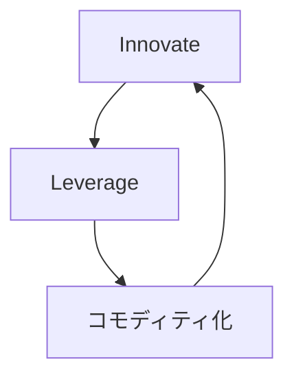

**エコシステムを感知エンジンとして使い、革新を誘導し続ける循環戦略です。**

> *「消費データを使って将来の成功を検知すること。」*
>
> - Simon Wardley

## 🤔 **解説**

### 革新・活用・コモディティ化 とは何か

革新・活用・コモディティ化 は、継続革新と市場主導権のための循環戦略です。3 段階で回ります。

1. **革新:** 新しいコンポーネントやプラットフォームを作って市場へ出す
2. **活用:** 顧客、パートナー、開発者など第三者エコシステムに、その上で構築してもらう
3. **コモディティ化:** 感知エンジンでエコシステムを観察し、成功したパターンを中核プラットフォームの標準的で安価かつ信頼できるコンポーネントに取り込む

これにより、市場自身が次に何を作るべきかを教えてくれる フィードバックループ ができます。

### なぜ使うのか

- **革新のリスクを下げる:** 市場が何千もの実験を行い、勝ち筋だけを自社が取れる
- **継続的 重要性:** 価値ある新機能を絶えず 中核プラットフォーム へ取り込める
- **市場主導権:** 台頭する標準をコモディティ化 し、競合 足場 を防げる
- **エコシステム価値:** コモディティ化された土台の上でも第三者が新しい価値を作れる

## 🗺️ **実例**

### Amazon Web Services（AWS）

AWS は EC2 や S3 で 基本部品 を **Innovate** し、その上で スタートアップ や企業の膨大な エコシステム を **Leverage** しました。顧客が EC2 上でデータベース運用に苦しむ パターンを感知し、それを Amazon RDS として **コモディティ化** しました。同じ流れが Redshift、Lambda、SageMaker でも繰り返されています。

### Apple の iOS

Apple は iPhone と App Store を **Innovate** し、巨大な開発者コミュニティを **Leverage** しました。そして App Store を感知エンジンとして使い、人気のアプリの概念を iOS へ **コモディティ化** してきました。懐中電灯、podcast、スクリーンタイム などが典型です。

### Microsoft と GitHub

GitHub は開発者向け協働基盤を **Innovate** しました。Microsoft はその エコシステム を **Leverage** し、最終的に GitHub を獲得することで、開発者の傾向を感知し、Azure や関連サービスへ **コモディティ化** しやすい立場に入りました。

### AWS Rekognition

AWS は、不正検知 向けに顧客が EC2 上で 顔認識 を作っているのを見ていました。それをより広い 利用者認証 用途へ広げ、最終的に Rekognition としてサービス化し、元のプレイヤーの価値市場を コモディティ化 しました。

出典: John Duffy、元スレッド: [https://x.com/jduffy/status/1440320398738870275](https://x.com/jduffy/status/1440320398738870275)

## 🚦 **使いどころ**

<Assessment strategyName="Innovate, Leverage, コモディティ化 (ILC)">
 <MapSignals>
  <li>他者が 構築 したくなる新しい プラットフォーム や ユーティリティ を作れる。</li>
  <li>大きく活気ある第三者エコシステムを形成できる可能性がある。</li>
  <li>バリューチェーンが多層で、既存 コンポーネント の上に新しい コンポーネント が乗りやすい。</li>
  <li>市場が速く動き、次の 勝ち筋となる機能 を予測しにくい。</li>
 </MapSignals>
 <Readiness>
  <li>信頼性とスケールを持つ プラットフォーム を作り運営できる。</li>
  <li>利用データ を収集・分析して 傾向 を見つける感知エンジンがある。</li>
  <li>成功 パターン を見つけたら、素早く コモディティ化 できる。</li>
  <li>自社利益と エコシステム 健全性の均衡を理解している。</li>
 </Readiness>
</Assessment>

### 向くとき

- 大きな エコシステム を引き寄せる プラットフォーム や ユーティリティ を作れるとき
- 顧客ニーズが絶えず変化する 変化の速い市場 にいるとき
- 革新・活用・コモディティ化の循環 を何度も回せる資源と俊敏性があるとき

### 避けるとき

- プラットフォーム の上に エコシステム を引き寄せられないとき
- 感知エンジンの シグナル を読んでも、行動が遅すぎるとき
- とても安定した 変化の遅い市場 で、そこまで動的革新が不要なとき

## 🎯 **リーダーシップ**

### 中核課題

この循環の 繊細な均衡 を保つことです。オープンプラットフォーム を作り、強い統制 を我慢し、成功した パターン を コモディティ化 しても エコシステム を殺さないようにしなければなりません。金のなるガチョウ を殺さないことが最難関です。

### 必要なスキル

- [プラットフォーム戦略とネットワーク効果](/leadership-skills/platform-strategy-and-network-effects) — プラットフォーム として事業を見る
- [コミュニティとエコシステムの育成](/leadership-skills/community-and-ecosystem-stewardship) — フィードバックループ を理解する
- [戦略的センスメイキング](/leadership-skills/strategic-sensemaking) — 勝ち パターン を素早く コモディティ化 する
- [ガバナンスと政策設計](/leadership-skills/governance-and-policy-design) — どこで介入し、どこは エコシステム に任せるかを決める

### 倫理面

主要論点は エコシステム との関係です。共生的なのか、搾取的なのか。Apple が 人気アプリ機能を OS に取り込む “Sherlocking” はその緊張をよく示します。エコシステム へ返す価値より取り過ぎれば、革新・活用・コモディティ化 の感知エンジンは止まります。

## 📋 **進め方**

1. **Innovate:** ユーティリティ 化できる コンポーネント を見つけ、 堅牢なプラットフォーム を作る
2. **Leverage:** 文書、API、サポート で 第三者 を呼び込む
3. **感知:** API 利用量、取引量、コミュニティのフィードバック などを測る
4. **勝ち筋の特定:** 目立つ成功と未充足ニーズ を示す パターン を見つける
5. **コモディティ化:** 勝ち パターン を 中核プラットフォームの 統合機能 にする
6. **反復:** 新しい コモディティ化された層 を次の イノベーションの波 の土台にする

## 📈 **成功指標**

- エコシステム の 活発な参加者 成長
- エコシステム シグナル をもとにした コモディティ化された 機能 の投入速度
- 中核プラットフォーム と新 コモディティ化された サービスの採用 成長
- 価値ある新機能の統合を通じて、競合に先行し続けられているか

## ⚠️ **失敗しやすい点**

### 感知エンジンが弱い

エコシステム を十分観測できなければ、この戦略全体が成り立ちません。

### エコシステム を殺す

成功したアイデアを片っ端から コモディティ化 すると、開発者は恐れて プラットフォーム 上で 革新 しなくなります。

### 行動が遅い

傾向 を読めても コモディティ化 が遅ければ、競合に先を越されます。

### プラットフォーム 放置

コモディティ化 側に偏りすぎると、次の 革新者 を引きつける土台が痩せます。

## 🧠 **戦略的示唆**

### 事業全体を 学習装置 にする

革新・活用・コモディティ化 は、事業全体を 学習装置 に変えます。エコシステム が 問題空間 を 並行して に探索し、感知エンジンがその学習を 中核 へ戻します。

### 未来は コモディティ になる

今日の イノベーション は明日の コモディティ です。革新・活用・コモディティ化 を回す側になれば、創造的破壊 の被害者ではなく推進者になれます。

## ❓ **問うべきこと**

- どの コンポーネント を プラットフォーム にすると、他者がその上に 構築したくなるか
- 成功パターン を見つける感知エンジンは何で、主要 指標 は何か
- エコシステム との 関与ルール をどう定めるか
- 各ターンが次のターンをさらに速く強くする フライホイール をどう作るか
- エコシステム を壊さずに、どこまで価値を回収するのか

## 🔀 **関連戦略**

- [収穫](/strategies/markets/harvesting) - コモディティ化 フェーズの主要 戦術
- [オープンアプローチ](/strategies/accelerators/open-approaches) - 活気あるエコシステムを引き寄せる基盤になりやすい
- [塔と堀](/strategies/ecosystem/tower-and-moat) - プラットフォーム が塔で、補完物 の コモディティ化 が堀になる
- [ファストフォロワー](/strategies/positional/fast-follower) - 自社 エコシステム の イノベーションを追随する形でもある
- [弱いシグナル](/strategies/positional/weak-signal-horizon) - 革新フェーズ へ 供給 する 新興 パターン を センシング する
- [共創](/strategies/ecosystem/co-creation) - エコシステム メンバー と 試作品 を生む
- [使い切って手放す](/strategies/dealing-with-toxicity/sweat-and-dump) - 非中核資産を外へ出し、イノベーション へ集中する
- [両面張り](/strategies/attacking/playing-both-sides) - 複数 前線 で 活用 を最大化する
- [バリューチェーンの分解と再統合](/strategies/dealing-with-toxicity/value-chain-disaggregation-and-re-aggregation) - 新機能 創発 と コモディティ化 による再編を促す
- [プラットフォーム包摂](/strategies/ecosystem/platform-envelopment) - コモディティ化 フェーズ は プラットフォーム包摂 の一形態でもある

## ⛅ **関連する状勢パターン**

- [コンポーネントは共進化できる](/climatic-patterns/components-can-co-evolve) – トリガー: エコシステム を育てると相互改善が加速する
- [効率がイノベーションを可能にする](/climatic-patterns/efficiency-enables-innovation) – 影響: コモディティ化 が次の波の資源を生む

## 📚 **参考文献**

- [Wardley Maps (the book)](https://medium.com/wardleymaps/on-being-lost-2ef5f05eb1ec) - 革新・活用・コモディティ化 を理解する基礎
- [イノベーションのジレンマ](/books/the-innovators-dilemma) - 既存勢力 が 破壊的 イノベーション で苦しむ理論背景
