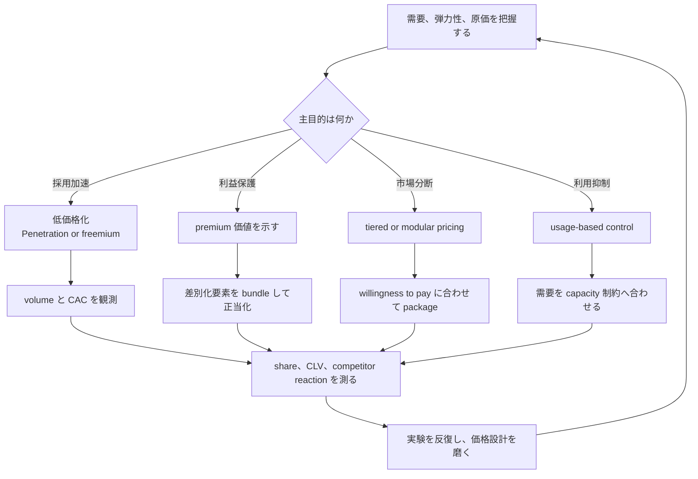

**価格を、需要操作、市場形成、競争優位のための戦略ツールとして使う戦略です。**

> *「価格弾力性、Jevons paradox、制約、分断戦略を含めた需給効果を活用すること。」*
>
> - Simon Wardley

## 🤔 **解説**

### 戦略的な価格政策とは何か

戦略的価格政策は、価格を単なる原価回収や利益計算の数字ではなく、特定の business objective を達成するための能動的レバーとして扱います。顧客行動を変え、競争地形を動かし、市場から取る価値を最大化するために価格を設計します。

### なぜ使うのか

原価積み上げや competitor 追随を超えて価格を使うと、次のことができます。

- **需要を刺激または抑制する**
- **市場を commoditize する**
- **新しい segment を作る**
- **価値と位置付けを signal する**
- **ユーザー基盤を素早く築く**

## 🗺️ **実例**

### AWS

AWS は penetration pricing を使い、クラウド価格を継続的に下げて採用を拡大しました。低 margin でも volume が勝ち、基盤そのものを commoditize し、市場支配を強めました。

### Dollar Shave Club

「1ドルでカミソリ」という低価格 subscription で、Gillette の高価格モデルを正面から崩しました。pricing 自体が value proposition でした。

### Apple の iPhone

Apple は premium pricing を維持し、高品質で aspirational な製品という認識を強めつつ、スマホ市場の profit pool を大きく取っています。

## 🚦 **使いどころ**

<Assessment strategyName="Pricing Policy">
  <MapSignals>
    <li>地図上で、積極価格によって commoditize できる component がある。</li>
    <li>市場の価格弾力性が高く、需要が価格に敏感である。</li>
    <li>競合の価格構造が硬直していて動きが遅い。</li>
    <li>tiered pricing や modular pricing で市場を分断できる。</li>
  </MapSignals>
  <Readiness>
    <li>原価構造と顧客価値を深く理解している。</li>
    <li>finance と marketing が密に連携している。</li>
    <li>異なる価格モデルを実験し、結果を測る仕組みがある。</li>
    <li>短期 margin を削っても pricing を戦略レバーに使う覚悟がある。</li>
  </Readiness>
</Assessment>

### 向くとき

- 持続的に competitor より安く出せる cost advantage があるとき
- 急速に share を取り、大きな user base を作りたいとき
- 商品差別化が強く premium を維持できるとき
- 顧客群ごとに異なる価格帯を出せるとき

### 避けるとき

- 高度規制産業のように、price が主要購買要因ではないとき
- exclusivity や prestige にブランドが依存し、値下げがそれを壊すとき
- competitor が容易に同じ価格へ合わせられ、industry 全体の利益を壊すとき
- 顧客の willingness to pay をよく分かっていないとき

## 🎯 **リーダーシップ**

### 中核課題

短期売上・利益の圧力と、長期戦略目的をどう両立するかです。share 拡大のための値下げは、finance 側の反発を呼びやすく、信念を持って押し切る力が要ります。

### 必要なスキル

- [Data strategy and analytics](/leadership-skills/data-strategy-and-analytics) — 市場力学、原価、顧客データを読む
- [Pricing strategy](/leadership-skills/pricing-strategy) — price を未来形成の道具として使う
- [Decision-making under uncertainty](/leadership-skills/decision-making-under-uncertainty) — 短期に unpopular な価格判断を下す
- [Strategic communication and storytelling](/leadership-skills/strategic-communication-and-storytelling) — pricing rationale を関係者へ伝える

### 倫理面

predatory pricing や price gouging のように、違法または不公正な価格政策は大きな問題になります。公平さと透明性が前提です。

## 📋 **進め方**

1. 市場、競争、原価、自社位置を分析する
2. 価格政策の objective を明確にする。share、profit、user acquisition など
3. penetration、premium、freemium、subscription などからモデルを選ぶ
4. A/B test や conjoint analysis などで実価格を決める
5. rollout し、value proposition とともに説明する
6. sales、profit、share、competitor 反応を見て調整する

### 価格政策の選択を図示する

## 📈 **成功指標**

- market share の変化
- target profit margin の達成度
- CAC の変化
- CLV の変化
- 価格弾力性の把握精度

## ⚠️ **失敗しやすい点**

### price war の開始

積極値下げは、industry 全体の profitability を壊す race to the bottom を招きます。

### customer の疎外

複雑、不透明、頻繁な価格変更は trust を壊します。

### 価値の誤認

安すぎれば money を置き忘れ、高すぎれば customer を失います。

### 原価無視

原価理解のない価格政策は持続しません。

## 🧠 **戦略的示唆**

### 価格と進化

コンポーネントが Genesis から Commodity へ進化するにつれて、最適 pricing は変わります。初期は premium が可能でも、市場成熟とともに competitive pricing が中心になります。

### 価値創造と価値回収

pricing は価値回収の主装置ですが、回収だけに寄ると長期の価値創造を止めます。均衡が必要です。

## ❓ **問うべきこと**

- price の主目的は何か
- 自社製品は顧客へどれだけの価値を作り、それをどう定量化するか
- 値上げ・値下げで volume はどう動くか
- competitor はどう反応するか
- pricing が brand image にどんな影響を与えるか

## 🔀 **関連戦略**

- [Fragmentation](/strategies/competitor/fragmentation) - pricing で市場を意図的に細分化できる
- [Jevons Paradox](/terms/jevons-paradox) - 価格低下が消費総量を増やすことがある
- [Buyer-Supplier Power](/strategies/markets/buyer-supplier-power) - buyer / supplier 関係での主要レバー
- [Last Man Standing](/strategies/markets/last-man-standing) - 低価格で競合を消耗させる戦略と結びつきやすい

## ⛅ **関連する状勢パターン**

- [効率化は支出減少を意味しない](/climatic-patterns/efficiency-does-not-mean-a-reduced-spend) – 影響: lower price が total consumption を増やすことがある
- [経済にはサイクルがある](/climatic-patterns/economy-has-cycles) – トリガー: 平時・戦時・驚異の各 phase で pricing tactics は変わる

## 📚 **参考文献**

- [Confessions of the Pricing Man](/books/confessions-of-the-pricing-man) - pricing の理論と実務
- [Monetizing Innovation](/books/monetizing-innovation) - innovation を pricing に結びつける方法
- [Priceless: The Myth of Fair Value](/books/priceless-the-myth-of-fair-value) - pricing psychology の考察
