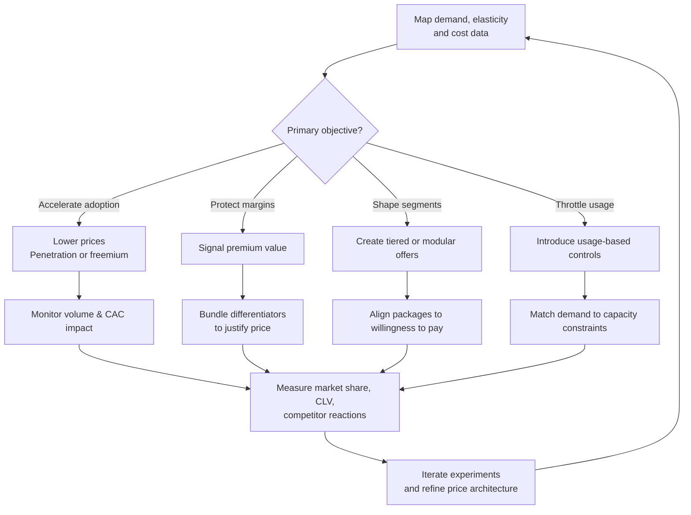

**Using pricing as a strategic tool to manipulate demand, shape markets, and gain competitive advantage.**

> *"Exploiting supply and demand effects including price elasticity, Jevons paradox and constraints including fragmentation plays."*
>
> - Simon Wardley

## 🤔 **Explanation**

### What is a Strategic Pricing Policy?

A strategic Pricing Policy treats pricing as a proactive tool to achieve specific business objectives, rather than simply a way to cover costs and generate profit. It involves setting prices to influence customer behavior, alter the competitive landscape, and maximize the value captured from the market. This can mean radically lowering prices to drive adoption or deliberately setting high prices to signal quality and maximize revenue from a niche segment.

### Why use a Strategic Pricing Policy?

By moving beyond cost-plus or competitor-based pricing, a strategic approach can:

- **Stimulate or suppress demand:** Lowering prices can dramatically increase consumption (see Jevons Paradox), while raising them can manage demand in the face of limited supply.
- **Commoditize a market:** Aggressively low pricing can turn a previously profitable component into a low-margin utility, hurting competitors who rely on it for revenue.
- **Create new market segments:** Modular or tiered pricing can fragment a market, allowing you to dominate specific niches.
- **Signal value and position:** Premium pricing can signal high quality and exclusivity, while low pricing can signal efficiency and value.
- **Build a user base:** Offering a product for free or at a very low price (freemium or penetration pricing) can be a powerful way to quickly build a large user base.

## 🗺️ **Real-World Examples**

### Amazon Web Services (AWS)

AWS famously used a penetration pricing strategy, constantly lowering the price of its cloud computing services. This drove massive adoption, making cloud computing accessible to a much wider audience. The increased volume more than made up for the lower margins and helped establish AWS as the dominant market leader, commoditizing the underlying infrastructure for many businesses.

### The Dollar Shave Club

The Dollar Shave Club disrupted the razor market with a simple, low-cost subscription model. By offering razors for "a dollar a month," they directly challenged the high-priced, feature-heavy models of incumbents like Gillette. This pricing strategy was central to their value proposition and helped them rapidly capture market share.

### Apple's iPhone

Apple has consistently used a premium pricing strategy for the iPhone. The high price reinforces the perception of the iPhone as a high-quality, aspirational product. This strategy has allowed Apple to capture a disproportionate share of the smartphone market's profits, even without having the largest market share in terms of units sold.

## 🚦 **When to Use / When to Avoid**

<Assessment strategyName="Pricing Policy">
  <MapSignals>
    <li>Your map shows a component that is ripe for commoditization through aggressive pricing.</li>
    <li>There is a high degree of price elasticity in your market, meaning demand is sensitive to price changes.</li>
    <li>Your competitors have rigid pricing structures that are slow to adapt.</li>
    <li>There are opportunities to fragment the market with modular or tiered pricing.</li>
  </MapSignals>
  <Readiness>
    <li>We have a deep understanding of our cost structure and the value our products provide to customers.</li>
    <li>Our finance and marketing teams work closely together to set and manage prices.</li>
    <li>We have the systems in place to experiment with different pricing models and measure the results.</li>
    <li>Our leadership is willing to use pricing as a strategic lever, even if it means short-term margin reduction.</li>
  </Readiness>
</Assessment>

### Use when

- You have a cost advantage that allows you to sustainably undercut competitors.
- You want to rapidly gain market share and build a large user base.
- Your product is highly differentiated, allowing you to command a premium price.
- You can segment your market and offer different price points to different customer groups.

### Avoid when

- You are in a market where price is not a primary driver of purchasing decisions (e.g., highly regulated industries).
- Your brand is built on exclusivity and prestige, and lowering prices would damage it.
- Your competitors can easily match your price changes, leading to a price war that erodes profits for everyone.
- You do not have a clear understanding of your customers' willingness to pay.

## 🎯 **Leadership**

### Core challenge

The primary challenge for leaders is to balance the short-term pressure for revenue and profit with the long-term strategic goals of the pricing policy. A decision to lower prices to gain market share, for example, may be met with resistance from a finance department focused on margins. Leaders must have the conviction to see the strategy through.

### Key leadership skills required

- [Data strategy and analytics](/leadership-skills/data-strategy-and-analytics) — The ability to understand complex market dynamics, cost structures, and customer data.
- [Pricing strategy](/leadership-skills/pricing-strategy) — The capacity to see pricing not just as a number, but as a tool for shaping the future of the market.
- [Decision-making under uncertainty](/leadership-skills/decision-making-under-uncertainty) — The willingness to make bold pricing decisions that may be unpopular in the short term.
- [Strategic communication and storytelling](/leadership-skills/strategic-communication-and-storytelling) — The ability to articulate the strategic rationale for the pricing policy to all stakeholders.

### Ethical considerations

Pricing policies can have significant ethical implications. Predatory pricing (setting prices below cost to drive competitors out of business) is illegal in many jurisdictions. Price gouging (charging excessively high prices for essential goods during an emergency) is also unethical and often illegal. Leaders must ensure their pricing policies are fair and transparent.

## 📋 **How to Execute**

1. **Analyze the Market and Your Position:** Understand the competitive landscape, your cost structure, and the value your product provides. Use Wardley Maps to identify opportunities for commoditization or differentiation.
2. **Define Your Strategic Objective:** What do you want to achieve with your pricing policy? (e.g., gain market share, maximize profit, deter new entrants).
3. **Choose Your Pricing Strategy:** Select a pricing model that aligns with your objective (e.g., penetration pricing, premium pricing, freemium, subscription).
4. **Set Your Price Points:** Determine the actual prices you will charge. This may involve A/B testing, conjoint analysis, or other market research techniques.
5. **Implement and Communicate:** Roll out the new pricing and clearly communicate the value proposition to your customers.
6. **Monitor and Adapt:** Continuously monitor the impact of your pricing on sales, profit, and market share. Be prepared to adjust your strategy in response to competitor actions and changing market conditions.

### Visualising pricing policy choices

This flow illustrates how teams connect strategic intent to pricing levers and then loop outcomes back into the next iteration of pricing experiments.

## 📈 **Measuring Success**

- **Market Share:** Has your pricing policy helped you gain or maintain market share?
- **Profitability:** Are you achieving your target profit margins?
- **Customer Acquisition Cost (CAC):** Has your pricing strategy helped to lower your CAC?
- **Customer Lifetime Value (CLV):** Are you attracting and retaining high-value customers?
- **Price Elasticity of Demand:** How sensitive is demand for your product to changes in price?

## ⚠️ **Common Pitfalls and Warning Signs**

### Starting a Price War

Aggressive price cuts can trigger a race to the bottom, destroying profitability for the entire industry.

### Alienating Customers

Complex or opaque pricing can confuse and frustrate customers. Sudden price increases can be seen as a betrayal of trust.

### Misunderstanding Value

If you underprice your product, you may be leaving money on the table. If you overprice it, you may drive customers away.

### Ignoring Costs

A pricing policy that is not grounded in a solid understanding of your costs is unsustainable.

## 🧠 **Strategic Insights**

### Pricing and Evolution

As components in a value chain evolve from Genesis to Commodity, the optimal pricing strategy changes. In the early stages, premium pricing may be possible. As the market matures, prices tend to fall, and cost-plus or competitive pricing becomes more common.

### Value Capture vs. Value Creation

Pricing is the primary mechanism for capturing value. However, a pricing policy that is too focused on value capture can stifle innovation and value creation in the long run. The most effective strategies find a balance between the two.

## ❓ **Key Questions to Ask**

- **Objective:** What is the primary goal of our pricing? (e.g., market share, profit, user acquisition)
- **Value:** How much value does our product create for our customers, and how can we quantify it?
- **Elasticity:** How will our sales volume change if we raise or lower our prices?
- **Competitor Reaction:** How are our competitors likely to react to our pricing moves?
- **Brand Image:** How does our pricing affect our brand's perception in the market?

## 🔀 **Related Strategies**

- **[Fragmentation](/strategies/competitor/fragmentation)**: Pricing can be used to deliberately break a market into smaller, more manageable segments.
- **[Jevons Paradox](/terms/jevons-paradox)**: Understanding that lowering the price of a resource can sometimes lead to a massive increase in its consumption.
- **[Buyer-Supplier Power](/strategies/markets/buyer-supplier-power)**: Pricing is a key lever in the power dynamics between buyers and suppliers.
- **[Last Man Standing](/strategies/markets/last-man-standing)**: A strategy that often involves aggressive pricing to outlast competitors in a declining market.

## ⛅ **関連する状勢パターン**

- [Efficiency does not mean a reduced spend](/climatic-patterns/efficiency-does-not-mean-a-reduced-spend) – influence: lower prices can drive up overall consumption.
- [Economy has cycles](/climatic-patterns/economy-has-cycles) – trigger: pricing tactics shift as markets move between peace, war and wonder phases.

## 📚 **Further Reading & References**

- **[Confessions of the Pricing Man](/books/confessions-of-the-pricing-man)** by Hermann Simon. A deep dive into the art and science of pricing.
- **[Monetizing Innovation](/books/monetizing-innovation)** by Madhavan Ramanujam and Georg Tacke. A practical guide to building a pricing strategy around innovation.
- **[Priceless: The Myth of Fair Value](/books/priceless-the-myth-of-fair-value)** by William Poundstone. An exploration of the psychology of pricing.
