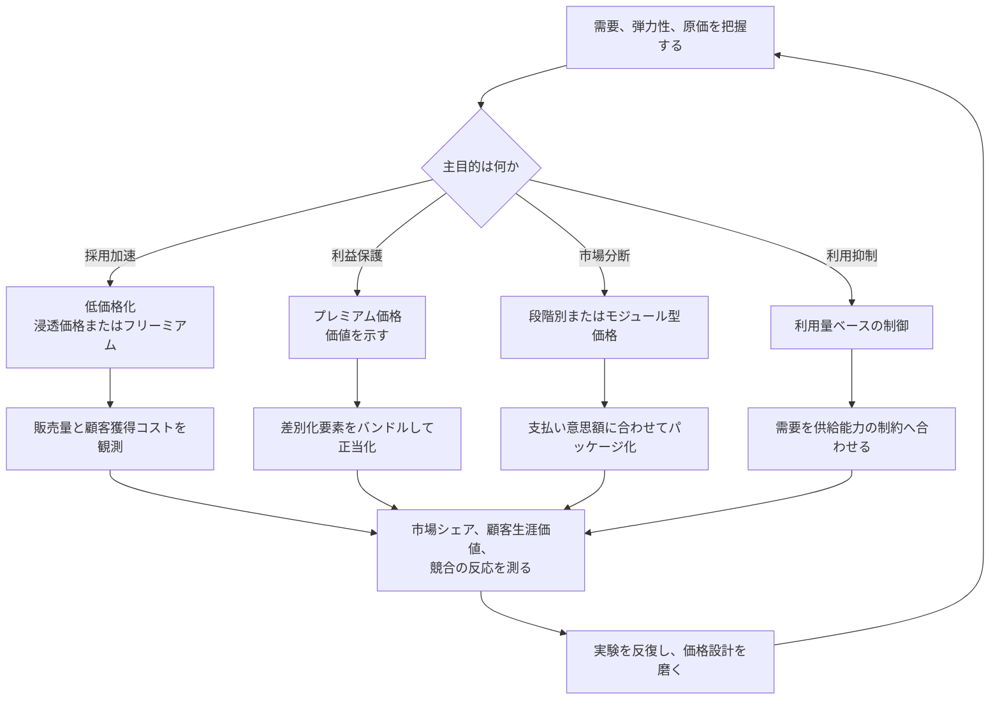

**価格を、需要操作、市場形成、競争優位のための戦略ツールとして使う戦略です。**

> *「価格弾力性、ジェヴォンズの逆説、制約、分断戦略を含めた需給効果を活用すること。」*
>
> - Simon Wardley

## 🤔 **解説**

### 戦略的な価格政策とは何か

戦略的価格政策は、価格を単なる原価回収や利益計算の数字ではなく、特定の事業目的を達成するための能動的なレバーとして扱います。顧客行動を変え、競争環境を動かし、市場から回収する価値を最大化するために価格を設計します。

### なぜ使うのか

原価積み上げや競合追随を超えて価格を使うと、次のことができます。

- **需要を刺激または抑制する**
- **市場をコモディティ化する**
- **新しいセグメントを作る**
- **価格を通じて価値と位置付けを示す**
- **ユーザー基盤を素早く築く**

## 🗺️ **実例**

### AWS

AWSは浸透価格戦略を使い、クラウド価格を継続的に下げて採用を拡大しました。低い利益率を取引量で補い、基盤そのものをコモディティ化して、市場支配を強めました。

### Dollar Shave Club

「1ドルでカミソリ」という低価格サブスクリプションで、Gilletteの高価格モデルを正面から崩しました。価格設定自体が価値提案でした。

### AppleのiPhone

Appleはプレミアム価格戦略を維持し、高品質で憧れを呼ぶ製品という認識を強めつつ、スマートフォン市場の利益プールを大きく取っています。

## 🚦 **使いどころ**

<Assessment strategyName="価格政策">
 <MapSignals>
  <li>地図上で、積極的な価格設定によってコモディティ化できるコンポーネントがある。</li>
  <li>市場の価格弾力性が高く、需要が価格に敏感である。</li>
  <li>競合の価格構造が硬直していて動きが遅い。</li>
  <li>段階別料金やモジュール型料金で市場を分断できる。</li>
 </MapSignals>
 <Readiness>
  <li>原価構造と顧客価値を深く理解している。</li>
  <li>財務とマーケティングが密に連携している。</li>
  <li>異なる価格モデルを実験し、結果を測る仕組みがある。</li>
  <li>短期利益率を削っても価格設定を戦略レバーに使う覚悟がある。</li>
 </Readiness>
</Assessment>

### 向くとき

- 持続的に競合より安く出せるコスト優位があるとき
- 急速にシェアを取り、大きな利用者基盤を作りたいとき
- 商品差別化が強くプレミアム価格を維持できるとき
- 顧客群ごとに異なる価格帯を出せるとき

### 避けるとき

- 高度規制産業のように、価格が主要購買要因ではないとき
- 排他性や威信にブランドが依存し、値下げがそれを壊すとき
- 競合が容易に同じ価格へ合わせられ、業界全体の利益を壊すとき
- 顧客の支払い意思額をよく分かっていないとき

## 🎯 **リーダーシップ**

### 中核課題

短期売上・利益の圧力と、長期戦略目的をどう両立するかです。シェア拡大のための値下げは、財務部門の反発を呼びやすく、信念を持って押し切る力が要ります。

### 必要なスキル

- [データ戦略と分析](/leadership-skills/data-strategy-and-analytics) — 市場力学、原価、顧客データを読む
- [価格戦略](/leadership-skills/pricing-strategy) — 価格を未来形成の道具として使う
- [不確実性下での意思決定](/leadership-skills/decision-making-under-uncertainty) — 短期に不人気な価格判断を下す
- [戦略的コミュニケーションとストーリーテリング](/leadership-skills/strategic-communication-and-storytelling) — 価格設定の理由を関係者へ伝える

### 倫理面

略奪的価格設定や便乗値上げのように、違法または不公正な価格政策は大きな問題になります。公平さと透明性が前提です。

## 📋 **進め方**

1. 市場、競争、原価、自社位置を分析する
2. 価格政策の目的を明確にする。シェア、利益、利用者獲得など
3. 浸透価格、プレミアム価格、フリーミアム、サブスクリプションなどからモデルを選ぶ
4. A/Bテストやコンジョイント分析などで実価格を決める
5. 新しい価格を展開し、価値提案とともに説明する
6. 売上、利益、シェア、競合反応を見て調整する

### 価格政策の選択を図示する

## 📈 **成功指標**

- 市場シェアの変化
- 目標利益率の達成度
- 顧客獲得コストの変化
- 顧客生涯価値の変化
- 価格弾力性の把握精度

## ⚠️ **失敗しやすい点**

### 価格戦争の開始

積極的な値下げは、業界全体の収益性を壊す際限のない値下げ競争を招きます。

### 顧客の疎外

複雑、不透明、頻繁な価格変更は信頼を壊します。

### 価値の誤認

安すぎれば利益を取りこぼし、高すぎれば顧客を失います。

### 原価無視

原価理解のない価格政策は持続しません。

## 🧠 **戦略的示唆**

### 価格と進化

コンポーネントが創世記からコモディティへ進化するにつれて、最適な価格戦略は変わります。初期はプレミアム価格が可能でも、市場の成熟とともに競争ベースの価格設定が中心になります。

### 価値創造と価値回収

価格設定は価値回収の主装置ですが、回収だけに寄ると長期の価値創造を止めます。均衡が必要です。

## ❓ **問うべきこと**

- 価格の主目的は何か
- 自社製品は顧客へどれだけの価値を作り、それをどう定量化するか
- 値上げ・値下げで販売量はどう動くか
- 競合はどう反応するか
- 価格設定がブランドイメージにどんな影響を与えるか

## 🔀 **関連戦略**

- [細分化戦略](/strategies/competitor/fragmentation) - 価格設定で市場を意図的に細分化できる
- [ジェヴォンズの逆説](/terms/jevons-paradox) - 価格低下が消費総量を増やすことがある
- [買い手と供給者の力関係](/strategies/markets/buyer-supplier-power) - 買い手・供給者関係における主要なレバー
- [最後の一社](/strategies/markets/last-man-standing) - 低価格で競合を消耗させる戦略と結びつきやすい

## ⛅ **関連する状勢パターン**

- [効率化は支出削減を意味しない](/climatic-patterns/efficiency-does-not-mean-a-reduced-spend) – 影響: 低価格が総消費量を増やすことがある
- [経済にはサイクルがある](/climatic-patterns/economy-has-cycles) – トリガー: 平時・戦時・驚異の各局面で価格戦術は変わる

## 📚 **参考文献**

- [価格設定者の告白](/books/confessions-of-the-pricing-man) - 価格設定の理論と実務
- [イノベーションの収益化](/books/monetizing-innovation) - イノベーションを価格設定に結びつける方法
- [価格の心理学](/books/priceless-the-myth-of-fair-value) - 価格心理学の考察
