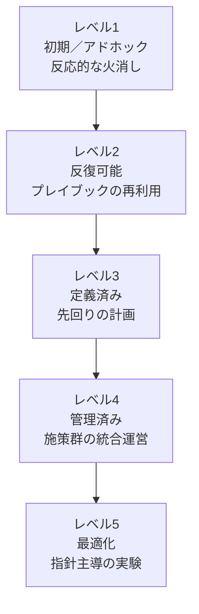

# 戦略成熟度モデル

Wardley Mappingは「どこで戦うべきか」を示しますが、組織の成熟度は「どう実行できるか」を決めます。このモデルは、日和見的な戦術から、指針に支えられた規律ある戦略実行へ向かう道筋を整理したものです。[戦略セルフ評価ツール](/about/assessment-tool)や[指針](/doctrines)とあわせて使うことで、どのゲームプレイが実行可能か、何が欠けているか、どこを意図的に育てるべきかを見極めやすくなります。

## 段階の全体像

| レベル | 戦略姿勢 | 実装の焦点 | マッピングと計測 | 協調 |
| --- | --- | --- | --- | --- |
| **レベル1 — 初期／アドホック** | 火消し中心で、勘に頼って意思決定する。 | 戦術的な頑張りに依存し、全体戦略とのつながりが弱い。 | マップがあっても静止画に近く、成功評価は逸話的。 | 各チームが独立して動き、共通言語はほぼない。 |
| **レベル2 — 反復可能** | 繰り返し現れるパターンを認識し、再利用しようとする。 | 似た文脈向けのプレイブックを整え始める。 | 単純なマッピングの型を再利用し、入力指標を少し追い始める。 | 実践コミュニティが生まれ、指針語彙の共有が始まる。 |
| **レベル3 — 定義済み** | 明確な戦略ポートフォリオに沿って先回りで計画する。 | 戦略が文書化され、明示的なガードレールとともに共有される。 | マッピングと計測が定常リズムに組み込まれる。 | 職能横断のグループが共通目標と指針のもとで連携する。 |
| **レベル4 — 管理済み** | 先読みしながら環境そのものを意図的に形づくる。 | 複数のプレイを、フィードバックループ付きのプログラムとして運営する。 | 価値とフローを測り、マップ変化と成果をダッシュボードで結びつける。 | 軽量なガバナンスと共有ツールのもとで全社連携する。 |
| **レベル5 — 最適化** | 継続的な実験で戦略優位を磨き続ける。 | 指針主導で適応的に動き、戦略を進化するポートフォリオとして扱う。 | リアルタイムのマッピングとデータを統合し、実験から体系的に学ぶ。 | エコシステム全体で滑らかに連携し、パートナーとも言語と指標を共有する。 |

## 5段階の成熟度

### レベル1 — 初期／アドホック

これは生存モードです。戦略は環境理解からではなく、危機対応やトップの指示から生まれます。

- **姿勢:** 非常に反応的で、リーダーは直感や過去経験に頼る。
- **実装の焦点:** 短命な施策による火消しが中心。
- **マッピングと計測:** マップは稀で、すぐ古くなり、成果物扱いされがち。計測は作業完了中心。
- **協調:** チームは局所最適に走り、重複や優先順位の衝突が起きる。
- **指針の焦点:** 深い実践に入る前に、共通語彙や目的の明確化といった基礎を入れる。

### レベル2 — 反復可能

パターンが見え始め、チームはうまくいった方法を再利用し始めます。ばらつきは残るものの、定番のプレイが生まれます。

- **姿勢:** 既知のトリガーが現れたときに、純粋な受け身から状況認識へ一歩進む。
- **実装の焦点:** 既知の文脈向けプレイブックが現れるが、実験はまだ限定的。
- **マッピングと計測:** 簡単なテンプレートでマップを更新し、リード指標（サイクルタイム、採用率など）を追い始める。
- **協調:** 非公式コミュニティが学びを交換し、横断的な足並みが生まれ始める。
- **指針の焦点:** [共通言語を使う](/doctrines/use-a-common-language)など基礎を取り入れ、前提を疑う習慣を促す。

### レベル3 — 定義済み

戦略立案が意図的になります。リーダーは、明示的なユーザー価値と競争ポジションに基づいてプレイを組み立てます。

- **姿勢:** 先手型。ひとつの大勝負ではなく複数シナリオを前提に計画する。
- **実装の焦点:** 施策は文書化された戦略マップに沿い、範囲と期待成果のガードレールを持つ。
- **マッピングと計測:** 定期的にマッピングし、進化を価値やフローの指標と結びつける。
- **協調:** 職能横断チームやガバナンスの場が依存関係と順序を調整する。
- **指針の焦点:** コミュニケーション、状況認識、異議申し立てに関する指針が制度化される。

### レベル4 — 管理済み

組織は複数の戦略を同時に運営し、エコシステムの一部を意図的に作り変えます。

- **姿勢:** 先読み型。市場の進化に影響を与えるレバレッジを探す。
- **実装の焦点:** 戦略は明確なフィードバックループと撤退基準を持つプログラムとして運営される。
- **マッピングと計測:** マップ成熟度、リスクシグナル、成果指標を組み合わせた定量ダッシュボードで投資判断する。
- **協調:** プロダクト、オペレーション、支援組織が全社リズムで統合され、意思決定権にも指針が反映される。
- **指針の焦点:** 「行動を重視する」、フロー最適化、継続進化の設計といった高度な指針を能動的に育てる。

### レベル5 — 最適化

戦略実行そのものが学習システムになります。指針とデータが、洞察、実験、優位性の好循環を生みます。

- **姿勢:** 完全に先手型。組織は常に探索し、学び、プレイのポートフォリオを磨き続ける。
- **実装の焦点:** 戦略はモジュール化され、マップや実験のシグナルに応じて素早く組み替えられる。
- **マッピングと計測:** ライブマッピングがテレメトリ、市場観測、財務データと統合され、実験結果が自動で戻る。
- **協調:** 連携はパートナー、サプライヤー、エコシステム全体に広がり、戦略のリズムを共有する。
- **指針の焦点:** 継続改善の指針が浸透し、リーダーは整合性を保ちながら自律性を育て、慣性を意図的に取り除く。

## このモデルの使い方

1. **現在地を診断する。** 最近の戦略施策を振り返り、どの行が実態に近いかを見る。理想ではなく、実際の意思決定のされ方に注目する。
2. **次の制約を見つける。** 姿勢、実装、マッピング、協調の各観点で、次の段階を開く最小の実践を特定する。
3. **評価ツールと組み合わせる。** 特定のゲームプレイを検討するときは、[戦略セルフ評価ツール](/about/assessment-tool)を使って、必要なマップシグナルと準備度が揃っているかを確認する。
4. **指針に結びつける。** 関連する[指針](/doctrines)を見直し、新しい成熟段階を支える行動を強化する。
5. **四半期ごとに見直す。** 成熟度は固定値ではなく動的な能力として扱い、チーム、リーダーシップ、市場環境の変化に合わせて更新する。

## 簡略版の3段階モデル

より少ない分類を好むステークホルダー向けには、次の3段階にまとめられます。

- **認識段階:** レベル1〜2。Wardley Mappingの概念を理解し始め、実践を再利用するが、まだ一貫性は弱い。
- **適用段階:** レベル3〜4。戦略プレイが意図的に運用され、計測され、チーム横断で調整される。
- **熟達段階:** レベル5。指針、マッピング、計測が適応システムとして統合され、戦略優位を継続改善する。

経営層向けにはこの簡略版を使い、具体的な改善計画を立てる段階で5段階モデルへ戻るのが有効です。
